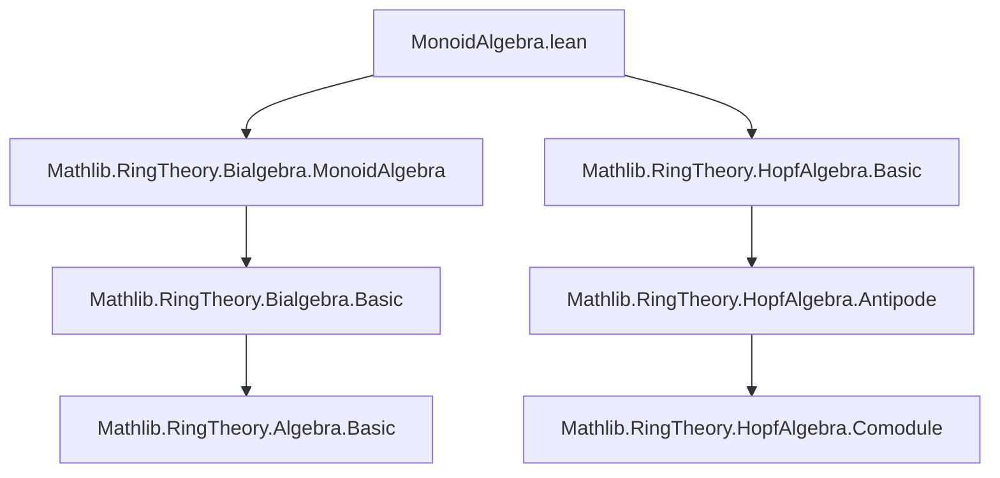

### Technical Brief: `MonoidAlgebra.lean`

---

#### **1. Key Definitions & Theorems**

| Name | Type / Signature | Purpose |
|------|------------------|---------|
| `instHopfAlgebraStruct` | `HopfAlgebraStruct R A[G]` | Defines the *antipode* on the monoid algebra $A[G]$, using $g \mapsto g^{-1}$ and the antipode on $A$. |
| `antipode_single` | `antipode R (single g a) = single g⁻¹ (antipode R a)` | Computes the antipode on basis elements; foundational for verifying Hopf algebra axioms. |
| `instHopfAlgebra` | `HopfAlgebra R A[G]` | Proves that the above structure satisfies the full Hopf algebra axioms (via `mul_antipode_rTensor_comul` and `mul_antipode_lTensor_comul`). |
| `instHopfAlgebra` (Laurent) | `HopfAlgebra R A[T;T⁻¹]` | Induces Hopf algebra structure on Laurent polynomials via identification $A[T;T⁻¹] \cong A[\mathbb{Z}]$. |
| `antipode_C` | `antipode R (C a) = C (antipode R a)` | Antipode commutes with constant embeddings $C : A \to A[T;T⁻¹]$. |
| `antipode_T` | `antipode R (T n) = T (-n)` | Antipode acts by negation on the Laurent monomial $T^n$. |
| `antipode_C_mul_T` | `antipode R (C a * T n) = C (antipode R a) * T (-n)` | Antipode on general Laurent monomials (products of constants and powers of $T$). |

---

#### **2. Naming Conventions**

- **Prefixes**:
  - `inst*`: Typeclass instances (`instHopfAlgebra`, `instHopfAlgebraStruct`)
  - `antipode_*`: Lemmas about the antipode map
  - `*single`: Lemmas about behavior on `single g a` (basis elements)
- **Suffixes**:
  - `_rTensor_comul`, `_lTensor_comul`: Conditions involving tensor products of multiplication/comultiplication
- **Notation**:
  - `C a`: Embedding of $a \in A$ into $A[T;T⁻¹]$
  - `T n`: Laurent monomial $T^n$, identified with `single (n : ℤ) 1`
  - `single g a`: Basis element of $A[G]$

---

#### **3. Tactic Stack**

| Tactic | Usage |
|--------|-------|
| `ext` | Extensionality for proving equality of linear maps / algebra homomorphisms |
| `simp` / `simp only` | Simplification using `@[simp]` lemmas (e.g., `antipode_single`, `single_eq_C`) |
| `rw` | Rewriting using definitions or previously proven equalities |
| `simpa` | Simplify using a target equality (often with `using` clause) |
| `congr` | Congruence rule to lift equalities under function applications |
| `unfold` | Unfold definitions (e.g., `T` as `AddMonoidAlgebra.single`) |

---

#### **4. Proof Logic**

- **Structure**:
  1. Define the antipode on $A[G]$ via linear extension of $g \mapsto g^{-1}$ composed with antipode on $A$.
  2. Prove basic behavior on basis elements (`antipode_single`) via `simp`.
  3. Verify Hopf algebra axioms:
     - Use `ext a b : 2` to reduce to checking equality on pure tensors.
     - Apply known identities in Hopf algebras:  
       $$
       \sum S(b_{(1)}) b_{(2)} = \varepsilon(b) 1, \quad \sum b_{(1)} S(b_{(2)}) = \varepsilon(b) 1
       $$
       encoded as `sum_antipode_mul_eq_algebraMap_counit` and `sum_mul_antipode_eq_algebraMap_counit`.
     - Use `congr` and `single`-based rewriting to lift to $A[G]$.

- **Laurent Polynomials**:
  - Reduce to additive monoid algebra over $\mathbb{Z}$: $A[T;T^{-1}] = A[\mathbb{Z}]$.
  - Use `AddMonoidAlgebra.antipode_single` and `single_eq_C_mul_T` to derive antipode formulas.

---

#### **5. Imports & Dependencies**

| Module | Role |
|--------|------|
| `Mathlib.RingTheory.Bialgebra.MonoidAlgebra` | Provides bialgebra structure on $A[G]$; basis for Hopf algebra extension |
| `Mathlib.RingTheory.HopfAlgebra.Basic` | Core Hopf algebra definitions and basic lemmas (e.g., antipode axioms, counit, comultiplication) |

---

#### **6. Mermaid Diagrams**

##### **Dependency Graph**



##### **Overview of Theory Flow**

```mermaid
flowchart LR
  subgraph Setup
    R[CommSemiring R]
    A[Semiring A + HopfAlgebra R A]
    G[Group G]
  end

  subgraph Construction
    M[A[G] as R-module]
    S[Antipode: g ↦ g⁻¹ ⊗ S_A]
  end

  subgraph Verification
    H1[Hopf Algebra Axioms]
    H2[Laurent Polynomials = A[ℤ]]
  end

  R --> M
  A --> M
  G --> M
  S --> H1
  H1 --> A
  M --> H2
  H2 --> A
```

---

#### **7. Mathematical Significance**

- **Group Algebras**: Shows that if $A$ is an $R$-Hopf algebra and $G$ a group, then the group algebra $A[G]$ inherits a canonical $R$-Hopf algebra structure — crucial for representation theory and Hopf–Galois extensions.
- **Laurent Polynomials**: The case $A = R$, $G = \mathbb{Z}$ yields the Hopf algebra structure on $R[T;T^{-1}]$, corresponding to the multiplicative group scheme $\mathbb{G}_m$ over $\operatorname{Spec} R$.
- **Additive Variant**: The `to_additive` attributes indicate support for additive groups (e.g., $\mathbb{Z}$-graded structures), enabling uniform treatment of additive and multiplicative cases.

--- 

Let me know if you'd like a formalization roadmap or a proof sketch for `mul_antipode_rTensor_comul`.
