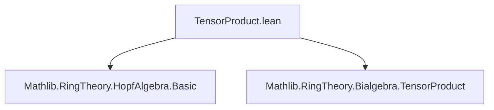
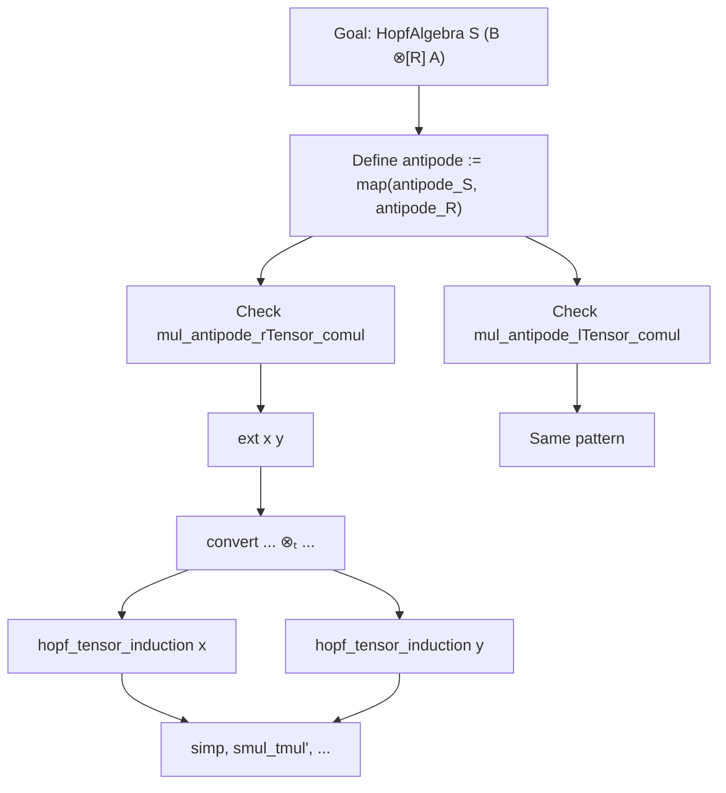

**Technical Brief: TensorProduct.lean — Tensor Product of Hopf Algebras**

---

### 1. **Key Definitions & Theorems**

| Name | Type / Signature | Purpose |
|------|------------------|---------|
| `HopfAlgebra.ofAlgHom` | `{R A : Type*} [CommSemiring R] [CommSemiring A] [Bialgebra R A] → (antipode : A →ₐ[R] A) → (two coherence conditions) → HopfAlgebra R A` | Constructs a Hopf algebra structure on a bialgebra by verifying the antipode satisfies the required convolution inverse conditions. |
| `TensorProduct.instHopfAlgebraTensorProduct` | `instance : HopfAlgebra S (B ⊗[R] A)` | Provides the canonical Hopf algebra structure on the tensor product $B \otimes_R A$, assuming $A$ is a Hopf algebra over $R$, $B$ a Hopf algebra over $S$, and compatible algebra structures. |
| `antipode_def` | `antipode S (A := B ⊗[R] A) = AlgebraTensorModule.map (antipode S) (antipode R)` | Explicitly identifies the antipode on the tensor product as the tensor product of the individual antipodes. |
| `mul_antipode_rTensor_comul`, `mul_antipode_lTensor_comul` | Coherence proofs for the antipode condition: $(m \circ (\text{antipode} \otimes \text{id}) \circ \Delta = \eta \circ \varepsilon)$ and its left variant. | Verified using `hopf_tensor_induction`, `simp`, and properties of algebra/tensor maps. |

---

### 2. **Naming Conventions**

- **Prefixes**:
  - `mul_`: refers to multiplication-related conditions (e.g., `mul_antipode_*`).
  - `antipode_`: pertains to the antipode map (e.g., `antipode_def`).
  - `ofAlgHom`: indicates construction via an algebra homomorphism.

- **Suffixes**:
  - `_rTensor_comul`, `_lTensor_comul`: denote right/left tensor versions of the antipode–comultiplication compatibility.
  - `_apply`: used in lemmas like `mul_antipode_rTensor_comul_apply`, likely stating pointwise equality (used in proofs).

- **Pattern**: `X_Y_Z` often encodes a composition $X \circ (Y \otimes Z)$ or similar.

---

### 3. **Tactic Stack**

Frequently used tactics in this file:

| Tactic | Role |
|--------|------|
| `ext` | Extensionality for proving equality of linear maps / algebra maps. |
| `convert` + `congr(... ⊗ₜ[R] ...)` | Reduce goal to tensor product of componentwise equalities. |
| `hopf_tensor_induction` | Induction on tensor product generators (likely a custom induction principle for Hopf algebras over tensor products). |
| `simp` / `dsimp` | Simplify using definitions (e.g., `AlgebraTensorModule.map`, `Algebra.TensorProduct.one_def`, `smul_tmul'`). |
| `rw` | Rewrite using lemmas like `Algebra.TensorProduct.lmul'_comp_map`. |
| `congr` | Extract equality of linear maps from equality of underlying functions. |

---

### 4. **Proof Logic**

The proof proceeds as follows:

1. **Construct the Hopf algebra structure** on $B \otimes_R A$:
   - Define the antipode as $\text{antipode}_S \otimes \text{antipode}_R$ via `AlgebraTensorModule.map`.
2. **Verify the Hopf algebra axioms**:
   - Use `ext x y` to reduce to checking equality on simple tensors $x \otimes y$.
   - Apply `convert` to reduce to the known identities for $x$ (over $S$) and $y$ (over $R$).
   - Use `hopf_tensor_induction` to decompose $x$ and $y$ into sums of simple tensors (if needed).
   - Simplify using algebraic identities (`smul_tmul'`, `algebraMap_eq_smul_one`, etc.).
3. **Leverage existing lemmas**:
   - `mul_antipode_rTensor_comul_apply` and `mul_antipode_lTensor_comul_apply` (likely lemmas in `HopfAlgebra` or `TensorProduct` modules) provide the componentwise identities.

This reflects a standard *tensor product induction* strategy: reduce to simple tensors, apply known identities, and reassemble.

---

### 5. **Imports & Dependencies**

| Module | Role |
|--------|------|
| `Mathlib.RingTheory.HopfAlgebra.Basic` | Core Hopf algebra definitions (antipode, axioms, basic lemmas). |
| `Mathlib.RingTheory.Bialgebra.TensorProduct` | Tensor product of bialgebras, algebra structures on tensor products, comultiplication/counit maps. |

These imports indicate the file sits at the intersection of:
- **Hopf algebra theory** (antipode, convolution),
- **Tensor product of algebras/modules**,
- **Bialgebra compatibility conditions**.

---

### 6. **Mermaid Diagrams**

#### **Dependency Graph (Module-Level)**



#### **Theoretical Overview (Structure of the Construction)**

```mermaid
flowchart LR
  A["HopfAlgebra R A"] -->|antipode_R| A'
  B["HopfAlgebra S B"] -->|antipode_S| B'
  A' & B' -->|Tensor| C["AlgebraTensorModule.map antipode_S antipode_R"]
  C -->|def| D["antipode on B ⊗[R] A"]
  
  BialgR["Bialgebra R A"] & BialgS["Bialgebra S B"] -->|Tensor| BialgTensor["Bialgebra S (B ⊗[R] A)"]
  BialgTensor -->|+ antipode| HopfTensor["HopfAlgebra S (B ⊗[R] A)"]

  subgraph Axioms
    M1["mul_antipode_rTensor_comul"]
    M2["mul_antipode_lTensor_comul"]
  end

  HopfTensor <--|axioms| Axioms
```

#### **Proof Strategy Flow**



---

### 7. **Summary**

This file formalizes the classical result that the tensor product of two Hopf algebras (over compatible base rings) inherits a canonical Hopf algebra structure. The construction is nontrivial due to the interaction between algebra, coalgebra, and antipode structures, and the proof relies on careful manipulation of tensor products and induction over simple tensors. The use of `hopf_tensor_induction` suggests a tailored induction principle for handling Hopf algebra structures on tensor products, likely developed in prior work.

--- 

Let me know if you'd like the corresponding `mul_antipode_rTensor_comul_apply` lemma or the definition of `hopf_tensor_induction`.
