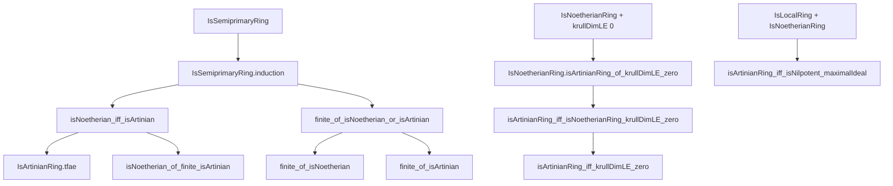

### Technical Brief: `HopkinsLevitzki.lean`

---

#### **1. Key Definitions & Theorems**

| Name | Type / Signature | Purpose |
|------|------------------|---------|
| `IsSemiprimaryRing.induction` | `{P : …} → (h0 : …) → (h1 : …) → P M` | Structural induction on modules over a semiprimary ring, using the Jacobson radical filtration. |
| `IsSemiprimaryRing.isNoetherian_iff_isArtinian` | `IsNoetherian R M ↔ IsArtinian R M` | Core statement of the **Hopkins–Levitzki theorem**: over a semiprimary ring, Noetherian ⇔ Artinian for modules. |
| `IsSemiprimaryRing.finite_of_isNoetherian` / `finite_of_isArtinian` | `IsNoetherian R M → Module.Finite R₀ M` (and dual) | Over a semiprimary ring, finite length implies finite generation over the base ring `R₀`. |
| `IsSemiprimaryRing.isNoetherian_iff_finite_of_jacobson_fg` | `(Ring.jacobson R).FG → (IsNoetherian R M ↔ Module.Finite R M)` | When the Jacobson ideal is finitely generated, Noetherian ⇔ finite as an `R`-module. |
| `IsSemiprimaryRing.isNoetherianRing_iff_jacobson_fg` | `IsNoetherianRing R ↔ (Ring.jacobson R).FG` | Characterization of Noetherianity for semiprimary rings via Jacobson ideal. |
| `IsArtinianRing.tfae` | `List.TFAE [Module.Finite R M, IsNoetherian R M, IsArtinian R M, IsFiniteLength R M]` | For Artinian rings, all four module-theoretic finiteness conditions are equivalent. |
| `isArtinianRing_iff_isFiniteLength` | `IsArtinianRing R ↔ IsFiniteLength R R` | A ring is Artinian iff it has finite length as a module over itself. |
| `isNoetherian_of_finite_isArtinian` | `[CommRing R] → Module.Finite R M → IsArtinian R M → IsNoetherian R M` | Over a *commutative* ring, finitely generated + Artinian ⇒ Noetherian. |
| `IsNoetherianRing.isArtinianRing_of_krullDimLE_zero` | `[CommRing R] → IsNoetherianRing R → Ring.KrullDimLE 0 R → IsArtinianRing R` | A Noetherian ring of Krull dimension ≤ 0 is Artinian. |
| `isArtinianRing_iff_isNoetherianRing_krullDimLE_zero` | `IsArtinianRing R ↔ IsNoetherianRing R ∧ Ring.KrullDimLE 0 R` | Full characterization of commutative Artinian rings. |
| `isArtinianRing_iff_krullDimLE_zero` | `[IsNoetherianRing R] → IsArtinianRing R ↔ Ring.KrullDimLE 0 R` | Simplified version for Noetherian rings. |
| `isArtinianRing_iff_isNilpotent_maximalIdeal` | `[CommRing R] [IsNoetherianRing R] [IsLocalRing R] → IsArtinianRing R ↔ IsNilpotent (maximalIdeal R)` | Local version: Artinian ⇔ maximal ideal nilpotent. |

---

#### **2. Naming Conventions**

- **Prefixes**:
  - `is_`: Predicate definitions (`isNoetherian`, `isArtinian`, `isFiniteLength`, `isSemiprimaryRing`, `isSemisimpleModule`, `isNilpotent`, `isLocalRing`, `isCoprime`, etc.)
  - `finite_`: Implications involving finite generation (`finite_of_isNoetherian`, `finite_of_isArtinian`)
  - `krullDimLE_`: Krull dimension bounds (`krullDimLE_zero`, `krullDimLE_and_isLocalRing_tfae`)
- **Suffixes**:
  - `_iff_`: Biconditional theorems (`isNoetherian_iff_isArtinian`, `isArtinianRing_iff_isNoetherianRing_krullDimLE_zero`)
  - `_tfae`: “Theorems with a finite number of equivalent assertions” (`tfae` list)
  - `_of_`: Implication or construction from a hypothesis (`isArtinianRing_of_krullDimLE_zero`, `isNoetherian_of_finite_isArtinian`)
- **Module-theoretic**:
  - `Submodule.annihilator`, `Module.annihilator`, `Module.isTorsionBySet`, `Module.Finite`, `Module.isTorsionBySet`
- **Ideal-theoretic**:
  - `Ring.jacobson`, `nilradical`, `radical`, `minimalPrimes`, `IsLocalRing.maximalIdeal`

---

#### **3. Tactic Stack**

| Tactic | Usage Frequency | Purpose |
|--------|-----------------|---------|
| `induction` | High | Structural induction on modules via `IsSemiprimaryRing.induction`. |
| `rw` / `simp_rw` | Very High | Rewriting definitions, equivalences, and module/ideal operations. |
| `tfae_have` / `tfae_finish` | Medium | Proving equivalence chains (e.g., `tfae` lists). |
| `exact`, `refine`, `apply` | High | Constructing proofs using lemmas and hypotheses. |
| `intro`, `cases` | Medium | Standard proof decomposition. |
| `have`, `obtain` | High | Introducing intermediate facts or decomposing existential statements. |
| `infer_instance` | Very High | Automatically discharging typeclass constraints (e.g., `Module`, `AddCommGroup`, `IsScalarTower`). |
| `convert`, `congr'` | Low | Rarely used; mostly for equality chaining. |
| `set`, `replace` | Medium | Introducing abbreviations or strengthening hypotheses. |
| `rwa`, `rw [← …]` | High | Rewriting with reversed equalities or using assumptions. |

---

#### **4. Proof Logic**

The proofs follow a **layered structural induction** strategy over the Jacobson radical filtration:

1. **Base case (semisimple modules)**:
   - When `Jac(R) • M = 0`, the module is semisimple.
   - Use `IsSemisimpleModule.finite_tfae` to relate finiteness conditions.

2. **Inductive step**:
   - Let `N = Jac(R) • M`.
   - Use the short exact sequence `0 → N → M → M/N → 0`.
   - Apply induction hypothesis to `N` and `M/N`.
   - Use lemmas like `isNoetherian_iff_submodule_quotient` and `isArtinian_iff_submodule_quotient`.

3. **Finite generation arguments**:
   - Use `finite_of_isNoetherian_or_isArtinian` to lift finite generation from `R₀`-module structure.
   - Leverage `Module.Finite.of_submodule_quotient` and scalar restriction.

4. **Commutative ring case**:
   - Reduce to semiprimary via `isSemisimpleRing (R ⧸ Jac(R))` and `Jac(R)` nilpotent.
   - Use `Ring.jacobson_eq_nilradical_of_krullDimLE_zero` and properties of minimal primes.

5. **Local case**:
   - Use equivalence between Krull dimension 0, maximal ideal nilpotent, and Artinian for Noetherian local rings.

---

#### **5. Imports & Dependencies**

| Module | Purpose |
|--------|---------|
| `Mathlib.Algebra.Module.Torsion.Basic` | Torsion modules, annihilators, torsion-by-set definitions. |
| `Mathlib.RingTheory.FiniteLength` | Finite length modules, equivalence with Noetherian + Artinian. |
| `Mathlib.RingTheory.Noetherian.Nilpotent` | Jacobson radical nilpotence in Noetherian rings. |
| `Mathlib.RingTheory.Spectrum.Prime.Noetherian` | Minimal primes, Krull dimension, finite spectrum in Noetherian rings. |
| `Mathlib.RingTheory.KrullDimension.Zero` | Characterizations of Krull dimension ≤ 0 (e.g., `krullDimLE_zero_and_isLocalRing_tfae`). |

---

#### **6. Mermaid Diagrams**

##### **Dependency Graph (Top-Level Theorems)**



##### **Overview of Theory Flow**

```mermaid
flowchart LR
  A[Semiprimary Rings] -->|Definition| B[Jac(R) nilpotent + R/Jac(R) semisimple]
  B --> C[Induction on Jacobson filtration]
  C --> D[Noetherian ⇔ Artinian for modules]
  D --> E[Artinian rings ⇒ Noetherian]
  D --> F[Finite length ⇔ Noetherian + Artinian]
  G[Commutative Noetherian] -->|Krull dim ≤ 0| H[Artinian]
  H --> I[Local case: maximal ideal nilpotent]
  style A fill:#f9f,stroke:#333
  style B fill:#bbf,stroke:#333
  style C fill:#bfb,stroke:#333
  style D fill:#f96,stroke:#333
  style E fill:#f96,stroke:#333
  style F fill:#f96,stroke:#333
  style G fill:#9cf,stroke:#333
  style H fill:#f96,stroke:#333
  style I fill:#f96,stroke:#333
```

---

#### **7. Summary**

This file formalizes the **Hopkins–Levitzki theorem** in Lean 4, establishing equivalence between Noetherian and Artinian conditions for modules over semiprimary rings. It further connects these conditions to finite length, finite generation, and Krull dimension in the commutative setting. The proofs rely heavily on structural induction over the Jacobson radical, with key auxiliary results about torsion modules, annihilators, and semisimplicity. The formalization is modular, leveraging existing libraries on Noetherian rings, finite length, and Krull dimension.
