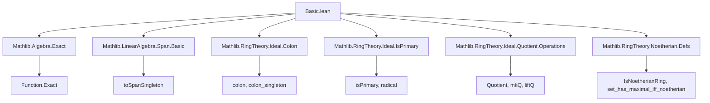
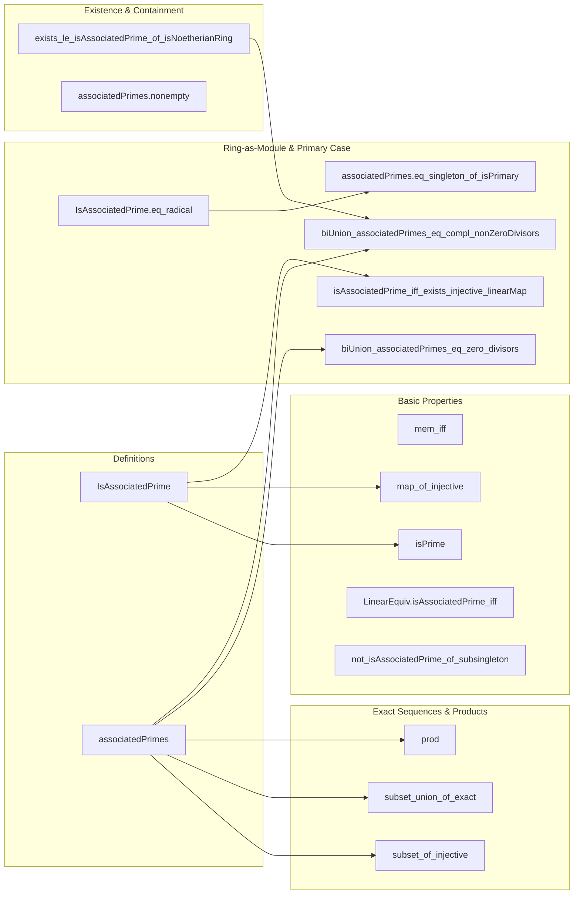

**Technical Brief: Associated Primes of a Module (Basic.lean)**  
*Based on Lean 4 formalization in Mathlib*

---

### 1. **Key Definitions & Theorems**

| Name | Type / Signature | Purpose |
|------|------------------|---------|
| `IsAssociatedPrime I M` | `Prop` | States that `I` is a prime ideal equal to the annihilator (`colon`) of some element `x : M`. Formally: `I.IsPrime ∧ ∃ x, I = ⊥.colon {x}` |
| `associatedPrimes R M` | `Set (Ideal R)` | The set of all associated primes of module `M` over ring `R`. Defined as `{ I | IsAssociatedPrime I M }` |
| `mem_iff` | `I ∈ associatedPrimes R M ↔ IsAssociatedPrime I M` | Membership equivalence (tautology) |
| `isPrime` | `IsAssociatedPrime I M → I.IsPrime` | Extracts primality of an associated prime |
| `map_of_injective` | `IsAssociatedPrime I M → Function.Injective f → IsAssociatedPrime I M'` | Pushforward of associated primes along injective linear maps |
| `LinearEquiv.isAssociatedPrime_iff` | `M ≃ₗ[R] M' ⇒ IsAssociatedPrime I M ↔ IsAssociatedPrime I M'` | Invariance under linear equivalence |
| `not_isAssociatedPrime_of_subsingleton` | `[Subsingleton M] → ¬IsAssociatedPrime I M` | No associated primes in trivial modules |
| `exists_le_isAssociatedPrime_of_isNoetherianRing` | `[IsNoetherianRing R] → x ≠ 0 ⇒ ∃ P, IsAssociatedPrime P M ∧ ann(x) ≤ P` | In Noetherian rings, every annihilator is contained in an associated prime |
| `subset_of_injective` | `Function.Injective f ⇒ associatedPrimes R M ⊆ associatedPrimes R M'` | Monotonicity of associated primes under injective maps |
| `subset_union_of_exact` | `Exact f g ⇒ associatedPrimes R M' ⊆ associatedPrimes R M ∪ associatedPrimes R M''` | Associated primes in exact sequences are covered by union |
| `prod` | `associatedPrimes R (M × M') = associatedPrimes R M ∪ associatedPrimes R M'` | Product of modules corresponds to union of associated primes |
| `LinearEquiv.AssociatedPrimes.eq` | `M ≃ₗ[R] M' ⇒ associatedPrimes R M = associatedPrimes R M'` | Equality of associated primes under linear equivalence |
| `associatedPrimes.eq_empty_of_subsingleton` | `[Subsingleton M] ⇒ associatedPrimes R M = ∅` | Trivial module has no associated primes |
| `associatedPrimes.nonempty` | `[IsNoetherianRing R] → [Nontrivial M] ⇒ (associatedPrimes R M).Nonempty` | Nontrivial Noetherian modules have at least one associated prime |
| `biUnion_associatedPrimes_eq_zero_divisors` | `[IsNoetherianRing R] ⇒ ⋃ p ∈ assocPrimes M, p = { r | ∃ x ≠ 0, r • x = 0 }` | Union of associated primes equals set of zero-divisors on `M` |
| `biUnion_associatedPrimes_eq_compl_nonZeroDivisors` | `[IsNoetherianRing R] ⇒ ⋃ p ∈ assocPrimes R R, p = (nonZeroDivisors R)ᶜ` | For the ring as a module over itself, union of associated primes is complement of non-zero-divisors |
| `isAssociatedPrime_iff_exists_injective_linearMap` | `IsAssociatedPrime I M ↔ I.IsPrime ∧ ∃ f : R⧸I →ₗ M, Injective f` | Alternative characterization via injective maps from quotient |
| `IsAssociatedPrime.eq_radical` | `I.IsPrimary ∧ IsAssociatedPrime J (R⧸I) ⇒ J = I.radical` | For primary ideals, only associated prime of quotient is its radical |
| `associatedPrimes.eq_singleton_of_isPrimary` | `[IsNoetherianRing R] ∧ I.IsPrimary ⇒ associatedPrimes R (R⧸I) = {I.radical}` | Primary quotient has unique associated prime: the radical |

---

### 2. **Naming Conventions**

- **Predicates**: `is_`, `not_`, `mem_`, `subset_`, `eq_`, `nonempty`, `biUnion_`
- **Operations on ideals/modules**: `colon`, `annihilator`, `radical`, `quotient`, `mkQ`, `liftQ`, `ker`, `map`, `prod`
- **Properties of maps**: `injective`, `exact`, `linearEquiv`, `surjective`
- **Module-theoretic constructs**: `Submodule.colon`, `Submodule.annihilator`, `Ideal.Quotient.mkₐ`, `Ideal.isPrimary`
- **Prefixes/suffixes**:
  - `is_`: property (e.g., `isPrimary`, `isAssociatedPrime`)
  - `mem_`: membership (e.g., `mem_iff`)
  - `subset_`: inclusion (e.g., `subset_of_injective`)
  - `eq_`: equality (e.g., `eq_singleton_of_isPrimary`)
  - `biUnion_`: union over index set (e.g., `biUnion_associatedPrimes_eq_zero_divisors`)
  - `of_`: implication from hypothesis (e.g., `of_injective`, `of_isNoetherianRing`)
  - `assocPrimes`: shorthand for `associatedPrimes`

---

### 3. **Tactic Stack**

Frequently used tactics in proofs:

| Tactic | Usage |
|--------|-------|
| `simp_rw` | Rewriting with simplification (e.g., `mem_colon_singleton`, `map_smul`) |
| `rw` | Rewriting using equalities/definitions |
| `ext` | Extensionality for set/ideal equality |
| `intro` / `rintro` | Introducing hypotheses/constructors |
| `apply_fun` | Applying function to both sides of equation/implication |
| `contrapose` | Turning implication into contrapositive |
| `by_cases` | Case analysis on propositional hypothesis |
| `exact` / `assumption` | Closing goals directly |
| `refine` | Partial proof construction with holes |
| `convert` / `congr` | Congruence reasoning (implicit in `antisymm`) |
| `aesop` / `tauto` | Not explicitly used here — leaner manual reasoning |
| `ring` | Not used — algebraic simplifications done via `simp` |
| `simp only [...]` | Targeted simplification (e.g., `Set.mem_empty_iff_false`) |
| `rwa` | Rewrite + assumption (used in `exists_le_isAssociatedPrime_of_isNoetherianRing`) |
| `convert` + `△` | Used in `biUnion_associatedPrimes_eq_compl_nonZeroDivisors` |

---

### 4. **Proof Logic**

- **Inductive/constructive style**: Proofs are mostly constructive, leveraging module-theoretic properties.
- **Common pattern**:
  1. Unfold definitions (`IsAssociatedPrime`, `colon`, `annihilator`, etc.)
  2. Use `ext` to reduce ideal/element-wise equality to membership equivalence.
  3. Apply `simp_rw` with lemmas like `mem_colon_singleton`, `map_smul`, `smul_comm`.
  4. Use `exact`, `refine`, or `apply_fun` to manipulate equations.
  5. For maximal ideal arguments: use `set_has_maximal_iff_noetherian.mpr` to extract maximal element satisfying certain properties.
  6. For exact sequences: split into cases (`by_cases`) on existence of lifts; handle each via module homomorphism properties.
  7. For radical equalities: use `le_antisymm` + `isPrimary` properties (`isPrimary_iff`) to show mutual inclusion.

---

### 5. **Imports & Dependencies**

**Core imports** (define scope and foundational tools):

```lean
Mathlib.Algebra.Exact
Mathlib.LinearAlgebra.Span.Basic
Mathlib.RingTheory.Ideal.Colon
Mathlib.RingTheory.Ideal.IsPrimary
Mathlib.RingTheory.Ideal.Quotient.Operations
Mathlib.RingTheory.Noetherian.Defs
```

**Key dependencies**:
- `Exact`: For `Function.Exact` and related lemmas.
- `Span.Basic`: For `toSpanSingleton`, used in annihilator constructions.
- `Ideal.Colon`: Defines `colon` operation (annihilator of singleton).
- `Ideal.IsPrimary`: Primary ideals and their properties.
- `Ideal.Quotient.Operations`: Quotient ring/module constructions, maps like `mkQ`, `liftQ`.
- `Noetherian.Defs`: `IsNoetherianRing`, maximal condition lemmas.

---

### 6. **Mermaid Diagrams**

#### **Dependency Graph (Module-Level)**



#### **Overview of Theory Flow**



---

### 7. **Summary**

This module formalizes the classical theory of associated primes in commutative algebra, focusing on modules over Noetherian rings. It establishes foundational properties (invariance under equivalence, behavior in exact sequences), existence results (every nonzero element’s annihilator lies in an associated prime), and structural results for primary quotients (unique associated prime = radical). The formalization is clean, modular, and leverages Mathlib’s robust ideal and module infrastructure.

Let me know if you'd like a **proof sketch** of a specific theorem or a **dependency analysis** of related files (e.g., `AssociatedPrimes.lean`).
