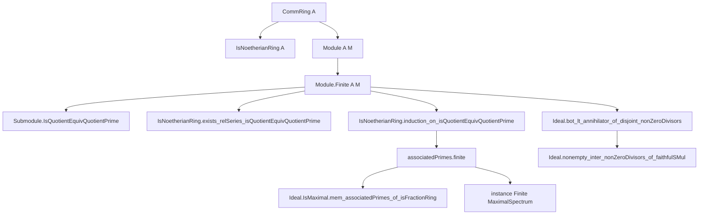
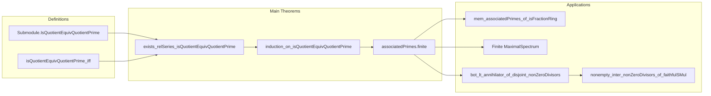

**Technical Brief: `Finiteness.lean`**

---

### 1. KEY DEFINITIONS & THEOREMS

| Name | Type / Signature | Purpose |
|------|------------------|---------|
| `Submodule.IsQuotientEquivQuotientPrime` | `Submodule A M → Submodule A M → Prop` | Asserts that $N_1 \le N_2$ and $N_2/N_1 \cong_A A/\mathfrak{p}$ for some prime ideal $\mathfrak{p}$. |
| `Submodule.isQuotientEquivQuotientPrime_iff` | `↔ ∃ x, Ideal.IsPrime ((⊥ : Submodule A (M ⧸ N₁)).colon {N₁.mkQ x}) ∧ N₂ = N₁ ⊔ span A {x}` | Characterizes the above condition via colon ideals and principal extensions. |
| `IsNoetherianRing.exists_relSeries_isQuotientEquivQuotientPrime` | `∃ s : RelSeries {...}, s.head = ⊥ ∧ s.last = ⊤` | Existence of a finite filtration (relative series) of $M$ with successive quotients isomorphic to $A/\mathfrak{p}_i$. |
| `IsNoetherianRing.induction_on_isQuotientEquivQuotientPrime` | Elimination principle for `Module.Finite A M` | Induction principle over modules built from $A/\mathfrak{p}$ via extensions; used to prove properties for all f.g. modules over Noetherian rings. |
| `associatedPrimes.finite` | `(associatedPrimes A M).Finite` | Main result: finitely many associated primes for f.g. modules over Noetherian rings. |
| `Ideal.IsMaximal.mem_associatedPrimes_of_isFractionRing` | `I ∈ associatedPrimes A A` | Maximal ideals are associated primes in a Noetherian total ring of fractions. |
| `instance [IsFractionRing A A] : Finite (MaximalSpectrum A)` | Instance | Noetherian total ring of fractions is semilocal (finitely many maximal ideals). |
| `Ideal.bot_lt_annihilator_of_disjoint_nonZeroDivisors` | `⊥ < Module.annihilator A I` | If $I$ avoids non-zero-divisors, its annihilator is nonzero. |
| `Ideal.nonempty_inter_nonZeroDivisors_of_faithfulSMul` | `((I : Set A) ∩ nonZeroDivisors A).Nonempty` | Faithful action of $I$ implies $I$ meets non-zero-divisors. |

---

### 2. NAMING CONVENTIONS

- **Predicate naming**:
  - `isQuotientEquivQuotientPrime`: property of a pair of submodules.
  - `IsNoetherianRing.*`: properties/lemmas about Noetherian rings and modules.
- **Module-theoretic operations**:
  - `quotient`, `submoduleOf`, `mkQ`, `span`, `colon`, `annihilator`, `mapQ`, `liftQ`.
- **Ideal-theoretic**:
  - `PrimeSpectrum`, `MaximalSpectrum`, `nonZeroDivisors`, `isPrimary`, `isMaximal`.
- **Logical structure**:
  - `finite`, `finite_iff`, `subset`, `union`, `exact`, `injective`, `surjective`.

Prefixes/suffixes:
- `is_`, `mem_`, `bot_`, `top_`, `quotient_`, `annihilator_`, `colon_`, `submoduleOf_`, `mkQ_`, `span_`, `nonZeroDivisors_`.

---

### 3. TACTIC STACK

Frequently used tactics:
- `simp`, `rw`, `ext`, `convert`, `refine`, `obtain`, `have`, `suffices`, `induction`, `exact`, `apply`, `symm`, `congr`, `simpa`, `change`, `replace`, `specialize`, `intro`, `cases`, `let`, `letI`, `haveI`, `apply_fun`, `convert_fun`, `funext`, `subset_antisymm`, `lt_iff_le_and_exists.mpr`, `eq_of_le_of_not_le`, `ne_of_gt`, `ne_of_ne`, `nonempty.intro`, `nonempty.elim`, `exists.intro`, `exists.elim`, `and.intro`, `and.elim`, `or.elim`, `not.intro`, `not.elim`, `by_contra`, `by_contra!`, `set_like.ext`, `submodule.ext`, `ideal.ext`, `linear_map.ext`, `linear_equiv.ext`, `quotient.ext`, `liftQ`, `mapQ`, `submoduleOfEquivOfLe`, `Submodule.topEquiv`, `Submodule.mkQ_surjective`, `Submodule.injective_subtype`, `LinearMap.exact_subtype_mkQ`, `Submodule.mapQ`, `Submodule.ker_mkQ`, `Submodule.range_toSpanSingleton`, `Submodule.submoduleOfEquivOfLe`, `Submodule.mkQ_surjective`, `Submodule.mapQ`, `Submodule.ker_mkQ`, `Submodule.range_toSpanSingleton`, `Submodule.submoduleOfEquivOfLe`, `Submodule.mkQ_surjective`, `Submodule.injective_subtype`, `LinearMap.exact_subtype_mkQ`.

Core automation:
- `aesop` (not explicitly used, but `simp` + `rw` dominate).
- `ring`, `abel`, `linarith` (not present — algebraic manipulations are done via `simp`/`rw` with lemmas).
- `induction` with custom eliminators (`using IsNoetherianRing.induction_on_isQuotientEquivQuotientPrime`).
- `wellFoundedGT.induction_top` for transfinite-style induction on submodules.

---

### 4. PROOF LOGIC

**General proof strategy**:
- **Inductive construction** via well-founded induction on submodules (top-down, starting from $\top$).
- **Filtration existence**: Use well-founded induction on $M$ to build a chain where each step adds a cyclic generator whose annihilator is prime.
- **Induction principle**: Prove a property holds for all f.g. modules by:
  1. Base case: zero module (subsingleton).
  2. Quotient case: $A/\mathfrak{p}$.
  3. Extension closure: short exact sequences.
- **Finiteness of associated primes**: Apply induction principle; use:
   - `associatedPrimes.eq_empty_of_subsingleton`
   - `associatedPrimes.eq_singleton_of_isPrimary`
   - `associatedPrimes.subset_union_of_exact`

**Key logical flow in `associatedPrimes.finite`**:
```text
Module.Finite A M
├─ subsingleton ⇒ associatedPrimes = ∅ ⇒ finite
├─ quotient A p ⇒ associatedPrimes = {p} ⇒ finite
└─ exact N₁ → N₂ → N₃ ⇒ associatedPrimes(N₂) ⊆ associatedPrimes(N₁) ∪ associatedPrimes(N₃)
   ⇒ finite by induction hypothesis + finite union
```

---

### 5. IMPORTS (PRIMARY DEPENDENCIES)

| Module | Purpose |
|--------|---------|
| `Mathlib.Order.RelSeries` | Formalization of relative series/filtrations. |
| `Mathlib.RingTheory.Ideal.AssociatedPrime.Basic` | Definition and basic properties of associated primes. |
| `Mathlib.RingTheory.Localization.FractionRing` | Total ring of fractions, `IsFractionRing`. |
| `Mathlib.RingTheory.Noetherian.Basic` | Noetherian rings and modules, `IsNoetherianRing`, `Module.Finite`. |
| `Mathlib.RingTheory.Spectrum.Prime.Defs` | Prime spectrum, `PrimeSpectrum`. |
| `Mathlib.RingTheory.Spectrum.Maximal.Basic` | Maximal spectrum, `MaximalSpectrum`. |

---

### 6. MERMAID DIAGRAMS

#### Dependency Graph (Top-Level)



#### Overview of File Structure



---

### 7. CONTEXTUAL NOTES

- **Stacks Project references**: `00L0` (filtration), `00LC` (finiteness of associated primes).
- **Bug workaround**: Induction principle is over `Module.Finite A M` due to Lean 4 issue #4246.
- **Universe handling**: Explicit universe parameters `u v`, and universe lifting via `PUnit.{v + 1}` in exactness step.
- **Key algebraic facts used**:
  - Primary decomposition of zero submodule in Noetherian modules.
  - Colon ideal characterization of associated primes.
  - Exact sequences induce inclusions of associated primes.
  - In total rings of fractions, maximal ideals are associated.

--- 

Let me know if you'd like a formalized dependency graph in `leanpkg.toml` format or a visualization of the filtration construction.
