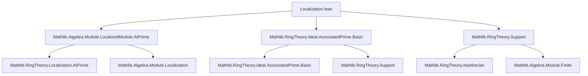

### Technical Brief: Localization.lean — Associated Primes of Localized Modules

---

#### **1. Key Definitions & Theorems**

| Name | Type / Signature | Purpose |
|------|------------------|---------|
| `associatedPrimes R M` | `Set (Ideal R)` | Set of *associated primes* of an $R$-module $M$: primes $\mathfrak{p} = \mathrm{ann}(x)$ for some $x \in M$. |
| `IsLocalizedModule S f` | Class | States that a linear map $f : M \to M'$ is the localization of modules at $S$, i.e., $M' \cong S^{-1}M$ and $f$ is the canonical map. |
| `IsLocalization S R'` | Class | $R' \cong S^{-1}R$ as localization. |
| `mem_associatedPrimes_of_comap_mem_associatedPrimes_of_isLocalizedModule` | `p ∈ Ass_{R'}(M')` if `p ∩ R ∈ Ass_R(M)` and $M'$ is localization of $M$ | **Main inclusion**: pullback of associated prime of localized module gives associated prime of original module under localization. |
| `mem_associatedPrimes_atPrime_of_mem_associatedPrimes` | $p \in \mathrm{Ass}(M) \Rightarrow \mathfrak{m}_{R_p} \in \mathrm{Ass}(M_p)$ | Special case of above for localization at a prime ideal (via `Localization.AtPrime`). |
| `comap_mem_associatedPrimes_of_mem_associatedPrimes_of_isLocalizedModule_of_fg` | $p \in \mathrm{Ass}_{R'}(M')$, $p \cap R$ f.g. ⇒ $p \cap R \in \mathrm{Ass}_R(M)$ | Converse inclusion under finite generation hypothesis. |
| `preimage_comap_associatedPrimes_eq_associatedPrimes_of_isLocalizedModule` | $(\mathrm{comap} \, \alpha)^{-1}(\mathrm{Ass}_R M) = \mathrm{Ass}_{R'} M'$ | Equality of sets under Noetherian hypothesis. |
| `minimalPrimes_annihilator_subset_associatedPrimes` | $\mathrm{Min}(\mathrm{ann}(M)) \subseteq \mathrm{Ass}(M)$ | Classical result: minimal primes over annihilator are associated. |

---

#### **2. Naming Conventions**

- **Prefixes**:
  - `mem_associatedPrimes_...`: membership lemmas in `associatedPrimes`.
  - `comap_mem_associatedPrimes_...`: lemmas about comap (contraction) of ideals.
  - `preimage_comap_associatedPrimes_...`: set-theoretic preimage under comap.
- **Suffixes**:
  - `_of_isLocalizedModule`: when $M'$ is a localized module of $M$.
  - `_of_fg`: when finite generation is used.
  - `_atPrime`: localization at a prime ideal (via `Localization.AtPrime`).
- **Aliases**:
  - Deprecated aliases use `alias mem_associatePrimes_... := mem_associatedPrimes_...`, indicating typo correction (`associatePrimes` → `associatedPrimes`).

---

#### **3. Tactic Stack**

| Tactic | Usage Frequency | Purpose |
|--------|------------------|---------|
| `rcases` | High | Unpack existential/and goals (e.g., `ass : p ∈ Ass(M')` ⇒ `⟨hp, x, hx⟩`). |
| `simp only [...]` | Very High | Simplify using localized module properties (`mk'_smul`, `mk'_eq_zero'`, etc.). |
| `rw [...]` | High | Rewrite using algebraic identities (e.g., `mk'_mul`, `smul_smul`, `Ideal.mem_comap`). |
| `exact`, `refine`, `apply` | Medium | Construct proofs using known lemmas. |
| `tauto` | Medium | Final simplification in logical combinations (e.g., `mem_or_mem` from prime ideal). |
| `have : ... := ...` | High | Intermediate lemmas (e.g., divisibility, ideal membership). |
| `ext`, `funext` | Medium | Extensionality for functions/ideals. |
| `convert`, `congr'` | Low | Rarely used; mostly `rw` suffices. |
| `aesop` | Not present | Not used — proofs are highly structured and require manual ideal/module reasoning. |

---

#### **4. Proof Logic**

- **Structure**:
  1. **Decompose assumptions** via `rcases` (e.g., `p ∈ Ass(M')` ⇒ prime ideal + element with annihilator).
  2. **Use localization properties**:
     - `IsLocalization.isPrime_iff_isPrime_disjoint`
     - `IsLocalization.disjoint_comap_iff`
     - `IsLocalizedModule.mk'_surjective`
     - `IsLocalizedModule.mk'_eq_zero'`
  3. **Construct witnesses** for associated primes:
     - For forward direction: use $f(x)$ in $M'$.
     - For reverse (fg case): construct element $\left(\prod g(a)\right) \cdot m$ using finite generating set $T$.
  4. **Ideal-theoretic reasoning**:
     - Use prime ideal properties (`mul_mem_iff_mem_or_mem`).
     - Use finite generation to control denominators.
  5. **Set equality proofs** via `ext` + mutual implication.

- **Induction**: Not used — proofs are direct and constructive.

- **Key logical pattern**:
  ```
  rcases h with ⟨prime, x, hx⟩
  constructor
  · prove prime ideal property via localization criteria
  · construct witness using localization maps and algebraic identities
  ```

---

#### **5. Imports & Dependencies**

| Import | Role |
|--------|------|
| `Mathlib.Algebra.Module.LocalizedModule.AtPrime` | Localized modules at prime ideals (`LocalizedModule.AtPrime`). |
| `Mathlib.RingTheory.Ideal.AssociatedPrime.Basic` | Definition and basic properties of `associatedPrimes`. |
| `Mathlib.RingTheory.Support` | Support of modules, annihilators, and relation to associated primes. |
| `Mathlib.Algebra.Module.Localization` (via `IsLocalization`, `IsLocalizedModule`) | General localization theory of modules and maps. |
| `Mathlib.RingTheory.Localization.AtPrime` | Localization at a prime ideal (`Localization.AtPrime`, `maximalIdeal`). |
| `Mathlib.RingTheory.Noetherian` | Used in `preimage_comap_associatedPrimes_eq_associatedPrimes_of_isLocalizedModule` (Noetherian hypothesis). |

---

#### **6. Mermaid Diagrams**

##### **Dependency Graph (Module-Level)**



##### **Overview of Theory Flow**

```mermaid
flowchart LR
  subgraph Definitions
    A[associatedPrimes R M] 
    B[IsLocalizedModule S f]
    C[Localization S R']
  end

  subgraph Main Results
    D[Forward inclusion: Ass(M) ⇒ Ass(S⁻¹M)]
    E[Reverse inclusion (fg): Ass(S⁻¹M) ⇒ Ass(M)]
    F[Equality under Noetherian]
    G[Minimal primes ⊆ Ass]
  end

  A --> D
  B --> D
  C --> D

  A --> E
  B --> E
  C --> E
  fg[fg hypothesis] --> E

  D --> F
  E --> F
  Noetherian[NoetherianRing R] --> F

  A --> G
  Support[Support & Annihilator] --> G
```

---

#### **7. Notes & Observations**

- **Typo fix**: `associatePrimes` → `associatedPrimes` (deprecated alias added for compatibility).
- **Stacks Project reference**: All lemmas tagged with [stacks 0310], matching *Tag 0310* (Associated primes of localized modules).
- **No automation**: Heavy reliance on manual ideal/module reasoning — no `aesop`, `linarith`, or `norm_cast`.
- **Deprecation dates**: `2025-08-15` and `2025-11-27` suggest this is part of a larger refactoring in progress.

--- 

Let me know if you'd like a formalized summary in Lean or a diagram in SVG/PNG format.
