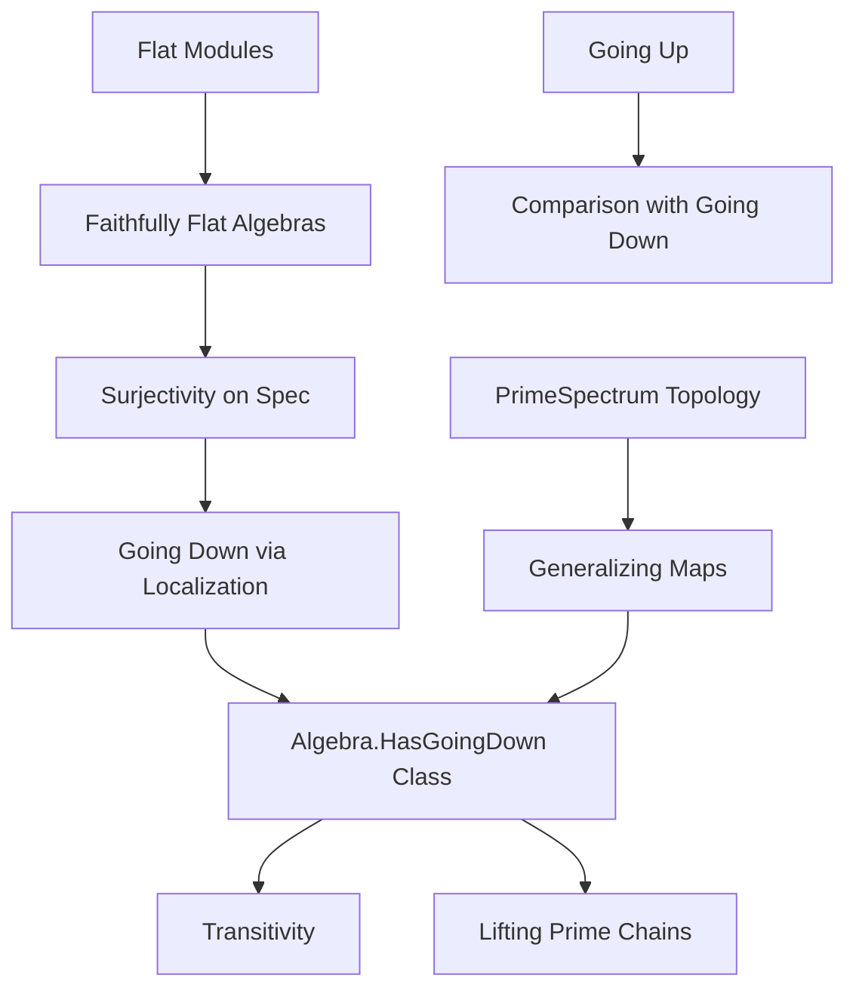
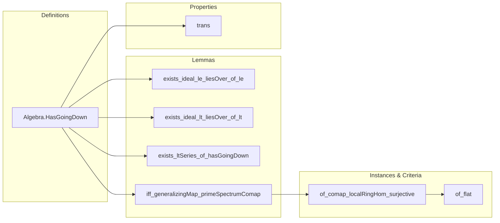

### Technical Brief: `GoingDown.lean`

---

#### **1. Key Definitions & Theorems**

| Name | Type / Signature | Purpose |
|------|------------------|---------|
| `Algebra.HasGoingDown R S` | `class Prop` | Predicate stating that for any primes $ \mathfrak{p} \subseteq \mathfrak{q} \subseteq R $ and a prime $ Q \subseteq S $ lying over $ \mathfrak{q} $, there exists a prime $ P \subseteq Q $ lying over $ \mathfrak{p} $. |
| `Ideal.exists_ideal_le_liesOver_of_le` | `lemma` | Extends the defining condition from strict inclusion $ \mathfrak{p} < \mathfrak{q} $ to non-strict $ \mathfrak{p} \le \mathfrak{q} $. |
| `Ideal.exists_ideal_lt_liesOver_of_lt` | `lemma` | Refines the conclusion to strict inclusion $ P < Q $ when $ \mathfrak{p} < \mathfrak{q} $. |
| `Ideal.exists_ltSeries_of_hasGoingDown` | `lemma` | Lifts chains of primes (via `LTSeries`) along the map $ \mathrm{Spec}(S) \to \mathrm{Spec}(R) $ under going down. |
| `iff_generalizingMap_primeSpectrumComap` | `lemma` | Equivalence: $ S $ has going down over $ R $ iff the induced map $ \mathrm{Spec}(S) \to \mathrm{Spec}(R) $ is a *generalizing map* (i.e., generalizations lift). |
| `Algebra.HasGoingDown.trans` | `lemma` | Transitivity: If $ R \to S $ and $ S \to T $ have going down, then so does $ R \to T $ (for scalar towers). |
| `Algebra.HasGoingDown.of_comap_localRingHom_surjective` | `lemma` | Sufficient condition: if all localizations $ \mathrm{Spec}(S_P) \to \mathrm{Spec}(R_{\mathfrak{p}}) $ are surjective, then going down holds. |
| `Algebra.HasGoingDown.of_flat` | `instance` | Flat algebras satisfy going down (via faithful flatness of localizations). |

---

#### **2. Naming Conventions**

- **Class prefix**: `Algebra.HasGoingDown` — standard Lean pattern for properties of algebra structures.
- **Lemma prefixes**:
  - `Ideal.exists_ideal_le_liesOver_of_*`: constructing primes lying over given ones, with control over inclusion.
  - `Algebra.HasGoingDown.*`: lemmas/instances about the class itself.
- **Suffixes**:
  - `_of_lt`, `_of_le`: indicate whether strict or non-strict inclusion is assumed.
  - `_surjective`, `_flat`: indicate the method of proof or hypothesis.

---

#### **3. Tactic Stack**

Frequently used tactics in proofs:
- `by_cases`, `by_contra`, `subst`, `simp`, `ext`: basic logic and extensionality.
- `rw`, `rwa`, `simpa`: rewriting with equalities and equivalences.
- `obtain ⟨…⟩ := …`: destructuring existential or product types.
- `induction … using RelSeries.inductionOn`: structural induction on `LTSeries`.
- `rwa`, `convert`, `exact`: for precise rewriting and unification.
- `apply`, `refine`: constructing proofs with holes.
- `have`, `suffices`: intermediate lemma introduction.

---

#### **4. Proof Logic**

- **Core strategy**: Reduce the algebraic condition (going down) to a topological one (lifting generalizations), via the homeomorphism $ \mathrm{Spec}(S) \to \mathrm{Spec}(R) $ induced by $ R \to S $.
- **Inductive structure**:
  - For `exists_ltSeries_of_hasGoingDown`, induction on the length of a prime chain in $ \mathrm{Spec}(R) $, lifting step-by-step using `exists_ideal_lt_liesOver_of_lt`.
- **Equivalence proofs** (`iff_generalizingMap_primeSpectrumComap`):
  - Forward direction: use the class hypothesis to lift specializations (via prime ideal inclusions).
  - Reverse direction: use the generalizing map property to produce the required prime $ P $.
- **Flat case** (`of_flat`):
  - Reduce to surjectivity of local maps via localization.
  - Use that flat + local ⇒ faithfully flat ⇒ surjective on spectra.

---

#### **5. Imports**

| Module | Purpose |
|--------|---------|
| `Mathlib.RingTheory.Ideal.GoingUp` | Related theory (going *up*), used for comparison and dual reasoning. |
| `Mathlib.RingTheory.Flat.FaithfullyFlat.Algebra` | Faithful flatness and its consequences (e.g., surjectivity on spectra). |
| `Mathlib.RingTheory.Flat.Localization` | Localization of flat modules/algebras, key for local-to-global arguments. |
| `Mathlib.RingTheory.Spectrum.Prime.Topology` | Topological properties of $ \mathrm{Spec} $, including specialization order and generalizations. |

---

#### **6. Mermaid Diagrams**

##### **Dependency Graph (Core Theory)**

##### **Overview of File Structure**

---

#### **7. Notes & References**

- **Stacks Project tags**:
  - `00HV`: Definition of going down (condition (2)).
  - `00HW`: Equivalence with generalizing maps (condition (1)).
  - `00HX`: Transitivity of going down.
  - `00HS`: Flat algebras satisfy going down.

- **Related files**:
  - `Mathlib/RingTheory/IntegralClosure/GoingDown.lean`: Going down for integral extensions over normal domains.

--- 

This file formalizes a foundational result in commutative algebra: flatness implies going down, and characterizes going down in terms of lifting generalizations in the prime spectrum. It leverages both algebraic and topological perspectives, with a clean interface via the `Algebra.HasGoingDown` class.
