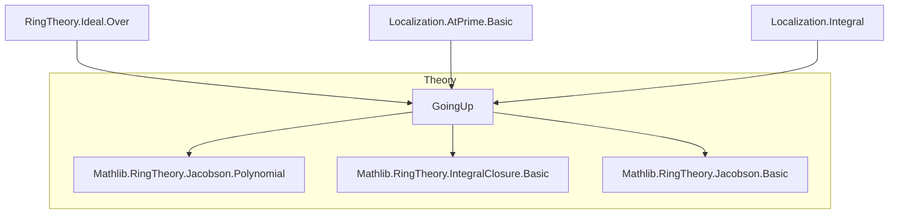
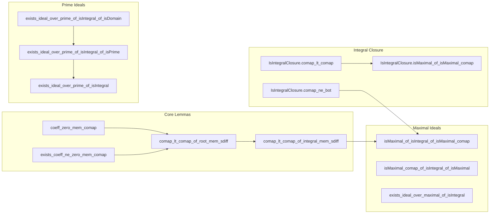

### Technical Brief: `GoingUp.lean`

---

#### **1. Key Definitions & Theorems**

| Name | Type / Signature | Purpose |
|------|------------------|---------|
| `coeff_zero_mem_comap_of_root_mem_of_eval_mem` | `r ∈ I → p.eval₂ f r ∈ I → p.coeff 0 ∈ I.comap f` | Shows constant term of polynomial vanishing at root lies in comap ideal. |
| `coeff_zero_mem_comap_of_root_mem` | `r ∈ I → p.eval₂ f r = 0 → p.coeff 0 ∈ I.comap f` | Special case of above when evaluation is zero. |
| `exists_coeff_ne_zero_mem_comap_of_non_zero_divisor_root_mem` | `(∀ x, x * r = 0 → x = 0) → r ∈ I → p ≠ 0 → p.eval₂ f r = 0 → ∃ i, p.coeff i ≠ 0 ∧ p.coeff i ∈ I.comap f` | Finds a nonzero coefficient of `p` lying in `I.comap f`, assuming `r` is a non-zero divisor. |
| `exists_coeff_ne_zero_mem_comap_of_root_mem [IsDomain S]` | `r ≠ 0 → r ∈ I → p ≠ 0 → p.eval₂ f r = 0 → ∃ i, p.coeff i ≠ 0 ∧ p.coeff i ∈ I.comap f` | Simplified version in integral domains (non-zero elements are non-zero divisors). |
| `exists_coeff_mem_comap_sdiff_comap_of_root_mem_sdiff [IsPrime I]` | `I ≤ J → r ∈ J \ I → p.map (Quotient.mk (I.comap f)) ≠ 0 → p.eval₂ f r ∈ I → ∃ i, p.coeff i ∈ J.comap f \ I.comap f` | Finds coefficient in `J.comap f` but not in `I.comap f`, used for strict inclusion. |
| `comap_lt_comap_of_root_mem_sdiff [I.IsPrime]` | `I ≤ J → r ∈ J \ I → p.map (Quotient.mk (I.comap f)) ≠ 0 → p.eval₂ f r ∈ I → I.comap f < J.comap f` | Proves strict inequality of comaps using coefficient from previous lemma. |
| `comap_lt_comap_of_integral_mem_sdiff [Algebra R S] [hI : I.IsPrime]` | `I ≤ J → x ∈ J \ I → IsIntegral R x → I.comap f < J.comap f` | Going-up for integral elements: if `x` is integral over `R` and lies in `J \ I`, then comaps differ strictly. |
| `comap_ne_bot_of_root_mem [IsDomain S]` | `r ≠ 0 → r ∈ I → p ≠ 0 → p.eval₂ f r = 0 → I.comap f ≠ ⊥` | Shows comap is non-zero if a nonzero root of nonzero polynomial lies in `I`. |
| `mem_of_one_mem` | `(1 : S) ∈ I → x ∈ I` | Trivial consequence: if `1 ∈ I`, then `I = ⊤`. |
| `isMaximal_of_isIntegral_of_isMaximal_comap [Algebra R S] [Algebra.IsIntegral R S]` | `I.IsPrime → IsMaximal (I.comap f) → IsMaximal I` | Lying-over for maximal ideals: if comap is maximal and extension is integral, then ideal is maximal. |
| `isMaximal_comap_of_isIntegral_of_isMaximal [Algebra.IsIntegral R S]` | `I.IsMaximal → (I.comap f).IsMaximal` | Contraction of maximal ideal under integral extension is maximal. |
| `eq_bot_of_comap_eq_bot [Nontrivial R] [IsDomain S] [Algebra.IsIntegral R S]` | `I.comap f = ⊥ → I = ⊥` | In integral domain extensions, comap zero implies ideal zero. |
| `exists_ideal_over_prime_of_isIntegral_of_isDomain` | `P.IsPrime → ker f ≤ P → ∃ Q, Q.IsPrime ∧ Q.comap f = P` | Going-up for prime ideals in integral extensions of domains. |
| `exists_ideal_over_prime_of_isIntegral_of_isPrime` | `P.IsPrime → I.IsPrime → I.comap f ≤ P → ∃ Q ≥ I, Q.IsPrime ∧ Q.comap f = P` | General going-up: lift prime over another prime containing its comap. |
| `exists_ideal_over_maximal_of_isIntegral` | `P.IsMaximal → ker f ≤ P → ∃ Q, Q.IsMaximal ∧ Q.comap f = P` | Going-up for maximal ideals. |
| `map_eq_top_iff_of_ker_le` | `ker f ≤ I → f.IsIntegral → I.map f = ⊤ ↔ I = ⊤` | Characterizes when extension of ideal is whole ring in integral extensions. |
| `primesOver.isMaximal` | `Q ∈ primesOver p B → Q.1.IsMaximal` | All primes over a maximal ideal are themselves maximal in integral extensions. |

---

#### **2. Naming Conventions**

- **Prefixes**:
  - `coeff_*`: deals with coefficients of polynomials.
  - `comap_*`: properties of contraction (`comap`) of ideals.
  - `exists_*`: existence lemmas (often constructive via minimal polynomials).
  - `isMaximal_*`, `isPrime_*`: properties of maximal/prime ideals.
  - `mem_*`, `eq_*`: membership or equality criteria.

- **Suffixes**:
  - `_of_root_mem`: root lies in ideal.
  - `_of_integral_mem`: element is integral.
  - `_sdiff`: difference of sets (`J \ I`).
  - `_of_isIntegral`: assumes integral extension.
  - `_of_isMaximal_comap`: comap is maximal.

- **Other patterns**:
  - `liesOver_iff`: characterizes when `Q` lies over `P`.
  - `primesOver`: type of primes lying over a given prime.

---

#### **3. Tactic Stack**

Frequently used tactics:
- `simp`, `rw`, `convert`, `refine`, `exact`
- `cases`, `obtain`, `rcases`, `rintro`
- `quotientMap_injective'`, `quotientMap_injective`, `mk_ker`, `eval₂_map`, `eval₂_C`, `eval₂_X`
- `ring`, `aesop`, `linarith`, ` positivity`
- `apply`, `apply_fun`, `funext`, `ext`
- `sup_le`, `le_sup_of_le_left`, `le_antisymm`, `bot_lt_iff_ne_bot`
- `isField_of_isIntegral_of_isField`, `isMaximal_of_isIntegral_of_isMaximal_comap`

---

#### **4. Proof Logic**

- **Core strategy**: Use minimal polynomials of integral/algebraic elements to extract coefficients in comap ideals.
- **Induction / recursion**: Often on polynomial via `p.recOnHorner`.
- **Localization**: Used in `exists_ideal_over_prime_of_isIntegral_of_isDomain` to reduce to local case and apply maximality.
- **Quotient arguments**: Many proofs pass to quotients (e.g., `S/I`) to work with roots modulo ideals.
- **Chain lifting**: `exists_ideal_over_prime_of_isIntegral_of_isPrime` provides inductive step for going-up chains.
- **Contrapositive reasoning**: Common in `ne_bot` proofs (e.g., assume comap = ⊥, derive contradiction via nonzero coefficient).

---

#### **5. Imports**

- `Mathlib.RingTheory.Ideal.Over`: defines `primesOver`, `liesOver`, etc.
- `Mathlib.RingTheory.Localization.AtPrime.Basic`: localization at prime ideals.
- `Mathlib.RingTheory.Localization.Integral`: integrality preserved under localization.

---

#### **8. Mermaid Diagrams**

##### **Dependency Graph (High-Level)**

##### **Overview of File Structure**

##### **Theoretical Flow**

- **Starting point**: Integral extensions (`Algebra.IsIntegral R S`).
- **Goal**: Relate ideal structure of `R` and `S`, especially primes/maximals.
- **Tools**:
  - Minimal polynomials → coefficients in comap.
  - Localization → reduce to local case.
  - Quotients → work modulo ideals.
- **Results**:
  - Going-up theorems (`exists_ideal_over_*`).
  - Lying-over for primes/maximals.
  - Invertibility of comap on spec/maxspec in integral extensions.

--- 

This file is foundational for *going-up* and *lying-over* theorems in commutative algebra within Lean, especially in the context of integral extensions and integral closures.
