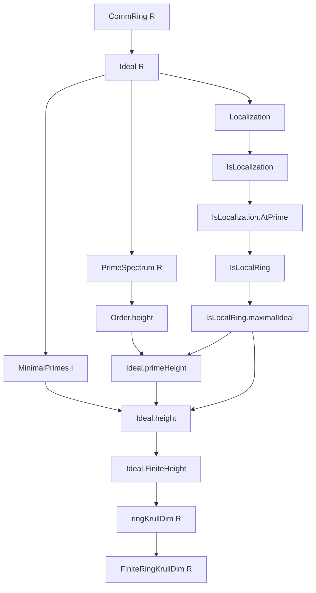
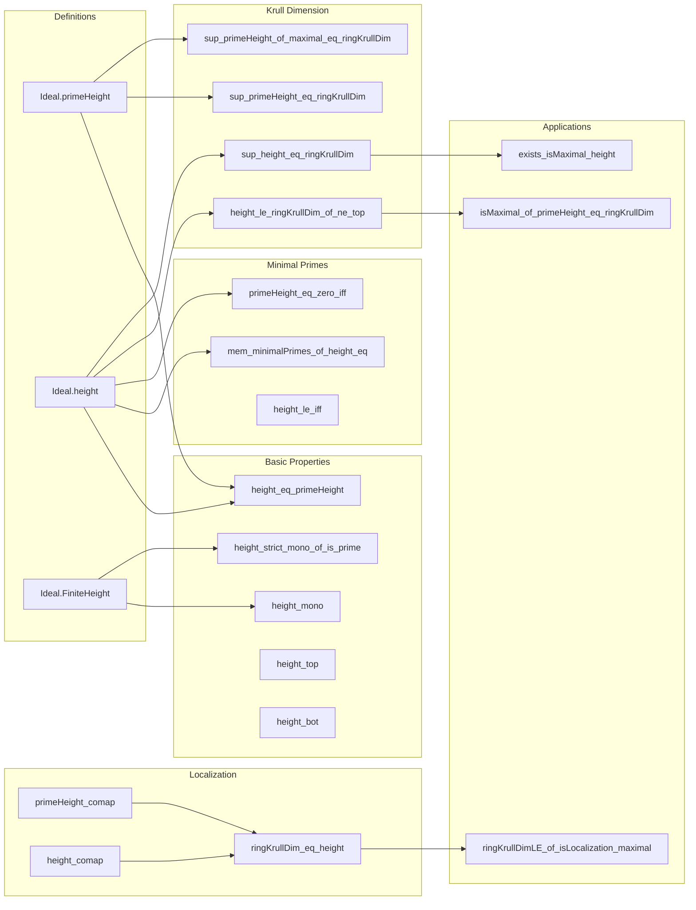

### Technical Brief: `Height.lean`

---

#### **1. Key Definitions & Theorems**

| Name | Type | Purpose |
|------|------|---------|
| `Ideal.primeHeight` | `[I.IsPrime] → ℕ∞` | Height of a prime ideal = supremum of lengths of strictly decreasing chains of primes below it (via `Order.height`). |
| `Ideal.height` | `I : Ideal R → ℕ∞` | Height of an arbitrary ideal = infimum of `primeHeight` over its minimal primes. |
| `Ideal.FiniteHeight` | `I : Ideal R → Prop` | Class stating `I = ⊤` or `I.height ≠ ⊤`. Enables finite-height reasoning. |
| `Ideal.height_eq_primeHeight` | `[I.IsPrime] : I.height = I.primeHeight` | For primes, height and prime height coincide. |
| `Ideal.height_le_ringKrullDim_of_ne_top` | `I ≠ ⊤ → I.height ≤ ringKrullDim R` | Height of any proper ideal ≤ Krull dimension. |
| `Ideal.exists_isMaximal_height` | `[FiniteRingKrullDim R] : ∃ m, m.IsMaximal ∧ m.height = ringKrullDim R` | In finite Krull dim, some maximal ideal attains the Krull dimension. |
| `Ideal.primeHeight_eq_zero_iff` | `[I.IsPrime] : I.primeHeight = 0 ↔ I ∈ minimalPrimes R` | Zero height ⇔ minimal prime. |
| `Ideal.height_bot` | `[Nontrivial R] : (⊥).height = 0` | Height of zero ideal is 0 in nontrivial rings. |
| `Ideal.height_top` | `(⊤).height = ⊤` | Unit ideal has infinite height. |
| `Ideal.height_mono` | `I ≤ J → I.height ≤ J.height` | Height is monotone w.r.t. inclusion. |
| `Ideal.height_strict_mono_of_is_prime` | `I < J, I.IsPrime, I.FiniteHeight → I.height < J.height` | Strict monotonicity for prime ideals. |
| `Ideal.mem_minimalPrimes_of_height_eq` | `I ≤ J, J.IsPrime, J.FiniteHeight, J.height ≤ I.height → J ∈ I.minimalPrimes` | Characterization of minimal primes via height equality. |
| `Ideal.isMaximal_of_primeHeight_eq_ringKrullDim` | `[FiniteRingKrullDim R], I.IsPrime, I.primeHeight = ringKrullDim R → I.IsMaximal` | Prime of maximal height is maximal. |
| `IsLocalization.primeHeight_comap` | `[J.IsPrime] : (J.comap f).primeHeight = J.primeHeight` | Prime height preserved under localization comap. |
| `IsLocalization.height_comap` | `(J.comap f).height = J.height` | Height preserved under localization comap. |
| `IsLocalization.AtPrime.ringKrullDim_eq_height` | `ringKrullDim A = I.height` | In localization at prime `I`, Krull dim = height of `I`. |
| `Ideal.sup_height_eq_ringKrullDim` | `[Nontrivial R] : ⨆ (I ≠ ⊤), I.height = ringKrullDim R` | Krull dim = sup of heights of all proper ideals. |
| `Ideal.sup_primeHeight_eq_ringKrullDim` | `[Nontrivial R] : ⨆ (I.IsPrime), I.primeHeight = ringKrullDim R` | Krull dim = sup of prime heights. |
| `Ideal.sup_primeHeight_of_maximal_eq_ringKrullDim` | `[Nontrivial R] : ⨆ (I.IsMaximal), I.primeHeight = ringKrullDim R` | Krull dim = sup of maximal ideal prime heights. |

---

#### **2. Naming Conventions**

- **Prefixes**:
  - `primeHeight_`: properties of `primeHeight`.
  - `height_`: properties of `height`.
  - `finiteHeight_`: properties of `FiniteHeight` class.
  - `mem_minimalPrimes_`: membership in minimal primes.
  - `exists_`: existence lemmas (e.g., chains, ideals).
  - `isMaximal_of_`, `isPrime_of_`: characterizations.

- **Suffixes**:
  - `_eq_zero_iff`, `_eq_iff`: biconditional characterizations.
  - `_mono`, `_strict_mono`: monotonicity/strict monotonicity.
  - `_comap`, `_map`: behavior under ring maps (especially localization).
  - `_top`, `_bot`: behavior on unit/zero ideal.
  - `_of_`: conditions (e.g., `height_mono_of_le`, `primeHeight_le_ringKrullDim`).

- **Special**:
  - `finiteHeight_iff`: `↔`-formulation of `FiniteHeight`.
  - `krullDimLE_of_`: used in dimension bounds.

---

#### **3. Tactic Stack**

| Tactic | Frequency | Role |
|--------|-----------|------|
| `simp_rw` | High | Rewriting with definitional equalities, especially `height_eq_primeHeight`, `minimalPrimes`, etc. |
| `rw` | High | General rewriting, often after `simp_rw`. |
| `exact`, `apply`, `refine` | High | Proof construction, especially with `iInf`, `iSup`, `le_antisymm`. |
| `gcongr` | Medium | For monotonicity lemmas (`height_mono`, `primeHeight_mono`). |
| `obtain` / `rcases` | High | Extracting witnesses from existential quantifiers (e.g., chains, minimal primes). |
| `norm_cast` | Medium | Handling `↑` coercions (e.g., `ℕ → ℕ∞`). |
| `push_cast`, `push_neg`, `push_iff` | Medium | Normalizing coercions/negations/iffs. |
| `convert` | Low | When target is definitionally close. |
| `grind` | Low | Custom tactic (likely project-specific). |
| `nontriviality` | Medium | To handle `Nontrivial R` assumptions. |
| `have`, `suffices` | High | Intermediate claims. |
| `by_cases` | Medium | Splitting on equality to `⊤`. |
| `convert` | Low | For equality chaining. |

---

#### **4. Proof Logic**

- **Inductive/Chain-based reasoning**:
  - Many proofs rely on chains of primes (via `LTSeries`, `RelSeries`, `Order.height`).
  - Use of `Order.height_le_coe_iff`, `Order.height_add_one_le`, `Order.height_strictMono`.

- **Minimal prime analysis**:
  - `I.minimalPrimes` is central; many lemmas relate `height I` to `primeHeight` of its minimal primes.
  - Use of `Ideal.exists_minimalPrimes_le`, `finite_minimalPrimes_of_isNoetherianRing`.

- **Localization & ring maps**:
  - Localization comap/map behavior is heavily used (`primeHeight_comap`, `height_comap`, `ringKrullDim_eq_of_ringEquiv`).
  - Localization at prime → local ring → maximal ideal height = Krull dim.

- **Dimension bounds**:
  - Krull dim = sup of heights (over primes/maximals/proper ideals).
  - Prove via `le_antisymm` + `iSup_le_iff` / `le_iSup`.

- **Finite-height reasoning**:
  - `FiniteHeight` class used to avoid `⊤` complications.
  - `finiteHeight_of_le`, `finiteHeight_of_finiteRingKrullDim`.

- **Strict monotonicity**:
  - For primes, `I < J ⇒ I.height + 1 ≤ J.height`, and with finite height ⇒ strict inequality.

---

#### **5. Imports**

| Module | Purpose |
|--------|---------|
| `Mathlib.Algebra.Module.SpanRank` | Used in `exists_spanRank_le_and_le_height_of_le_height`. |
| `Mathlib.RingTheory.Spectrum.Prime.Noetherian` | Prime spectrum in Noetherian rings (e.g., finite minimal primes). |
| `Mathlib.RingTheory.Ideal.MinimalPrime.Localization` | Minimal primes under localization. |

---

#### **6. Mermaid Diagrams**

##### **Dependency Graph (Core Concepts)**

##### **Overview of File Structure**

---

#### **7. Theory Context**

- **Main Theory**: *Krull dimension* and *height theory* in commutative algebra.
- **Scope**: Works in general `CommRing`, with emphasis on:
  - Noetherian rings (finite minimal primes, span rank arguments).
  - Localization (especially at primes, leading to local rings).
  - Dimension theory: Krull dim = sup of heights.
- **Key Connections**:
  - `Order.height` → `primeHeight`
  - `minimalsPrimes` → `height`
  - Localization → local rings → maximal ideal height = Krull dim.
  - Finite Krull dim ⇒ existence of maximal ideal attaining dim.

---

#### **8. Summary**

This file formalizes the *height* of ideals in a commutative ring, distinguishing between prime and general ideals. It leverages order-theoretic notions (`Order.height`) and localization theory to connect height with Krull dimension. The development is rich in monotonicity, minimality, and localization properties, with applications to dimension theory and local algebra. The proofs are highly structured, using chain arguments, minimal prime analysis, and careful handling of `⊤` via `FiniteHeight`.
