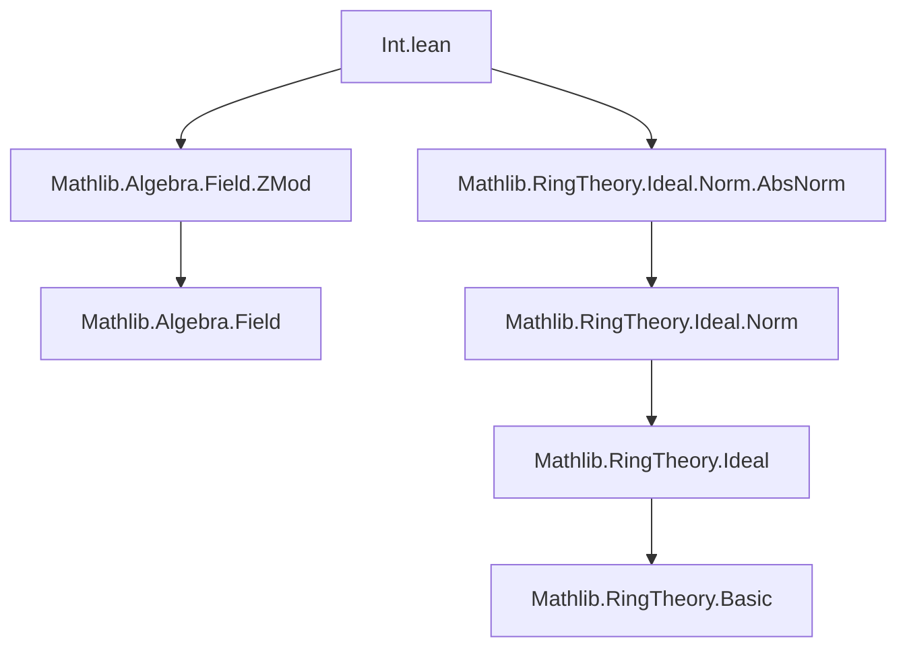
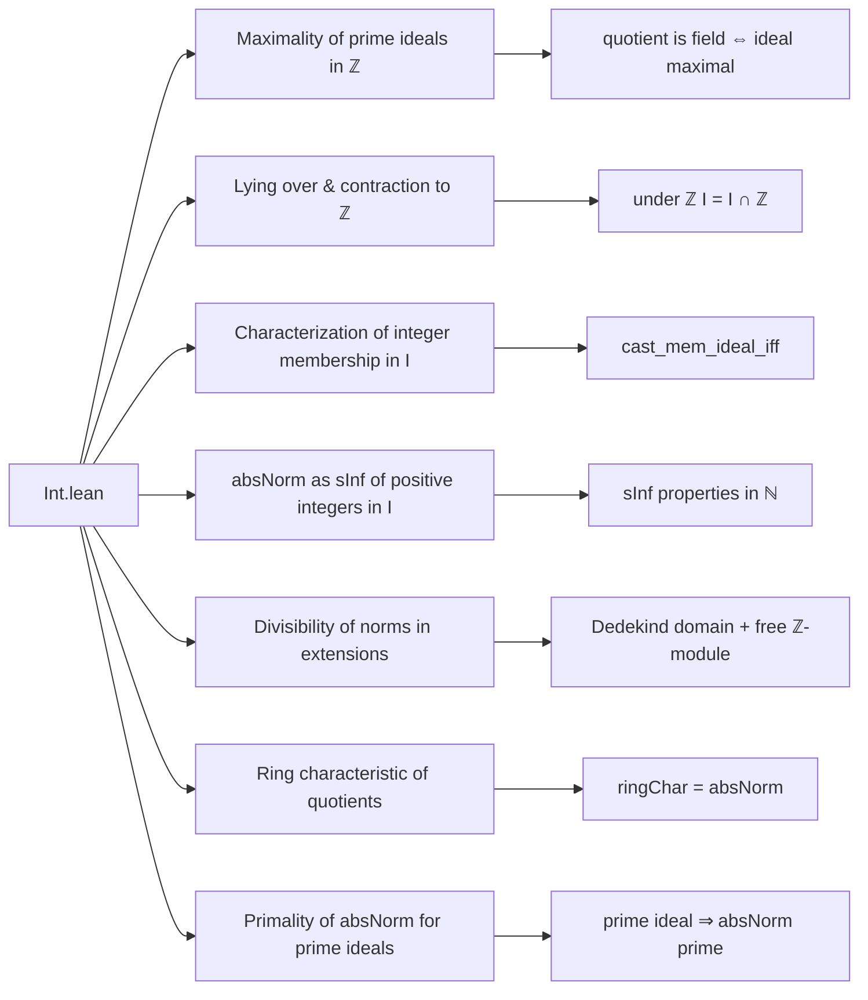

Here is the structured technical metadata extracted from the provided Lean 4 file `Int.lean`:

---

### **1. Key Definitions & Theorems**

| Name | Type / Signature | Purpose |
|------|------------------|---------|
| `Int.ideal_span_isMaximal_of_prime` | `(p : ℕ) [Fact (Nat.Prime p)] → (Ideal.span {(p : ℤ)}).IsMaximal` | Shows that the principal ideal generated by a prime number in `ℤ` is maximal. |
| `Int.liesOver_span_absNorm` | `I : Ideal R → I.LiesOver (Ideal.span {(absNorm (under ℤ I) : ℤ)})` | Proves that the ideal `I` lies over the principal ideal generated by its `absNorm` over `ℤ`. |
| `Int.cast_mem_ideal_iff` | `(d : R) ∈ I ↔ (absNorm (under ℤ I) : ℤ) ∣ d` | Characterizes membership of integers in `I` via divisibility by `absNorm (under ℤ I)`. |
| `Int.absNorm_under_mem` | `(absNorm (under ℤ I) : R) ∈ I` | States that the image of `absNorm (under ℤ I)` in `R` lies in `I`. |
| `Int.absNorm_under_eq_sInf` | `absNorm (under ℤ I) = sInf {d : ℕ | 0 < d ∧ (d : R) ∈ I}` | Identifies `absNorm (under ℤ I)` as the smallest positive integer in `I`. |
| `Int.absNorm_under_dvd_absNorm` | `absNorm (under ℤ I) ∣ absNorm I` (under Dedekind domain + free ℤ-module assumptions) | Relates the `ℤ`-norm of `I` to its absolute norm over `ℤ`. |
| `Ideal.ringChar_quot` | `ringChar (S ⧸ I) = absNorm (under ℤ I)` | Identifies the ring characteristic of the quotient `S/I` with `absNorm (under ℤ I)`. |
| `Nat.absNorm_under_prime` | `[P.IsPrime] [NeZero P] → (absNorm (under ℤ P)).Prime` | Shows that for a nonzero prime ideal `P`, the `absNorm` over `ℤ` is a prime natural number. |

---

### **2. Naming Conventions**

- **Prefixes**:
  - `absNorm_`: for functions/theorems about the absolute norm (smallest positive integer in an ideal).
  - `cast_`: for results involving coercion from `ℤ` or `ℕ` to a ring `R`.
  - `liesOver_`: for statements about lying over in integral extensions.
  - `under_`: for the contraction of an ideal to `ℤ` (i.e., `I ∩ ℤ`).
- **Suffixes**:
  - `_iff`: for biconditional characterizations.
  - `_eq_sInf`: for characterizations as infima.
  - `_dvd_`: for divisibility results.
  - `_prime`: for primality-related results.

---

### **3. Tactic Stack**

Frequently used tactics in proofs:
- `rw` — rewriting using equalities/definitions.
- `simp_rw` — simplification with rewriting.
- `by_cases` — case analysis on equalities or propositions.
- `by_contra!` — contradiction proof (with `not` introduction).
- `exact`, `refine`, `apply` — constructing proofs term-by-term.
- `have`, `set`, `obtain` — intermediate lemma introduction.
- `rw [← cast_natCast]`, `rw [← map_natCast]` — coercions management.
- `simp` / `simp_rw` — simplification using algebraic identities.
- `exact` / `infer_instance` — typeclass resolution.

---

### **4. Proof Logic**

- **Structure**: Most proofs follow a pattern of:
  1. **Reduction** via `rw` to simplify using definitions (`under_def`, `ideal_span_absNorm_eq_self`, etc.).
  2. **Case analysis** on whether `absNorm = 0` or not.
  3. **Set-theoretic arguments** (e.g., showing a set is empty or nonempty).
  4. **Divisibility reasoning** using `natCast_dvd_natCast`, `natCast_ne_zero`, etc.
  5. **Application of known lemmas** from `Mathlib` (e.g., `AddGroup.exponent_dvd_card`, `ringChar.eq_iff`).
- **Induction**: Not used directly here; relies on algebraic properties and lattice-theoretic facts (`sInf` properties).
- **Key logical flow**:
  - Prove membership ⇔ divisibility.
  - Use that to show minimality (`absNorm_under_eq_sInf`).
  - Use minimality to deduce divisibility of norms (`absNorm_under_dvd_absNorm`).
  - Use ring-theoretic properties (e.g., quotient ring structure) to link to characteristic and primality.

---

### **5. Imports**

- `Mathlib.Algebra.Field.ZMod`: Used for `Int.quotientSpanNatEquivZMod`, linking `ℤ/pℤ` to `ℤ/(p)` and field structure.
- `Mathlib.RingTheory.Ideal.Norm.AbsNorm`: Provides definitions and basic properties of `absNorm`, `under`, and related constructions.

---

### **6. Mermaid Diagrams**

#### **Dependency Graph (Module-Level)**

#### **Overview of File Content**

---

Let me know if you'd like a formal dependency graph for the *theorems* themselves or a proof dependency DAG.
