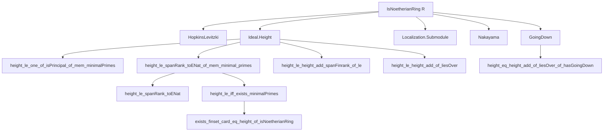
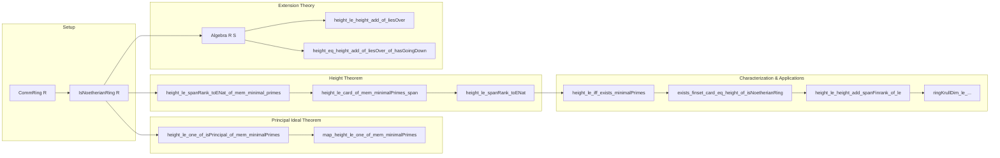

### Technical Brief: Krull’s Height Theorem in Lean 4

---

#### **1. Key Definitions & Theorems**

| Name | Type | Purpose |
|------|------|---------|
| `Ideal.height_le_one_of_isPrincipal_of_mem_minimalPrimes` | `∀ {R : CommRing} [IsNoetherianRing R] (I : Ideal R) [I.IsPrincipal] (p : Ideal R), p ∈ I.minimalPrimes → p.height ≤ 1` | **Krull’s Principal Ideal Theorem**: Prime ideals minimal over a principal ideal have height ≤ 1. |
| `Ideal.height_le_spanRank_toENat_of_mem_minimal_primes` | `∀ (I : Ideal R) (p : Ideal R), p ∈ I.minimalPrimes → p.height ≤ I.spanRank.toENat` | **Krull’s Height Theorem**: Prime ideals minimal over an ideal generated by `n` elements have height ≤ `n`. |
| `Ideal.height_le_spanRank_toENat` | `∀ (I : Ideal R), I ≠ ⊤ → I.height ≤ I.spanRank.toENat` | Corollary: Height of a proper ideal ≤ minimal number of generators (via `spanRank`). |
| `Ideal.height_le_iff_exists_minimalPrimes` | `p.height ≤ n ↔ ∃ I, p ∈ I.minimalPrimes ∧ I.spanRank ≤ n` | Characterization of height via minimal primes over finitely generated ideals. |
| `Ideal.exists_finset_card_eq_height_of_isNoetherianRing` | `∃ s : Finset R, p ∈ (span s).minimalPrimes ∧ s.card = p.height` | Existence of an ideal generated by exactly `p.height` elements having `p` as minimal prime. |
| `Ideal.height_le_height_add_spanFinrank_of_le` | `I ≤ p ⇒ p.height ≤ (p ⧸ I).height + I.spanFinrank` | Height decomposition over quotient + ideal. |
| `Ideal.height_le_height_add_of_liesOver` | `P.liesOver p ⇒ P.height ≤ p.height + (P ⧸ pS).height` | Height inequality for primes in integral extensions (Matsumura 13.B Th. 19 (1)). |
| `Ideal.height_eq_height_add_of_liesOver_of_hasGoingDown` | `[HasGoingDown R S] ⇒ P.height = p.height + (P ⧸ pS).height` | Equality version under going-down (Matsumura 13.B Th. 19 (2)). |

**Notation & Helpers**:
- `I.minimalPrimes`: Set of prime ideals minimal over `I`.
- `I.spanRank`: Minimal cardinality of a generating set of `I` (as a cardinal).
- `I.spanRank.toENat`: Embedding into `ℕ∞` (extended naturals).
- `I.spanFinrank`: Minimal number of generators when `I` is finitely generated (`ℕ`).
- `primeHeight p`: Height of prime `p` as a `PrimeSpectrum` point.
- `height_eq_primeHeight`: Equivalence of ideal height and prime height for primes.

---

#### **2. Naming Conventions**

- **Prefixes**:
  - `height_le_...`: Upper bounds on height.
  - `mem_minimalPrimes`: Membership in minimal primes over an ideal.
  - `isPrincipal`, `isPrime`, `liesOver`, `hasGoingDown`: Structural assumptions.
  - `quotient`, `map`, `comap`: Operations on ideals under ring maps.
- **Suffixes**:
  - `_of_mem_minimalPrimes`: Hypothesis that `p ∈ I.minimalPrimes`.
  - `_of_le`: Hypothesis `I ≤ p`.
  - `_of_liesOver`, `_of_hasGoingDown`: Extension-theoretic conditions.
  - `_of_isNoetherianRing`: Global Noetherian assumption.
- **Helper Lemmas**:
  - `map_height_le_one_of_mem_minimalPrimes`, `mem_minimalPrimes_span_of_mem_minimalPrimes_span_insert`: Inductive step tools.
  - `height_le_ringKrullDim_quotient_add_*`: Bounds via Krull dimension of quotients.

---

#### **3. Tactic Stack**

| Tactic | Usage Frequency | Purpose |
|--------|------------------|---------|
| `simp` / `simp_rw` | Very High | Simplify goals using definitional equalities, especially for `map`, `comap`, `quotient`, `span`, `radical`. |
| `rw` | Very High | Rewrite using lemmas like `height_eq_primeHeight`, `IsLocalization.height_comap`, `mk_ker`, etc. |
| `exact` / `refine` | High | Construct proofs using existing lemmas; often with `⟨...⟩` for existential goals. |
| `induction` | Medium | Strong induction on `s.card` in `height_le_spanRank_toENat_of_mem_minimal_primes`. |
| `convert` | Medium | Align goals with known lemmas (e.g., `height_le_spanRank_toENat_of_mem_minimal_primes`). |
| `grind` | Medium | Automated solving of arithmetic/inequality goals (custom tactic in Mathlib). |
| `aesop` / `linarith` | Low | Rarely used; most reasoning is algebraic. |
| `nontriviality`, `finiteHeight_iff`, `lt_irrefl` | Medium | Handle edge cases (nontriviality, finiteness, strict inequalities). |
| `convert_to` | Low | Adjust target type for norm_cast compatibility. |

---

#### **4. Proof Logic**

- **Inductive Structure**:
  - Base case: `n = 0` ⇒ `p.height = 0` ⇔ `p` is minimal ⇒ `p ∈ I.minimalPrimes` with `I = ⊥`.
  - Inductive step: For `s : Finset R`, `s.card = n+1`, write `s = insert x s'`, localize or quotient to reduce to principal case.
- **Localization Strategy**:
  - Reduce to local case via `Localization.AtPrime p`, where `p` becomes maximal.
  - Use `IsLocalRing.quotient_artinian_of_mem_minimalPrimes_of_isLocalRing` to get Artinian quotient ⇒ Krull dimension 0 ⇒ nilpotent maximal ideal.
  - Apply Nakayama/Jacobson radical arguments to show stabilization of powers ⇒ height ≤ 1.
- **Going-Down & Lifting Series**:
  - For equality in extension: construct strictly increasing chains in base and fiber, combine via `hasGoingDown` to lift chains.
  - Use `LTSeries` (long transfinite series of primes) to relate lengths (heights).
- **Decomposition Lemmas**:
  - `height_le_height_add_spanFinrank_of_le`: Factor height via quotient + ideal.
  - `height_le_height_add_of_liesOver`: Fibered version for ring extensions.

---

#### **5. Imports & Dependencies**

| Module | Role |
|--------|------|
| `Mathlib.RingTheory.HopkinsLevitzki` | Artinian ↔ Krull dim 0 for Noetherian rings. |
| `Mathlib.RingTheory.Ideal.GoingDown` | Going-down property, lying-over, incomparability. |
| `Mathlib.RingTheory.Ideal.Height` | Definitions: `height`, `primeHeight`, `finiteHeight`, `krullDim`. |
| `Mathlib.RingTheory.Localization.Submodule` | Localization of modules/ideals, behavior of height under localization. |
| `Mathlib.RingTheory.Nakayama` | Nakayama’s lemma, Jacobson radical, applications to generation. |

**Key Supporting Theories**:
- `PrimeSpectrum`, `Localization`, `Radical`, `Quotient`, `Span`, `Minimals`, `KrullDimension`.

---

#### **6. Mermaid Diagrams**

##### **Dependency Graph (Core Theorems)**

##### **Overview of File Structure**

---

#### **7. Theory Scope**

- **Scope**: Commutative Noetherian algebra, with emphasis on:
  - Dimension theory (Krull dimension, height).
  - Behavior under localization, quotient, and ring extensions.
  - Constructive aspects (existence of minimal generating sets, finite height).
- **Place in Mathlib**:
  - Part of `RingTheory` hierarchy, following `KrullDimension.lean`, `Height.lean`.
  - Builds on `Localization`, `GoingDown`, `HopkinsLevitzki`, `Nakayama`.
  - Enables proofs of dimension formulas in algebraic geometry (e.g., fibers, going-down).

---

#### **8. Notes on Formalization Quality**

- **Precision**: All theorems distinguish between `spanRank` (cardinal), `spanFinrank` (natural), and `toENat` embeddings.
- **Modularity**: Local-to-global reduction via localization is cleanly abstracted.
- **Stacks Tagging**: Explicit references to [Stacks Project](https://stacks.math.columbia.edu/) tags (`00OM`, `00ON`) for cross-verification.
- **Constructive Flavor**: Lemmas like `exists_finset_card_eq_height_of_isNoetherianRing` provide explicit finite witnesses.

--- 

This file is a cornerstone of dimension theory in Lean, enabling rigorous algebraic geometry developments (e.g., dimension of schemes, fiber dimensions).
