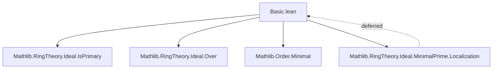
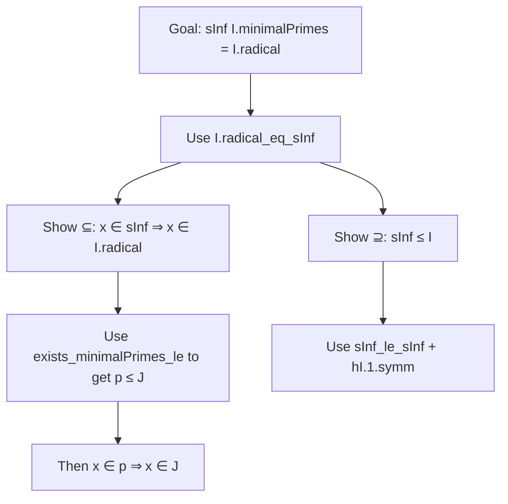

### Technical Brief: `Basic.lean` — Minimal Primes in Lean 4

---

#### **1. Key Definitions & Theorems**

| Name | Type / Signature | Purpose |
|------|------------------|---------|
| `Ideal.minimalPrimes` | `I.minimalPrimes : Set (Ideal R)` | Set of ideals minimal among primes *over* `I`. Formally: `{p | Minimal (fun q ↦ q.IsPrime ∧ I ≤ q) p}` |
| `minimalPrimes R` | `minimalPrimes : Set (Ideal R)` | Minimal primes of the ring `R`, defined as `Ideal.minimalPrimes ⊥` |
| `Ideal.exists_minimalPrimes_le` | `∀ {J}, J.IsPrime → I ≤ J → ∃ p ∈ I.minimalPrimes, p ≤ J` | Every prime over `I` contains a minimal prime over `I` (Zorn’s Lemma application) |
| `Ideal.radical_minimalPrimes` | `I.radical.minimalPrimes = I.minimalPrimes` | Minimal primes over `I` and over `I.radical` coincide |
| `Ideal.sInf_minimalPrimes` | `sInf I.minimalPrimes = I.radical` | Radical of `I` equals intersection of its minimal primes over `I` |
| `Ideal.minimalPrimes_eq_subsingleton` | `I.IsPrimary → I.minimalPrimes = {I.radical}` | For primary ideals, only one minimal prime (its radical) |
| `Ideal.minimalPrimes_eq_subsingleton_self` | `I.IsPrime → I.minimalPrimes = {I}` | For prime ideals, the only minimal prime over itself is itself |
| `IsDomain.minimalPrimes_eq_singleton_bot` | `[IsDomain R] → minimalPrimes R = {⊥}` | In a domain, the only minimal prime is `⊥` |
| `Ideal.minimalPrimes_top` | `(⊤).minimalPrimes = ∅` | The unit ideal has no minimal primes |
| `Ideal.minimalPrimes_eq_empty_iff` | `I.minimalPrimes = ∅ ↔ I = ⊤` | Characterization of when minimal primes are empty |
| `Ideal.mem_minimalPrimes_sup` | Under quotient conditions, primality lifts to sup | Lifting minimal primes through quotient + sup |
| `Ideal.map_sup_mem_minimalPrimes_of_map_quotientMk_mem_minimalPrimes` | Lifting minimal primes along algebra maps | Generalization of previous to base change |

---

#### **2. Naming Conventions**

- **Prefixes**:
  - `is_`: e.g., `IsPrimary`, `IsPrime`, `IsDomain` — typeclass predicates.
  - `mem_`: e.g., `mem_minimalPrimes_sup` — membership in a set.
  - `map_`, `comap_`, `quotientMk`: standard ideal operations.
  - `radical_`: e.g., `radical_minimalPrimes`, `radical_eq_sInf`.
  - `minimalPrimes_`: e.g., `minimalPrimes_eq_subsingleton`, `minimalPrimes_top`.

- **Suffixes**:
  - `_eq_subsingleton`: indicates singleton equality (often via uniqueness).
  - `_eq_empty_iff`: biconditional with emptiness.
  - `_le`: indicates containment or lifting along ≤.
  - `_sup`: indicates behavior under supremum (join) of ideals.

- **General pattern**: `Ideal.[action]_[condition]_[result]`, e.g., `mem_minimalPrimes_sup`.

---

#### **3. Tactic Stack**

Frequent tactics used in proofs:

| Tactic | Usage |
|--------|-------|
| `rw` / `simp` / `simp_rw` | Rewriting definitions (`Ideal.minimalPrimes`, `radical`, `sInf`, etc.) |
| `exact` / `assumption` | Closing goals directly from hypotheses |
| `apply zorn_le_nonempty₀` | Zorn’s Lemma for existence of maximal elements in chains |
| `convert`, `congr_arg` | Equality proofs via congruence or conversion |
| `intro`, `rintro`, `obtain` | Introducing or destructuring hypotheses |
| `ext` | Extensionality for set equality |
| `apply le_antisymm` | Proving equality of ideals via mutual inclusion |
| `simpa` / `simp only [...] at *` | Simplifying under assumptions |
| `convert`, `symm`, `trans` | Equality manipulation |
| `by_contra` | Proof by contradiction (e.g., `eq_bot_of_minimalPrimes_eq_empty`) |

---

#### **4. Proof Logic**

- **Inductive/Existence Proofs**:
  - Use Zorn’s Lemma (`zorn_le_nonempty₀`) to get maximal elements in a chain of primes over `I`, then dualize to get minimal ones.
  - `exists_minimalPrimes_le`: chain condition on primes over `I` in the opposite category (`(Ideal R)ᵒᵈ`) ensures existence of minimal elements.

- **Uniqueness Proofs**:
  - For primary/prime ideals, minimality + containment implies equality via `antisymm`.
  - E.g., `minimalPrimes_eq_subsingleton`: if `p` is minimal over primary `I`, then `p = I.radical`.

- **Radical Characterization**:
  - `radical_minimalPrimes`: uses `radical_le_iff` to swap between `I ≤ p` and `I.radical ≤ p`.
  - `sInf_minimalPrimes`: shows intersection of minimal primes = radical via double inclusion.

- **Quotient & Sup Lifting**:
  - Use properties of `map`/`comap` under quotient maps (`comap_map_quotientMk`, `map_mono`).
  - `mem_minimalPrimes_sup`: lifts minimal primality from quotient to sup via monotonicity and primality preservation.

---

#### **5. Imports**

| Module | Purpose |
|--------|---------|
| `Mathlib.RingTheory.Ideal.IsPrimary` | For `IsPrimary`, `isPrime_radical`, radical properties |
| `Mathlib.RingTheory.Ideal.Over` | For `LiesOver`, `over`, `under` — lying-over theory |
| `Mathlib.Order.Minimal` | For `Minimal`, `Maximal`, and order-theoretic minimality machinery |

> **Note**: Localization theory is deferred to `Mathlib/RingTheory/Ideal/MinimalPrime/Localization.lean`.

---

#### **6. Mermaid Diagrams**

##### **Dependency Graph (Module-Level)**



##### **Conceptual Overview (Theory Flow)**

```mermaid
graph LR
  I[Ideal I] -->|minimalPrimes I| P[Set of minimal primes over I]
  P -->|exists_minimalPrimes_le| Q[Every prime over I contains one]
  P -->|sInf_minimalPrimes| R[Radical of I]
  I -->|radical_minimalPrimes| R
  I -->|primary| S[Unique minimal prime = radical]
  I -->|prime| T[Unique minimal prime = itself]
  R -->|IsDomain| U[Minimal primes = {⊥}]
  I -->|top| V[No minimal primes]
```

##### **Proof Strategy Flow (Example: `sInf_minimalPrimes`)**



---

#### **7. Summary**

This file formalizes foundational results about **minimal primes over an ideal** in a commutative semiring/ring. It leverages:
- Order-theoretic minimality (`Minimal`),
- Ideal-theoretic operations (`radical`, `sInf`, `map`, `quotient`),
- Classical tools like Zorn’s Lemma,
- And structural properties (primary, prime, domain).

It sets the stage for deeper results in localization (deferred), and is essential for dimension theory, primary decomposition, and algebraic geometry applications.

--- 

Let me know if you'd like a formalized dependency graph (e.g., for `leanproject`), or a visualization of the proof DAG for a specific theorem.
