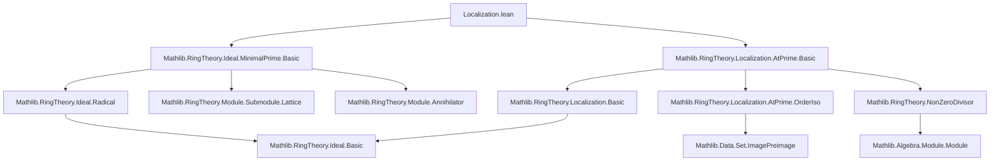

### Technical Brief: Localization.lean — Minimal Primes and Localization

---

#### **1. Key Definitions & Theorems**

| Name | Type / Signature | Purpose |
|------|------------------|---------|
| `Ideal.minimalPrimes` | `Ideal R → Set (Ideal R)` | Set of minimal primes *over* an ideal `I`, i.e., minimal elements in `{ p ∈ Ideal R | I ≤ p ∧ p.IsPrime }` under inclusion. |
| `Ideal.comap f p` | `Ideal S → R →+* S → Ideal R` | Preimage of an ideal along a ring homomorphism `f`. |
| `Ideal.map f I` | `Ideal R → R →+* S → Ideal S` | Extension of an ideal along `f`. |
| `IsLocalization S A` | Class | `A` is a localization of `R` at submonoid `S`. |
| `Localization.AtPrime p` | `p : Ideal R` with `p.IsPrime` → `CommRing` | Localization of `R` at the complement of `p`. |

**Main Theorems:**

| Name | Type | Purpose |
|------|------|---------|
| `Ideal.iUnion_minimalPrimes` | `⋃ p ∈ I.minimalPrimes, p = { x | ∃ y ∉ I.radical, x * y ∈ I.radical }` | Describes union of minimal primes over `I` in terms of radical elements. |
| `Ideal.exists_minimalPrimes_comap_eq` | `p ∈ (I.comap f).minimalPrimes ⇒ ∃ p' ∈ I.minimalPrimes, comap f p' = p` | Lifts minimal primes over a pullback ideal to minimal primes over the original ideal. |
| `Ideal.minimalPrimes_eq_comap` | `I.minimalPrimes = comap (quotient.mk I) '' minimalPrimes (R ⧸ I)` | Minimal primes over `I` correspond bijectively to minimal primes of the quotient `R/I`. |
| `IsLocalization.minimalPrimes_comap` | `(J.comap f).minimalPrimes = comap f '' J.minimalPrimes` | For localization `f : R → A`, minimal primes over `J.comap f` are preimages of minimal primes over `J`. |
| `IsLocalization.minimalPrimes_map` | `(J.map f).minimalPrimes = comap f ⁻¹' J.minimalPrimes` | For localization `f : R → A`, minimal primes over `J.map f` are exactly those whose preimage is minimal over `J`. |
| `Localization.AtPrime.prime_unique_of_minimal` *(not in file but referenced in docstring)* | `p ∈ minimalPrimes R ⇒ (Localization.AtPrime p).primeSpectrum.card = 1` | Localizing at a minimal prime yields a ring with a unique prime ideal (i.e., a local ring with nilradical = maximal ideal). |

---

#### **2. Naming Conventions**

- **`minimalPrimes`**: Used for sets of minimal primes *over* an ideal (`I.minimalPrimes`) or over the zero ideal (`minimalPrimes R`).
- **`comap` / `map`**: Standard for preimage/extension of ideals along ring maps.
- **`exists_*_comap_eq` / `exists_*_map_eq`**: Existence of lifts or extensions of minimal primes under pullback/pushforward.
- **`_eq_comap` / `_eq_map`**: Equality of sets of minimal primes under pullback/pushforward.
- **`_of_*` suffix**: Conditions on the map (e.g., `of_surjective`, `of_injective`, `of_minimal`).
- **`disjoint_nonZeroDivisors`**: Relates minimal primes to zero-divisors.

Prefixes like `Ideal.`, `IsLocalization.`, `Localization.AtPrime.` indicate module of definition.

---

#### **3. Tactic Stack**

Frequently used tactics in proofs:

| Tactic | Role |
|--------|------|
| `ext` | Extensionality for set equality (e.g., `⋃`, image/preimage). |
| `simp only [...]` | Simplify using precise lemmas (e.g., `Set.mem_iUnion`, `Ideal.mem_map_of_mem`, etc.). |
| `rw [...] at *` | Rewrite using equivalences (e.g., `Ideal.radical_eq_sInf`, `IsLocalization.mem_map_algebraMap_iff`). |
| `obtain ⟨...⟩` | Destruct existential/universal hypotheses. |
| `exact`, `apply`, `refine` | Construct proofs stepwise, often with holes filled later (`?_`). |
| `convert` / `apply Ideal.le_antisymm` | Prove equality of ideals via mutual inclusion. |
| `ring`, `linarith`, `aesop` | Arithmetic and linear reasoning (used sparingly; more `ring` and `simp`). |
| `convert ... using n` | Match goal up to `n` subgoals. |
| `set_tac` (via `Set.` lemmas) | Set-theoretic manipulations (e.g., `image_preimage_eq_iff`, `subset_trans`). |

Notably, heavy use of `IsLocalization` lemmas like `eq_iff_exists`, `mem_map_algebraMap_iff`, `map_comap`, etc.

---

#### **4. Proof Logic**

**General proof strategy:**

1. **Set equality via extensionality (`ext x`)**: Prove membership equivalence.
2. **Radical & minimal prime interplay**: Use `Ideal.radical_eq_sInf`, `I.minimalPrimes` as minimal elements in primes ≥ `I`.
3. **Localization-specific tools**:
   - `IsLocalization.isPrime_iff_isPrime_disjoint`: Characterizes primes in localization.
   - `IsLocalization.mem_map_algebraMap_iff`, `eq_iff_exists`: Describe elements in localized rings.
   - `comap_map` identities under surjectivity/injectivity/disjointness.
4. **Inductive/minimal choice**: Use `Nat.find` to extract minimal exponent in radical membership (e.g., in `Ideal.exists_mul_mem_of_mem_minimalPrimes`).
5. **Disjointness arguments**: `Disjoint (S : Set R) I` ↔ `S ∩ I = ∅`, crucial for primes in localization.

**Typical flow**:
- Assume `p ∈ I.minimalPrimes`.
- Use minimality to force inclusion/exclusion.
- Lift to localization via `algebraMap`, use properties of `S = p.primeCompl`.
- Pull back via `comap` and use monotonicity/injectivity/surjectivity lemmas.

---

#### **5. Imports & Dependencies**

**Core imports**:
```lean
import Mathlib.RingTheory.Ideal.MinimalPrime.Basic
import Mathlib.RingTheory.Localization.AtPrime.Basic
```

**Implicit dependencies** (via `Mathlib` hierarchy):
- `Mathlib.RingTheory.Ideal.Radical`
- `Mathlib.RingTheory.Localization.Basic`
- `Mathlib.RingTheory.Localization.AtPrime.OrderIso`
- `Mathlib.RingTheory.Module.Annihilator`
- `Mathlib.RingTheory.NonZeroDivisor`
- `Mathlib.RingTheory.Quotient`
- `Mathlib.Algebra.Module.Submodule.Map`
- `Mathlib.Data.Set.ImagePreimage`

These provide foundational lemmas on radicals, annihilators, non-zero divisors, and localization.

---

#### **6. Mermaid Diagrams**

##### **Dependency Graph (High-Level)**



##### **Overview of Theory Flow**

```mermaid
flowchart LR
  subgraph Theory
    I[Ideal I] --> M[I.minimalPrimes]
    M --> U[Union = radical-related set]
    M --> E[exists_mul_mem_of_mem_minimalPrimes]
    E --> Z[Zero divisors contain minimal primes]
    
    R[Ring R] --> L[Localization A = S⁻¹R]
    L --> C[comap: ideals of A → ideals of R]
    L --> M_map[map: ideals of R → ideals of A]
    
    C -->|IsLocalization.minimalPrimes_comap| J[J ⊆ A] --> M_A[J.minimalPrimes]
    M_A -->|pullback| M_R[(J.comap f).minimalPrimes]
    
    M -->|quotient| Q[R/I] --> M_Q[minimalPrimes (R/I)]
    M_Q -->|comap mk| M
    
    R -->|surj f| S[Ring S]
    S --> M_S[J ⊆ S] -->|hf surj| M_R[(J.comap f).minimalPrimes]
  end
```

---

#### **7. Summary**

This module formalizes the interaction between **minimal primes over an ideal** and **localization**, establishing:
- A correspondence between minimal primes over `I` and those over `R/I`.
- Behavior under pullback (`comap`) and pushforward (`map`) for localization maps.
- Structural properties (e.g., uniqueness of prime in localization at a minimal prime).
- Applications to zero-divisors and regular elements.

It leverages deep properties of localization (e.g., prime correspondence, disjointness with multiplicative sets) and minimal prime minimality (via radical membership and exponent minimality). The proofs are highly structured, using set-theoretic extensionality, ideal monotonicity, and localization-specific equivalences.

--- 

Let me know if you'd like a formalized dependency graph (e.g., `.lean`-level imports) or a tactic-level proof trace for a specific theorem.
