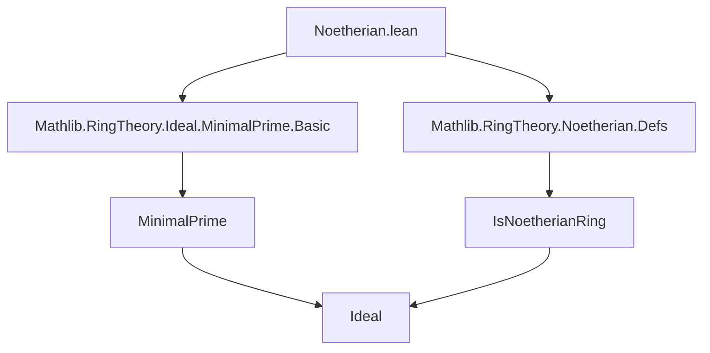
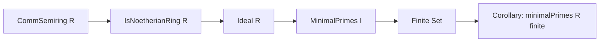

**Technical Brief: `Noetherian.lean`**

---

### 1. **Key Definitions & Theorems**

| Name | Type | Purpose |
|------|------|---------|
| `Ideal.minimalPrimes` | `Ideal R → Set (Ideal R)` | Returns the set of *minimal primes* over a given ideal $I$, i.e., prime ideals $P \supseteq I$ minimal under inclusion among such primes. |
| `Ideal.finite_minimalPrimes_of_isNoetherianRing` | `∀ I : Ideal R, I.minimalPrimes.Finite` | Main theorem: In a Noetherian commutative semiring $R$, every ideal has only finitely many minimal primes above it. |
| `minimalPrimes.finite_of_isNoetherianRing` | `(minimalPrimes R).Finite` | Corollary: The set of *all* minimal prime ideals of $R$ is finite (applied to $I = \bot$). |

---

### 2. **Naming Conventions**

- **Prefixes**:
  - `finite_...`: Indicates finiteness of a set (e.g., `finite_minimalPrimes`).
  - `is_...`: Predicate-style (e.g., `IsNoetherianRing`).
- **Suffixes**:
  - `_of_...`: Indicates dependence on a structure or property (e.g., `of_isNoetherianRing`, `of_isNoetherianRing`).
- **Constants**:
  - `hI`, `hmax`, `h1`, `h2`: Standard hypothesis naming in Lean proofs.
  - `hp`, `hx`, `hy`: Local hypotheses in the proof.

---

### 3. **Tactic Stack**

| Tactic | Usage |
|--------|-------|
| `by_contra` | To assume the negation of the goal (for contradiction). |
| `obtain ⟨...⟩` | To extract witnesses from existential or universal negations. |
| `simp only [...] at ...` | To simplify hypotheses using specific lemmas (e.g., `minimalPrimes_eq_subsingleton_self`, `minimalPrimes_top`). |
| `contrapose!` | To flip implication and simplify negated goals. |
| `rw [...] at ...` | To rewrite using equivalences (e.g., `← Ideal.span_singleton_le_iff_mem`, `← left_lt_sup`). |
| `refine ...` | To construct a term with holes (e.g., `?_` for subgoals). |
| `rcases ... with ...` | To destruct conjunctions/disjunctions (e.g., `hp.2 (hI h)` yields `hxp | hyp`). |
| `union`, `subset`, `fun ... ↦ ...` | Set-theoretic reasoning and lambda abstraction in proofs. |

---

### 4. **Proof Logic**

The proof proceeds by **contradiction + maximal counterexample**:

1. Assume infinitely many minimal primes over $I$.
2. Use the *Noetherian condition* (`set_has_maximal_iff_noetherian.mpr`) to get a *maximal* ideal $I$ with infinitely many minimal primes.
3. Show $I$ is not prime and not the unit ideal:
   - If $I$ were prime, it would be the unique minimal prime over itself ⇒ contradiction.
   - If $I = \top$, then only one minimal prime ($\top$) ⇒ contradiction.
4. Use `not_isPrime_iff` to get $x, y \notin I$ with $xy \in I$.
5. Lift to ideals: $(x) + I \subsetneq J$, $(y) + I \subsetneq K$, with $J \cup K \supseteq I$.
6. Any minimal prime over $I$ must contain $(x)$ or $(y)$, so lies over one of the two larger ideals.
7. By maximality of $I$, each of those has only finitely many minimal primes over $I$ ⇒ contradiction.

The final corollary follows by applying the lemma to $I = \bot$.

---

### 5. **Imports**

| Import | Purpose |
|--------|---------|
| `Mathlib.RingTheory.Ideal.MinimalPrime.Basic` | Defines `minimalPrimes`, basic properties of minimal primes over an ideal. |
| `Mathlib.RingTheory.Noetherian.Defs` | Defines `IsNoetherianRing`, related finiteness conditions. |

No use of `PrimeSpectrum` — avoids heavy topological machinery.

---

### 6. **Mermaid Diagrams**

#### **Dependency Graph (Module-Level)**



#### **Overview of Theoretical Flow**



#### **Proof Strategy Flow**

```mermaid
graph TD
  G[Assume infinite minimal primes over I] --> H[Maximal counterexample I]
  H --> I[Show I not prime & not ⊤]
  I --> J[Get x,y ∉ I with xy ∈ I]
  J --> K[Use sup decomposition]
  K --> L[Minimal primes over I split over (x)+I or (y)+I]
  L --> M[Contradiction via maximality]
```

--- 

Let me know if you'd like a formalization-level dependency graph (e.g., `leanpkg` or `lake`-style), or a comparison with `PrimeSpectrum`-based approaches.
