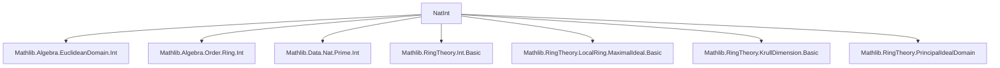

**Technical Brief: `NatInt.lean` — Prime Ideals in ℕ and ℤ**

---

### 1. **Key Definitions & Theorems**

| Name | Type / Signature | Purpose |
|------|------------------|---------|
| `IsLocalRing ℕ` | `instance` | Shows ℕ is a local semiring; maximal ideal = {1}ᶜ |
| `Nat.mem_maximalIdeal_iff` | `n ∈ maximalIdeal ℕ ↔ n ≠ 1` | Characterizes membership in the maximal ideal of ℕ |
| `Nat.coe_maximalIdeal` | `(maximalIdeal ℕ : Set ℕ) = {1}ᶜ` | Explicit description of maximal ideal as complement of {1} |
| `Nat.maximalIdeal_eq_span_two_three` | `maximalIdeal ℕ = span {2, 3}` | Shows maximal ideal is generated by {2, 3} |
| `Nat.one_mem_span_iff` | `1 ∈ span s ↔ 1 ∈ s` | Criterion for unit membership in span over ℕ |
| `Nat.one_mem_closure_iff` | `1 ∈ AddSubmonoid.closure s ↔ 1 ∈ s` | Same for additive monoid closure |
| `Ideal.isPrime_nat_iff` | `P.IsPrime ↔ P = ⊥ ∨ P = maximalIdeal ℕ ∨ ∃ p : ℕ, p.Prime ∧ P = span {p}` | Full classification of prime ideals in ℕ |
| `Ideal.map_comap_natCastRingHom_int` | `(I.comap (Nat.castRingHom ℤ)).map (Nat.castRingHom ℤ) = I` | Retraction property of extension–contraction along ℤ ← ℕ |
| `Ideal.isPrime_int_iff` | `P.IsPrime ↔ P = ⊥ ∨ ∃ p : ℕ, p.Prime ∧ P = span {(p : ℤ)}` | Classification of prime ideals in ℤ |
| `ringKrullDim_nat` | `ringKrullDim ℕ = 2` | Computes Krull dimension of ℕ as 2 |

---

### 2. **Naming Conventions**

- **Prefixes**:
  - `isPrime_`: predicates primality of ideals (`isPrime_nat_iff`, `isPrime_int_iff`)
  - `mem_`: membership in distinguished sets (`mem_maximalIdeal_iff`)
  - `one_mem_`: unit membership in algebraic closures (`one_mem_span_iff`, `one_mem_closure_iff`)
  - `coe_`: coercion of sets (`coe_maximalIdeal`)
  - `map_comap_`: behavior of extension/contraction of ideals (`map_comap_natCastRingHom_int`)
- **Suffixes**:
  - `_iff`: biconditional characterizations
  - `_nat`, `_int`: domain-specific variants (ℕ vs ℤ)
- **Constants**:
  - `maximalIdeal`, `span`, `bot`, `top`, `asIdeal`, `natAbs`, `sign`

---

### 3. **Tactic Stack**

Frequently used tactics in proofs:

| Tactic | Role |
|--------|------|
| `simp` / `simp_rw` | Simplification using definitional equalities and lemmas |
| `aesop` / `lia` | Automatic reasoning for linear arithmetic and basic logic |
| `rw` / `rwa` | Rewriting using equalities, with `*`-context |
| `exact`, `apply`, `intro`, `cases`, `obtain`, `push_neg` | Standard proof structure |
| `refine`, `le_antisymm`, `antisymm` | Constructing equality via double inequality |
| `SetLike.mem_coe`, `Set.mem_compl_iff`, `Set.singleton_subset_iff` | Set-theoretic manipulations |
| `span_le`, `mem_span_pair`, `span_singleton_lt_span_singleton.mp` | Ideal span properties |
| `mul_mem_left`, `mul_mem_right`, `add_mem`, `mem_of_pow_mem` | Ideal membership closure properties |
| `find_spec`, `find_min`, `exists_add_mul_eq_of_gcd_dvd_of_mul_pred_le` | Number-theoretic lemmas (Bezout-type) |

---

### 4. **Proof Logic**

- **Structure of `isPrime_nat_iff`**:
  - *Forward direction*: Assume `P` prime. If `P ≠ ⊥`, pick minimal nonzero `p ∈ P`. Show `p` is prime (via minimal counterexample argument). Then either `P = span {p}` or `P = maximalIdeal ℕ` (if no such `p` exists).
  - *Backward direction*: Check each case:
    - `⊥` is prime (domain),
    - `maximalIdeal ℕ` is maximal ⇒ prime,
    - `span {p}` with `p` prime ⇒ prime ideal (since ℤ is UFD and ℕ injects into ℤ).
- **Structure of `isPrime_int_iff`**:
  - Uses that ℤ is a PID with no zero divisors ⇒ prime ideals are generated by prime or 0.
  - Relates ℤ-prime ideals to ℕ-prime ideals via `natAbs`.
- **Krull dimension proof**:
  - Upper bound: Any strictly increasing chain of prime ideals in ℕ has length ≤ 2 (via `isPrime_nat_iff` and properties of span containment).
  - Lower bound: Exhibit chain `⊥ < span{2} < maximalIdeal ℕ`.

---

### 5. **Imports & Dependencies**

| Module | Purpose |
|--------|---------|
| `Mathlib.Algebra.EuclideanDomain.Int` | ℤ is a Euclidean domain ⇒ PID ⇒ UFD |
| `Mathlib.Algebra.Order.Ring.Int` | Ordered ring structure on ℤ |
| `Mathlib.Data.Nat.Prime.Int` | Interaction between natural and integer primes |
| `Mathlib.RingTheory.Int.Basic` | Basic ring theory of ℤ |
| `Mathlib.RingTheory.LocalRing.MaximalIdeal.Basic` | Local rings, maximal ideals |
| `Mathlib.RingTheory.KrullDimension.Basic` | Krull dimension definitions and lemmas |
| `Mathlib.RingTheory.PrincipalIdealDomain` | PID properties (used in `isPrime_int_iff`) |

---

### 6. **Mermaid Diagrams**

#### **Dependency Graph (Module-Level)**



#### **Conceptual Overview of Theory Flow**

```mermaid
flowchart LR
  A[ℕ is local semiring] --> B[maximalIdeal ℕ = {1}ᶜ = span{2,3}]
  B --> C[Classification of prime ideals in ℕ]
  D[ℤ is PID, no zero divisors] --> E[Classification of prime ideals in ℤ]
  C --> F[ringKrullDim ℕ = 2]
  E --> F
  C -->|via natAbs| E
```

#### **Ideal Lattice of ℕ (schematic)**

```mermaid
flowchart TD
  Bot[⊥ = span{0}] --> Span2[span{2}] --> Max[maximalIdeal = span{2,3}]
  Bot --> Span3[span{3}] --> Max
  Span2 --> Span6[span{6}] --> Max
  Span3 --> Span6
  style Bot fill:#f9f,stroke:#333
  style Span2 fill:#bbf,stroke:#333
  style Span3 fill:#bbf,stroke:#333
  style Max fill:#f96,stroke:#333
```

> Note: Only prime ideals are shown in bold/colored; non-prime ideals (e.g., `span{6}`) lie below `maximalIdeal` but are not prime.

---

### 7. **Key Lemmas & Proof Techniques**

- **Bezout-style lemma**: `exists_add_mul_eq_of_gcd_dvd_of_mul_pred_le` used to express numbers as combinations of generators.
- **Minimal counterexample argument**: To prove `p` is prime, assume `p = ab` with `a,b > 1`, derive contradiction via minimality of `p ∈ P`.
- **Retraction via `map_comap_natCastRingHom_int`**: Shows extension–contraction along ℤ ← ℕ is identity on ideals of ℤ.
- **Krull dimension via chain analysis**: Uses `isPrime_nat_iff` to enumerate all possible prime ideals and show no chain longer than 2 exists.

---

### 8. **Summary**

This module establishes a complete classification of prime ideals in the semiring ℕ and the ring ℤ, leveraging:
- Local semiring structure of ℕ,
- PID structure of ℤ,
- Number-theoretic properties (gcd, primality, Bezout),
- Ideal-theoretic tools (span, containment, primality criteria).

It culminates in a rigorous proof that `ringKrullDim ℕ = 2`, distinguishing ℕ from ℤ (which has Krull dimension 1).
