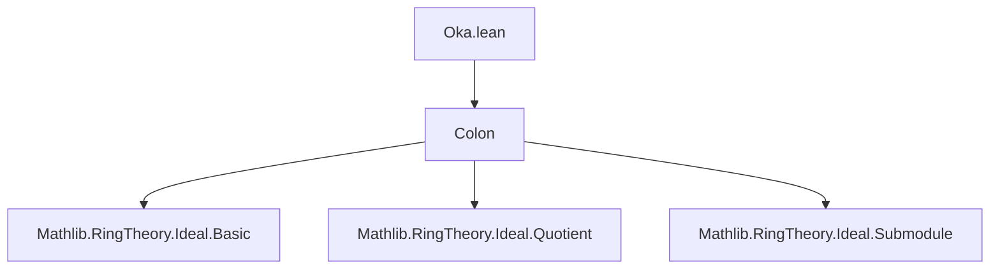

**Technical Brief: Oka Predicates in Lean 4 (`Oka.lean`)**

---

### 1. KEY DEFINITIONS & THEOREMS

| Name | Type / Signature | Purpose |
|------|------------------|---------|
| `IsOka` | `structure IsOka (P : Ideal R → Prop) : Prop` | Defines when a predicate $P$ on ideals is *Oka*: $P(\top)$ holds, and $P(I \supseteq J : \text{colon}) \land P(I \supseteq J : \text{sup}) \Rightarrow P(I)$ for $J = \langle a \rangle$. |
| `top` | `P ⊤` | Axiom of `IsOka`: the unit ideal satisfies $P$. |
| `oka` | `P (I ⊔ span {a}) → P (I.colon (span {a})) → P I` | Core Oka condition: if both the *extension* and *colon* satisfy $P$, then so does $I$. |
| `isPrime_of_maximal_not` | `{I : Ideal R} → Maximal (¬P ·) I → I.IsPrime` | If $I$ is *maximal among ideals not satisfying* $P$, then $I$ is prime. |
| `forall_of_forall_prime` | `(∀ I, ¬P I → ∃ I, Maximal (¬P ·) I) → (∀ I, I.IsPrime → P I) → ∀ I, P I` | If all primes satisfy $P$, and every non-$P$ ideal embeds into a maximal non-$P$ ideal, then *all* ideals satisfy $P$. |
| `forall_of_forall_prime'` | Variant using Zorn’s lemma on chains: `(∀ C ⊆ {I | ¬P I}, IsChain (· ≤ ·) C → ∀ _ ∈ C, P (sSup C) → ∃ I ∈ C, P I) → (∀ I, I.IsPrime → P I) → ∀ I, P I` | A more constructive version using chain completeness (Zorn-style). |

---

### 2. NAMING CONVENTIONS

- **Predicate prefix**: `IsOka` — structure naming convention for properties of predicates.
- **Theorem prefixes**:
  - `isPrime_of_maximal_not`: “if maximal *not* satisfying $P$, then prime”.
  - `forall_of_forall_prime`: “from primes to all ideals”.
  - `forall_of_forall_prime'`: variant with primed name for alternate hypothesis.
- **Variable naming**:
  - `I`, `J`, `M` for ideals.
  - `a`, `b` for ring elements.
  - `hP`, `hI`, `h₁`, `h₂`, `hab`, `ha`, `hb` for hypotheses.
- **Hypothesis abbreviations**:
  - `hmax`, `hprime`, `hchain`: high-level assumptions in main theorems.

---

### 3. TACTIC STACK

| Tactic | Usage Frequency | Role |
|--------|-----------------|------|
| `by_contra!` | High | To assume negation and derive contradiction (used in both main theorems). |
| `of_not_not` | Medium | To convert `¬¬P` to `P`. |
| `lt_of_le_of_ne` | Medium | To upgrade a non-strict inequality to strict when inequality is known not to be equality. |
| `simp_rw` / `rw` | Implicit | Used implicitly via `△` (congruence rewriting) and `mem_colon_span_singleton`. |
| `zorn_le_nonempty₀` | Medium | In `forall_of_forall_prime'`, to apply Zorn’s lemma on ideals ordered by inclusion. |
| `intro`, `exact`, `refine` | High | Standard proof structuring. |
| `have`, `obtain` | High | Intermediate lemma construction. |
| `aesop` | Not present | No use of automated reasoning. |

---

### 4. PROOF LOGIC

- **Structure of proofs**:
  1. **Indirect proof by contradiction** (`by_contra!`) is the dominant strategy.
  2. In `isPrime_of_maximal_not`, the proof proceeds by:
     - Assuming $ab \in I$, $a \notin I$, $b \notin I$.
     - Showing $P(I + \langle a \rangle)$ and $P(I : \langle a \rangle)$ via maximality of $I$ w.r.t. $\neg P$.
     - Applying the Oka condition to deduce $P(I)$, contradicting maximality.
  3. In `forall_of_forall_prime`, the logic is:
     - Assume some $I$ fails $P$.
     - Use $h_{\text{max}}$ to get a maximal such $I$.
     - Apply `isPrime_of_maximal_not` to get $I$ prime.
     - Contradiction via $h_{\text{prime}}$.
  4. In `forall_of_forall_prime'`, the logic is:
     - Use Zorn’s lemma to lift any non-$P$ ideal to a maximal one.
     - Then apply previous theorem.

- **Key logical flow**:  
  $$
  \text{Maximal } \neg P \Rightarrow \text{Prime} \Rightarrow P \text{ (if all primes satisfy } P) \Rightarrow \forall I,\, P(I)
  $$

---

### 5. IMPORTS

| Module | Purpose |
|--------|---------|
| `Mathlib.RingTheory.Ideal.Colon` | Provides `Ideal.colon`, essential for the Oka condition. |

> No other imports are listed — the file is self-contained modulo colon ideal theory.

---

### 6. MERMAID DIAGRAMS

#### Dependency Graph (Module-Level)



#### Theoretical Flow (Conceptual)

```mermaid
graph LR
  A[IsOka Predicate P] --> B[top: P ⊤]
  A --> C[oka: P(I + ⟨a⟩) ∧ P(I : ⟨a⟩) ⇒ P(I)]
  B & C --> D[isPrime_of_maximal_not]
  D --> E[forall_of_forall_prime]
  D --> E2[forall_of_forall_prime']
  E & E2 --> F[All ideals satisfy P if primes do]
```

#### Proof Strategy Flow (for `isPrime_of_maximal_not`)

```mermaid
graph TD
  Start[Assume I maximal for ¬P] --> Hyp[Assume ab ∈ I, a,b ∉ I]
  Hyp --> Sup[P(I + ⟨a⟩) by maximality]
  Hyp --> Colon[P(I : ⟨a⟩) by maximality]
  Sup & Colon --> Oka[Apply oka rule]
  Oka --> Contradiction[P(I), contradicting ¬P(I)]
```

---

### 7. CONTEXTUAL NOTES

- **Mathlib alignment**: The file follows the `stacks` tag convention (`@[stacks 05K9]`, `@[stacks 05KE]`) referencing the Stacks Project and Lam–Reyes (2009).
- **Scope**: Applies to *commutative semirings* (`CommSemiring R`), not just rings — broader than typical treatments.
- **Philosophy**: Emphasizes *maximal counterexample* arguments, a hallmark of Oka-family theory.

--- 

Let me know if you'd like a formalized summary in `leanpkg` format or a comparison with `Ako` predicates.
