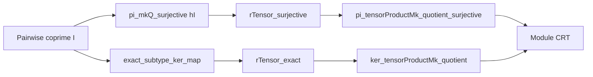

**Technical Brief: `ChineseRemainder.lean` (Module Version of Chinese Remainder Theorem)**

---

### 1. **Key Definitions & Theorems**

| Name | Type / Signature | Purpose |
|------|------------------|---------|
| `pi_mkQ_rTensor` | `LinearMap.pi (fun i ↦ (I i).mkQ).rTensor M = ...` | Relates the right tensor product of the product of quotient maps with a canonical map involving tensor products of quotients and the identity on $M$. Used to re-express the tensor-based CRT map in terms of simpler components. |
| `pi_tensorProductMk_quotient_surjective` | `Surjective (LinearMap.pi fun i ↦ TensorProduct.mk R (R ⧸ I i) M 1)` | **CRT Part I**: Surjectivity of the natural map $M \to \prod_i (R / I_i) \otimes_R M$ under pairwise coprimality of ideals. |
| `ker_tensorProductMk_quotient` | `ker (LinearMap.pi fun i ↦ TensorProduct.mk R (R ⧸ I i) M 1) = (⨅ i, I i) • (⊤ : Submodule R M)` | **CRT Part II**: Kernel of the same map is the submodule generated by the intersection of the ideals acting on $M$. |

- Notation:  
  - $(R \sslash I_i)$ denotes the quotient ring/module $R / I_i$.  
  - $\bigwedge_i I_i = \bigcap_i I_i = \inf_i I_i = \bigcap_{i \in \iota} I_i$ (infimum of ideals = intersection).  
  - $(\bigcap_i I_i) \cdot M$ is the submodule of $M$ generated by elements $r \cdot m$ with $r \in \bigcap_i I_i$, $m \in M$.

---

### 2. **Naming Conventions**

- **Prefixes**:
  - `pi_...`: For maps into a product (e.g., `pi_mkQ`, `pi_tensorProductMk_quotient`).
  - `rTensor_...`: For right tensor product constructions (e.g., `rTensor_surjective`, `rTensor_exact`).
  - `mkQ`: For canonical quotient maps $R \to R / I$ (`mkQ` = “make quotient”).
- **Suffixes**:
  - `_surjective`, `_exact`, `_ker`: Indicate properties of maps (used in lemmas about exactness/surjectivity).
- **Structure**:
  - `..._rTensor`: Relates tensor product constructions with product maps.
  - `..._quotient`: Involves quotient modules $R / I_i$.

---

### 3. **Tactic Stack**

Frequently used tactics in this file:

| Tactic | Role |
|--------|------|
| `ext` | Extensionality for linear maps (to prove equality of maps). |
| `simp` / `simp_rw` | Simplification using definitions (e.g., `LinearMap.pi`, `TensorProduct.mk`, `mkQ`). |
| `rw` | Rewriting using equalities (e.g., `pi_mkQ_rTensor`, `comp_assoc`). |
| `convert` + `le_antisymm` | Proving equality of submodules via double inequality. |
| `intro` / `rintro` / `refine` | Introducing elements and constructing witnesses (e.g., in kernel proofs). |
| `induction_on` | Structural induction on elements of submodules (e.g., `x.induction_on` for elements of `•`-generated submodule). |
| `simpa` | Simplify and discharge goal using assumptions. |
| `classical` | For classical reasoning (e.g., when using `Fintype.ofFinite`). |

---

### 4. **Proof Logic**

**General Strategy**:
- Leverage **homological algebra** tools: tensor product exactness, surjectivity criteria, and submodule generation.
- Use the fact that pairwise coprime ideals give rise to a surjective map $\prod R \to \prod R / I_i$ with kernel $\bigcap I_i$ (classical CRT for rings).
- Lift this to modules via tensoring: use right-exactness of $- \otimes_R M$.

**Proof Outline**:

1. **Surjectivity (`pi_tensorProductMk_quotient_surjective`)**:
   - Use `rTensor_surjective` on the known surjective map $\prod R \to \prod R / I_i$ (from `pi_mkQ_surjective hI`).
   - Rewrite using `pi_mkQ_rTensor` to identify the tensor-based map.
   - Conclude surjectivity.

2. **Kernel (`ker_tensorProductMk_quotient`)**:
   - Use `rTensor_exact` on the short exact sequence:
     $$
     0 \to \bigcap I_i \hookrightarrow R \to \prod R / I_i \to 0
     $$
     (exactness follows from `exact_subtype_ker_map _` and `pi_mkQ_surjective`).
   - Tensor with $M$ and use right-exactness: get
     $$
     (\bigcap I_i) \otimes_R M \to M \to \prod (R / I_i) \otimes_R M \to 0
     $$
   - Identify the kernel as the image of $(\bigcap I_i) \otimes_R M \to M$, which is $(\bigcap I_i) \cdot M$.
   - Prove equality of submodules via `le_antisymm`, using:
     - `Submodule.smul_le.mpr` for $\subseteq$,
     - `Submodule.smul_mem_smul`, `add_mem`, and induction for $\supseteq$.

---

### 5. **Imports & Dependencies**

| Import | Purpose |
|--------|---------|
| `Mathlib.LinearAlgebra.TensorProduct.Pi` | Product of modules and tensor product behavior with products (`pi`, `rTensor`, etc.). |
| `Mathlib.LinearAlgebra.TensorProduct.RightExactness` | Right-exactness of tensor product: $- \otimes_R M$ preserves cokernels. |
| `Mathlib.RingTheory.Ideal.Quotient.Operations` | Quotient ring/module constructions, maps `mkQ`, properties of `I.mkQ`, kernels, etc. |

- Core dependencies: `CommRing`, `AddCommGroup`, `Module`, `Ideal`, `TensorProduct`, `Submodule`, `Fintype`, `Finite`.

---

### 6. **Mermaid Diagrams**

#### **Dependency Graph (Module Scope)**

```mermaid
graph TD
  A[CommRing R] --> B[Module R M]
  C[Ideal R] --> D[Pairwise Coprime I]
  B --> E[TensorProduct R M]
  D --> F[Quotient R (I i)]
  E --> G[LinearMap.pi ...]
  F --> G
  G --> H[Surjectivity / Kernel]
  H --> I[CRT for Modules]
```

#### **Overview of Proof Flow**



#### **Exact Sequence Used**

$$
0 \longrightarrow \bigcap_i I_i \xrightarrow{\iota} R \xrightarrow{f} \prod_i R / I_i \longrightarrow 0
$$

Tensoring with $M$ (right-exact):

$$
(\bigcap_i I_i) \otimes_R M \xrightarrow{\iota \otimes \mathrm{id}} M \xrightarrow{g} \prod_i (R / I_i) \otimes_R M \longrightarrow 0
$$

- $\mathrm{im}(\iota \otimes \mathrm{id}) = (\bigcap_i I_i) \cdot M = \ker(g)$

---

### 7. **Summary**

This file formalizes the **module-theoretic Chinese Remainder Theorem**, extending the classical ring-theoretic CRT to arbitrary $R$-modules $M$. It shows that under pairwise coprimality of ideals $I_i$, the natural map
$$
M \to \prod_i (R / I_i) \otimes_R M
$$
is surjective with kernel $(\bigcap_i I_i) \cdot M$, i.e.,
$$
M / (\bigcap_i I_i) \cdot M \cong \prod_i (R / I_i) \otimes_R M.
$$
The proof leverages tensor product exactness and structural properties of quotient maps, with heavy use of `LinearMap.pi`, `TensorProduct.mk`, and submodule generation.

--- 

Let me know if you'd like a formalized statement of the corollary $M / (\bigcap I_i)M \cong \prod (R / I_i) \otimes M$ or a generalization to finite products of modules.
