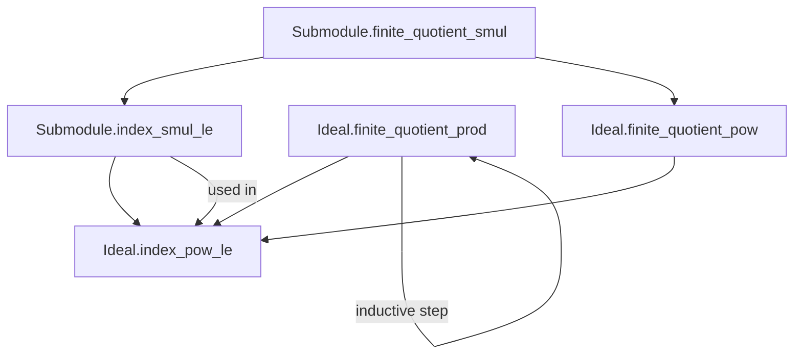

**Technical Brief: `Index.lean` — Indices of Ideals and Submodules**

---

### 1. **Key Definitions & Theorems**

| Name | Type / Signature | Purpose |
|------|------------------|---------|
| `Submodule.finite_quotient_smul` | `[Finite (R ⧸ I)] → [Finite (M ⧸ N)] → N.FG → Finite (M ⧸ I • N)` | Shows that if $N \le M$ is finitely generated and both $R/I$ and $M/N$ are finite, then $M/(I \cdot N)$ is finite. Core structural lemma. |
| `Submodule.index_smul_le` | `[Finite (R ⧸ I)] → s : Finset M → span s = N → (I • N).index ≤ I.index^(s.card) * N.index` | Quantitative bound on the index of $I \cdot N$ in terms of generators of $N$ and index of $I$. |
| `Ideal.finite_quotient_prod` | `(∀ i ∈ s, (I i).FG) → (∀ i ∈ s, Finite (R ⧸ I i)) → Finite (R ⧸ ∏_{i ∈ s} I i)` | Finite quotient of finite product of finite-index, f.g. ideals. Used inductively. |
| `Ideal.finite_quotient_pow` | `I.FG → Finite (R ⧸ I) → Finite (R ⧸ I^n)` | Finite quotient of powers of a finite-index, f.g. ideal. |
| `Ideal.index_pow_le` | `span s = I → Finite (R ⧸ I) → (I^n).index ≤ I.index^{∑_{i=0}^{n-1} |s|^i}` | Explicit bound on index of $I^n$, using geometric sum. Key quantitative result. |

---

### 2. **Naming Conventions**

- **Prefixes**:
  - `finite_quotient_`: asserts finiteness of a quotient module/group.
  - `index_`: bounds or computes additive subgroup index (cardinality of quotient).
  - `smul`: action of ideal on submodule.
- **Suffixes**:
  - `_le`: inequality bound (index ≤ ...).
  - `_prod`, `_pow`: structural operations (product of ideals, powers).
- **Helper variables**:
  - `s : Finset M` or `s : Finset R`: finite generating sets.
  - `hs : span s = N`: witness that $N$ is finitely generated.

---

### 3. **Tactic Stack**

| Tactic | Usage |
|--------|-------|
| `simp` / `simp only` | Simplify goals using definitional equalities, especially `Finset.prod_empty`, `pow_zero`, `one_eq_top`. |
| `rw` | Rewrite using equivalences (`Nat.card_congr`, `AddSubgroup.relIndex_mul_index`, `geom_sum_succ`). |
| `gcongr` | Lift inequalities under monotone functions (e.g., exponentiation). |
| `induction` | Structural induction on `Finset` or natural number `n`. |
| `exact`, `refine`, `apply` | Apply lemmas with missing arguments filled via `have` or `let`. |
| `have` / `suffices` | Introduce intermediate claims (e.g., `FiniteIndex` → `Finite`). |
| `let` / `have` + `e : … ≃ₗ[R] …` | Construct linear equivalences (often tensor-based). |
| `convert` / `congr`-style reasoning | Via `Nat.card_congr`, `Nat.card_le_card_of_surjective`. |
| `aesop` (not present) | Not used — proofs are highly structured and rely on explicit algebraic constructions. |

---

### 4. **Proof Logic**

- **Inductive structure**:
  - For `finite_quotient_pow`, `index_pow_le`: induction on $n$ (natural number).
  - For `finite_quotient_prod`: induction on finite set `s` (using `Finset.induction_on`).
- **Core logical flow**:
  1. Reduce to additive subgroup index via `Submodule.toAddSubgroup`.
  2. Use `AddSubgroup.relIndex_mul_index` to decompose index of $I \cdot N$ relative to $N$.
  3. Construct linear equivalence:
     $$
     N / (I \cdot N) \;\cong_R\; (R / I) \otimes_R N
     $$
     via `Submodule.quotEquivOfEq` and `quotTensorEquivQuotSMul`.
  4. Bound cardinalities using:
     - Surjectivity of tensor product of surjective maps (`lTensor_surjective`).
     - Finiteness of $R/I$ and $N$ (via `of_fg`, `finite_of_finite`).
     - Finsupp linear combination surjectivity (`Finsupp.range_linearCombination`).
- **Tensor product centrality**: All key equivalences and bounds rely on tensor product constructions (`TensorProduct`, `quotTensorEquivQuotSMul`, `lTensor`).

---

### 5. **Imports & Scope**

| Import | Role |
|--------|------|
| `Mathlib.Algebra.Ring.GeomSum` | Geometric sum identities (`geom_sum_succ`, `pow_mul`). |
| `Mathlib.GroupTheory.Index` | Additive subgroup index, `relIndex_mul_index`, `finite_quotient_of_finiteIndex`. |
| `Mathlib.LinearAlgebra.DirectSum.Finsupp` | Finsupp-based constructions, linear combinations. |
| `Mathlib.LinearAlgebra.TensorProduct.*` | Tensor product machinery: `lTensor`, `quotTensorEquivQuotSMul`, `tensorEquiv`, `Finsupp.linearCombination`. |
| `Mathlib.RingTheory.Finiteness.Cardinality` | Cardinality finiteness criteria (`Finite`, `FiniteIndex`). |
| `Mathlib.RingTheory.Ideal.Quotient.Operations` | Ideal quotient arithmetic, `mul_comm`, `pow_succ`, `one_eq_top`. |
| `Mathlib.RingTheory.TensorProduct.Finite` | Finiteness of tensor products (`finite_of_finite`, `lTensor_surjective`). |

**Scope**: Commutative algebra over a commutative ring $R$, focusing on:
- Submodule/ideal indices (additive group indices of quotients),
- Finiteness conditions (fg, finite quotient),
- Tensor product techniques for bounding indices.

---

### 6. **Mermaid Diagrams**

#### **Dependency Graph (Theorems)**



#### **Overview of File Structure**

```mermaid
flowchart LR
  subgraph "Core Setup"
    R[CommRing R]
    M[AddCommGroup M]
    N[Submodule R M]
    I[Ideal R]
  end

  subgraph "Tensor Equivalence"
    T1[N / (I•N) ≃ (R/I) ⊗ N]
    T2[quotTensorEquivQuotSMul]
    T3[Submodule.quotEquivOfEq]
  end

  subgraph "Finiteness Results"
    F1[Submodule.finite_quotient_smul]
    F2[Ideal.finite_quotient_pow]
    F3[Ideal.finite_quotient_prod]
  end

  subgraph "Index Bounds"
    I1[Submodule.index_smul_le]
    I2[Ideal.index_pow_le]
  end

  R --> N
  R --> I
  I --> I•N
  N --> T1
  T3 --> T1
  T2 --> T1
  F1 --> I1
  F1 --> F2
  F2 --> I2
  F3 --> I2
```

---

### 7. **Mathematical Summary**

This file formalizes foundational results in *ideal index theory* over commutative rings. It shows:
- Finiteness is preserved under ideal multiplication on f.g. submodules.
- Powers of finite-index, f.g. ideals have finite index, with explicit bounds governed by geometric sums.
- Tensor products provide the key bridge between module-theoretic quotients and ideal quotients.

The results are essential for deeper structure theory (e.g., Noether normalization, dimension theory) and are used in formalizations of algebraic geometry and arithmetic geometry (e.g., in `Mathlib.RingTheory.DedekindDomain` or `padics`).

--- 

Let me know if you'd like a formalized dependency graph (e.g., for `leanproject graph`) or a tactic-level proof trace.
