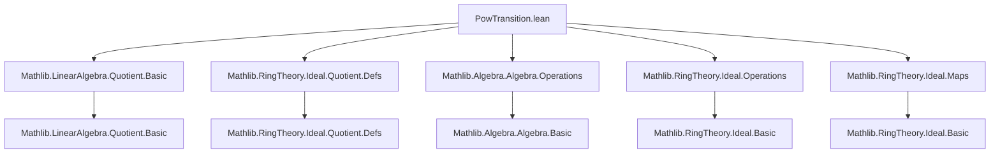
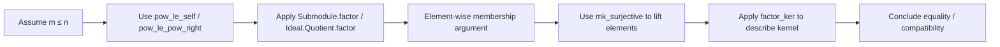

### Technical Brief: `PowTransition.lean`

---

#### **1. Key Definitions & Theorems**

| Name | Type / Signature | Purpose |
|------|------------------|---------|
| `factor` | `I ≤ J → R ⧸ I →+* R ⧸ J` | Canonical ring homomorphism induced by inclusion of ideals (requires `I`, `J` two-sided). |
| `Submodule.factor` | `I ≤ J → M ⧸ I →ₗ[R] M ⧸ J` | Canonical linear map induced by inclusion of submodules. |
| `factorPow` (Submodule) | `m ≤ n → M ⧸ (Iⁿ • ⊤) →ₗ[R] M ⧸ (Iᵐ • ⊤)` | Transition map between successive *power quotients* of a module. |
| `factorPow` (Ideal) | `n ≤ m → R ⧸ Iᵐ →+* R ⧸ Iⁿ` | Transition ring map between successive *power quotients* of a ring. |
| `factorPowSucc` | `M ⧸ (I^(m+1)•⊤) →ₗ[R] M ⧸ (Iᵐ•⊤)` or `R ⧸ I^(n+1) →+* R ⧸ Iⁿ` | Special case of `factorPow` for successor steps. |
| `Ideal.Quotient.factor_ker` | `ker(factor H) = J.map (mk I)` | Describes kernel of `factor H` as image of `J` under quotient map. |
| `Submodule.eq_factor_of_eq_factor_succ` | Inductive compatibility lemma for factor maps. | Ensures consistency of compatible families across quotients. |
| `Ideal.map_mk_comap_factor` | `(I.map (mk J)).comap (factor hJK) = I.map (mk K)` | Interaction between pullback/pushforward along quotient maps. |
| `factorPowSucc.isUnit_of_isUnit_image` | If image under `factorPowSucc` is unit ⇒ preimage is unit (under positivity condition). | Key for lifting units in adic completions. |

---

#### **2. Naming Conventions**

- **Prefixes**:
  - `factor`: for maps induced by inclusion (submodule or ideal).
  - `factorPow`: for maps induced by inclusion of *powers* of an ideal.
  - `factorPowSucc`: successor-step version of `factorPow`.
- **Suffixes**:
  - `_eq_factor`: identifies equivalence with more general `factor`.
  - `_eq_factor_succ`: used for inductive compatibility lemmas.
- **Module/ideal variants**:
  - `Submodule.factor` vs `Ideal.Quotient.factor`: same concept, but for modules vs rings.
  - `mapQ` vs `factor`: `mapQ` is defined via `Submodule.mapQ`, while `factor` is more direct.

---

#### **3. Tactic Stack**

Frequent tactics used in proofs:
- `aesop`: for automated reasoning with linear arithmetic and basic algebra.
- `ring`: simplifying polynomial expressions.
- `simp_rw`, `simp only`: rewriting using definitional equalities and lemmas.
- `rcases`, `cases'`: destructuring existential/universal hypotheses.
- `induction ... with | succ ih =>`: structural induction on natural numbers.
- `ext x`: extensionality for set equality (via membership).
- `rw [← eq]`, `subst this`: substitution and rewriting using equalities.
- `apply`, `exact`, `refine`: proof construction.
- `lia`, `linarith`: linear arithmetic for inequalities.

---

#### **4. Proof Logic**

- **Inductive structure**: Many proofs (e.g., `eq_factor_of_eq_factor_succ`) proceed by induction on `n - m`, using antitonicity of the sequence of submodules/ideals.
- **Element-chasing**: Proofs of kernel/image equalities (e.g., `factor_ker`, `map_mk_comap_factor`) use surjectivity of `mk I` and element-wise membership arguments.
- **Lifting properties**: For `isUnit_of_isUnit_image`, the proof lifts a unit in the quotient to a candidate inverse in the original ring, then corrects it using the kernel description and ideal power containment.
- **Generalization strategy**: Comments explicitly advise generalizing to `Submodule.factor` or `Ideal.factor` before adding new lemmas — indicating a design philosophy of minimizing redundancy.

---

#### **5. Imports**

Core dependencies defining the scope:

```lean
Mathlib.LinearAlgebra.Quotient.Basic
Mathlib.RingTheory.Ideal.Quotient.Defs
Mathlib.Algebra.Algebra.Operations
Mathlib.RingTheory.Ideal.Operations
Mathlib.RingTheory.Ideal.Maps
```

These provide:
- Quotient constructions for modules and ideals.
- Basic algebraic operations (e.g., `smul`, `map`, `comap`).
- Ideal arithmetic (powers, multiplication, containment).
- First isomorphism theorem and related tools (e.g., `factor`, `mk`, `mapQ`).

---

#### **6. Mermaid Diagrams**

##### **Dependency Graph (Module-Level)**



##### **Overview of Theory Flow**

```mermaid
flowchart LR
  A[Ideal Powers Iⁿ] --> B[Submodule Iⁿ • ⊤]
  B --> C[Quotient Module M ⧸ Iⁿ • ⊤]
  A --> D[Quotient Ring R ⧸ Iⁿ]
  C --> E[Factor Maps Submodule.factor]
  D --> F[Factor Maps Ideal.Quotient.factor]
  E --> G[Transition Maps factorPow]
  F --> G
  G --> H[Adic Completeness (e.g., IsAdicComplete)]
  H --> I[Lifting Compatible Sequences]
```

##### **Key Logical Flow in Proofs**



---

#### **7. Role in Larger Theory**

This file serves as a **technical bridge** between:
- **Module theory** (`Submodule.factor`) and **ring theory** (`Ideal.Quotient.factor`).
- **Ideal powers** and **adic filtrations**, especially relevant for:
  - `IsAdicComplete` (completeness w.r.t. `I`-adic topology).
  - Constructing lifts of compatible sequences `(xₙ ∈ R ⧸ Iⁿ)`.

The lemmas `eq_factor_of_eq_factor_succ` and `factorPowSucc.isUnit_of_isUnit_image` are critical for:
- Proving existence of limits in inverse systems.
- Verifying that certain sequences are Cauchy or converge.

---

#### **8. Design Notes**

- **Avoiding duplication**: The file intentionally avoids re-proving lemmas already available for `Submodule.factor` or `Ideal.factor`, unless strictly necessary.
- **Two-sidedness assumptions**: Required for `factor` to be a ring homomorphism; Lean’s typeclass inference handles this via `[I.IsTwoSided]`.
- **Module vs ring separation**: Though closely related, module and ring cases are kept distinct (`Submodule.factor` vs `Ideal.Quotient.factor`) to preserve modularity.

--- 

Let me know if you'd like a formalized dependency graph (e.g., `.dot` format) or a summary of how this file interfaces with `IsAdicComplete`.
