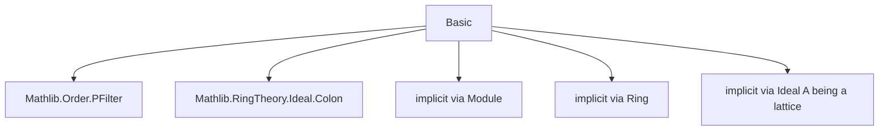
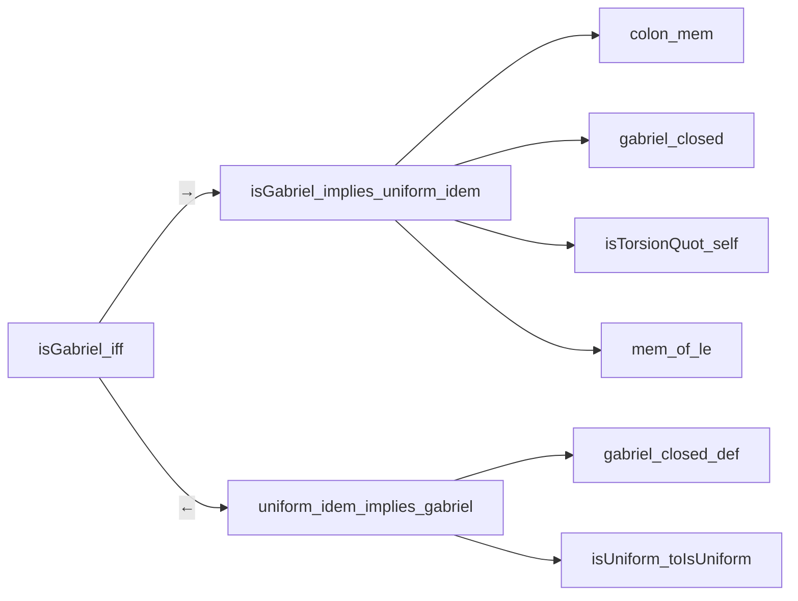

### Technical Brief: `Basic.lean` — Ideal Filters in Lean 4

---

#### **1. Key Definitions & Theorems**

| Name | Type / Signature | Purpose |
|------|------------------|---------|
| `IdealFilter A` | `abbrev IdealFilter (A : Type*) [Ring A] := Order.PFilter (Ideal A)` | Type of filters on the lattice of left ideals of a ring `A`. |
| `IsUniform F` | `class IsUniform (F : IdealFilter A)` | A filter is *uniform* if closed under colon by singletons: $I \in F \Rightarrow I.\text{colon}\{a\} \in F$ for all $a \in A$. |
| `IsTorsionElem F m` | `def IsTorsionElem (F : IdealFilter A) (m : M)` | $m \in M$ is *$F$-torsion* if $\exists L \in F$ s.t. $L \cdot m = 0$. |
| `IsTorsion F M` | `def IsTorsion (F : IdealFilter A) (M : M)` | $M$ is *$F$-torsion* if all its elements are $F$-torsion. |
| `IsTorsionQuot F L K` | `def IsTorsionQuot (F : IdealFilter A) (L K : Ideal A)` | Quotient $K/L$ is $F$-torsion iff $\forall k \in K$, $\exists I \in F$, $I \le L.\text{colon}\{k\}$. |
| `gabrielComposition F G` | `def gabrielComposition (F G : IdealFilter A)` | Gabriel composition: $F \bullet G = \{L \mid \exists K \in G,\ F.\text{IsTorsionQuot}\ L\ K\}$. |
| `F • G` | `infixl:70 " • " => gabrielComposition` | Notation for Gabriel composition. |
| `IsGabriel F` | `class IsGabriel (F : IdealFilter A) extends F.IsUniform` | $F$ is *Gabriel* if uniform and satisfies **T4**: if $\exists J \in F$ s.t. $\forall x \in J,\ I.\text{colon}\{x\} \in F$, then $I \in F$. |
| `isGabriel_iff` | `theorem isGabriel_iff (F : IdealFilter A)` | **Main theorem**: $F$ is Gabriel $\iff F$ is uniform and $F \bullet F = F$. |
| `isTorsionQuot_inter_left_iff` | `lemma isTorsionQuot_inter_left_iff` | Shows $F.\text{IsTorsionQuot}\ (L \sqcap K)\ K \iff F.\text{IsTorsionQuot}\ L\ K$, allowing $L \nsubseteq K$. |
| `isPFilter_gabrielComposition` | `lemma isPFilter_gabrielComposition` | Proves Gabriel composition yields a valid `PFilter`. |

---

#### **2. Naming Conventions**

- **Prefixes**:
  - `is_`: Predicate definitions (`isTorsion`, `isTorsionElem`, `isTorsionQuot`).
  - `colon_`: Operations involving colon ideals (`colon_mem`, `colon_mono`, `colon_inf_eq_left_of_subset`).
- **Suffixes**:
  - `_def`: Simplified definitions (e.g., `isTorsion_def`, `isTorsionQuot_def`).
  - `_iff`: Logical equivalences (`isTorsionQuot_inter_left_iff`).
  - `_left`, `_right`, `_mono`: Directional or monotonicity lemmas (`mono_left`, `anti_right`, `mono`).
- **Infixes**:
  - `•` for Gabriel composition (`gabrielComposition`).

---

#### **3. Tactic Stack**

Frequently used tactics in proofs:
- `intro`, `rcases`, `obtain`, `exact`, `refine`: Core intro/elimination.
- `simp`, `simpa`, `simp only`, `simp_rw`: Simplification with lemmas like `colon_inf_eq_left_of_subset`, `inf_colon.ge`.
- `constructor`, `ext`, `apply`, `apply_fun`: For biconditionals and extensionality.
- `le_of_le_of_eq`, `le_trans`, `inf_le_inf`: Order reasoning in `Ideal A`.
- `aesop`: Likely used in automation (not explicit here, but standard in Mathlib).
- `ring`/`abel`: Not used here (no additive/multiplicative ring identities needed beyond module action).

---

#### **4. Proof Logic**

- **Structure**: Most proofs follow a *two-directional* (`↔`) pattern:
  - **Forward direction**: Unpack existential/forall hypotheses, construct witness using filter properties (e.g., `F.nonempty`, `F.inf_mem`).
  - **Backward direction**: Use filter axioms (e.g., upward closure, directedness) to show membership.
- **Induction**: Not used (no natural numbers or inductive types).
- **Cases**: On membership hypotheses (`hI : I ∈ F`) or existential witnesses (`⟨J, hJ, htors⟩`).
- **Key reasoning**:
  - Use of `Submodule.colon` properties (monotonicity, interaction with infima).
  - Filter properties: upward closure, directedness, nonemptiness.
  - Equivalence via `isTorsionQuot_inter_left_iff` to avoid quotient modules.

---

#### **5. Imports**

| Import | Purpose |
|--------|---------|
| `Mathlib.Order.PFilter` | Core theory of *pointwise filters* on a preorder — used to define `IdealFilter` as `PFilter (Ideal A)`. |
| `Mathlib.RingTheory.Ideal.Colon` | Colon ideal (`I.colon J`) and its basic properties (e.g., `colon_inf_eq_left_of_subset`, `colon_mono`). |

---

#### **6. Mermaid Diagrams**

##### **Dependency Graph (Module-Level)**



##### **Conceptual Overview (Theory Flow)**

```mermaid
graph LR
  A[Ring A] --> I[Ideal A lattice]
  I --> F[IdealFilter A = PFilter(Ideal A)]
  F --> U[IsUniform F]
  F --> T[IsTorsionElem / IsTorsion]
  F --> Q[IsTorsionQuot]
  F & G --> GComp[gabrielComposition F G = F • G]
  U & T4[axiom T4] --> G[IsGabriel F]
  U & idem[F • F = F] <-->|isGabriel_iff| G
```

##### **Proof Dependency (Key Theorem)**



---

#### **7. Summary**

This module formalizes the foundational theory of *ideal filters* and *Gabriel filters* in Lean 4, following Stenström’s approach but adapted to **left ideals**. It introduces torsion theory relative to filters, defines the Gabriel composition operation, and proves the central characterization:  
$$
F \text{ is Gabriel } \iff F \text{ is uniform and } F \bullet F = F.
$$  
The development avoids quotient modules by working directly with colon ideals and ideal inclusions, aligning with the categorical and module-theoretic tradition in noncommutative localization.

--- 

Let me know if you'd like a formalization roadmap or a comparison with Stenström’s original axioms.
