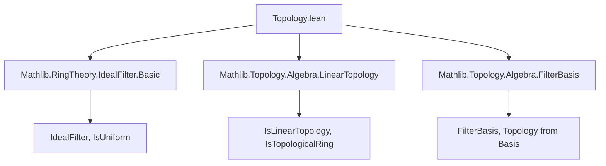

**Technical Brief: Topology.lean (Ideal Filter Topologies)**  
*Prepared for Domain-Specific AI Agent Training*

---

### 1. KEY DEFINITIONS & THEOREMS

| Name | Type / Signature | Purpose |
|------|------------------|---------|
| `IdealFilter.addGroupFilterBasis` | `{A : Type*} [Ring A] → (F : IdealFilter A) → AddGroupFilterBasis A` | Constructs an additive group filter basis from the ideals of `F`. |
| `IdealFilter.ringFilterBasis` | `{A : Type*} [Ring A] → (F : IdealFilter A) → [F.IsUniform] → RingFilterBasis A` | Lifts `addGroupFilterBasis` to a *ring* filter basis when `F` is uniform. |
| `IdealFilter.isUniform_iff_exists_ringFilterBasis` | `{A : Type*} [Ring A] → (F : IdealFilter A) → F.IsUniform ↔ ∃ B : RingFilterBasis A, B.sets = {I | I ∈ F}` | Characterizes uniform ideal filters as those whose ideals form a ring filter basis. |
| `WithIdealFilter` | `{A : Type*} [Ring A] → IdealFilter A → Type _` | Type synonym for `A` parameterized by an ideal filter, enabling instance inference for topological structures. |
| `WithIdealFilter.instTopologicalSpace` | `TopologicalSpace (WithIdealFilter F)` | Induces a topology on `A` via `F.addGroupFilterBasis.topology`. |
| `WithIdealFilter.instIsTopologicalAddGroup` | `IsTopologicalAddGroup (WithIdealFilter F)` | Ensures addition is continuous (i.e., `A` is a topological additive group). |
| `WithIdealFilter.instIsLinearTopology` | `IsLinearTopology (WithIdealFilter F) (WithIdealFilter F)` | Shows the topology is linear: neighborhoods of 0 have a basis of ideals. |
| `WithIdealFilter.instIsTopologicalRing` | `[F.IsUniform] → IsTopologicalRing (WithIdealFilter F)` | Under uniformity, multiplication is continuous — `A` becomes a topological ring. |
| `WithIdealFilter.mem_nhds_iff` | `s ∈ 𝓝 a ↔ ∃ I ∈ F, a +ᵥ idealSet I ⊆ s` | Neighborhood basis at `a` consists of additive cosets of ideals in `F`. |
| `WithIdealFilter.mem_nhds_zero_iff` | `s ∈ 𝓝 0 ↔ ∃ I ∈ F, idealSet I ⊆ s` | Neighborhood basis at 0 consists of ideals in `F`. |

---

### 2. NAMING CONVENTIONS

- **Prefixes**:
  - `is_`: Predicate-style (e.g., `IsUniform`, `IsTopologicalAddGroup`, `IsLinearTopology`) — indicates a *property* or *structure*.
  - `inst_`: Instance definitions (e.g., `instRing`, `instTopologicalSpace`) — Lean’s typeclass inference.
  - `idealSet`: Converts an ideal in `A` to a subset of `WithIdealFilter F`.
- **Suffixes**:
  - `_basis`: Filter bases (e.g., `addGroupFilterBasis`, `ringFilterBasis`).
  - `_iff`: Biconditional theorems (e.g., `isUniform_iff_exists_ringFilterBasis`).
- **Notation**:
  - `idealSet I` = `(I : Set A)` — coercion of ideal to set.
  - `a +ᵥ idealSet I` — additive coset notation using `+ᵥ` (vector addition).

---

### 3. TACTIC STACK

Frequent tactics used in proofs:

| Tactic | Role |
|--------|------|
| `aesop` | Automated reasoning for basic algebra/filter properties (e.g., `zero'`, `add'`, `neg'`, `conj'`). |
| `simp_rw` / `simpa` | Simplification with rewrite rules (e.g., `simpa [zero_vadd] using …`). |
| `exact`, `refine`, `apply` | Direct proof construction. |
| `rintro` / `intro` | Introduce hypotheses and destruct conjunctions/disjunctions. |
| `rcases` / `obtain` | Destruct existential/universal quantifiers (e.g., `obtain ⟨V, hbasis, hsub⟩ := …`). |
| `set_mem_iff.mpr` / `Set.mul_subset_iff.mpr` | Convert set-theoretic inclusions to element-wise conditions. |
| `Submodule.mem_colon_singleton.mp` | Use module-theoretic definitions (colon ideal). |
| `Order.PFilter.*` | Filter-theoretic reasoning (e.g., `inf_mem`, `mem_of_le`). |

---

### 4. PROOF LOGIC

**General proof strategy**:

1. **Induction/Case analysis** is minimal; most proofs are *constructive* and *element-wise*.
2. **Basis-based reasoning**: Prove properties by working with filter basis elements (e.g., ideals `I ∈ F`).
3. **Equivalence proofs (`↔`)**:
   - `→`: Construct `ringFilterBasis` from uniformity.
   - `←`: Extract uniformity from existence of a ring filter basis with same sets.
4. **Neighborhood characterizations**:
   - Use `nhds_hasBasis` to reduce neighborhood membership to basis elements.
   - Translate via `idealSet` and coset arithmetic.
5. **Uniformity ⇒ Topological Ring**:
   - Leverage `ringFilterBasis` to verify continuity of multiplication (via `mul'`, `mul_left'`, `mul_right'`).
6. **Linear topology**:
   - Use `IsLinearTopology.mk_of_hasBasis'` with ideals as basis elements and `Submodule.smul_mem` for scalar multiplication continuity.

---

### 5. IMPORTS & DEPENDENCIES

| Module | Role |
|--------|------|
| `Mathlib.RingTheory.IdealFilter.Basic` | Core definitions: `IdealFilter`, `IsUniform`, colon ideals, infima. |
| `Mathlib.Topology.Algebra.LinearTopology` | `IsLinearTopology`, `IsTopologicalAddGroup`, `IsTopologicalRing`. |
| `Mathlib.Topology.Algebra.FilterBasis` | `AddGroupFilterBasis`, `RingFilterBasis`, topology generation, neighborhood bases. |

**Key abstractions used**:
- `IdealFilter`: A filter on the poset of ideals of a ring, closed under multiplication and containing principal ideals (via `IsUniform`).
- `AddGroupFilterBasis` / `RingFilterBasis`: Filters of subsets closed under group/ring operations.
- `WithIdealFilter`: A trick to attach structure (topology, ring, etc.) to a type via a parameter.

---

### 6. MERMAID DIAGRAMS

#### Dependency Graph (Module-Level)



#### Overview of Theoretical Flow

```mermaid
flowchart LR
  F[IdealFilter F] -->|F.IsUniform?|{Uniform?}
  Uniform -->|Yes| RB[ringFilterBasis]
  Uniform -->|No| AGB[addGroupFilterBasis]
  RB --> TR[IsTopologicalRing]
  AGB --> TAG[IsTopologicalAddGroup]
  RB & AGB --> TS[TopologicalSpace]
  TS --> NL[Neighborhoods = cosets of ideals]
  NL --> LT[IsLinearTopology]
```

#### Core Equivalence

```mermaid
flowchart LR
  F.IsUniform ↔ ∃ B : RingFilterBasis A, B.sets = {I | I ∈ F}
  F.IsUniform -->|→| RB.sets = ideals
  RB.sets = ideals -->|←| F.IsUniform
```

---

### 7. SUMMARY FOR AI AGENT

- **Domain**: Ring theory + topology, focusing on *linear* and *uniform* topologies induced by ideal filters.
- **Key insight**: Uniformity of `F` ⇔ its ideals form a *ring* filter basis.
- **Pattern**: Parameterize a type (`WithIdealFilter`) by a filter to inherit structure.
- **Proof style**: Constructive, basis-driven, with heavy use of `idealSet`, `ideal.mem_of_le`, and `Submodule` lemmas.
- **Target use**: Formalizing adic topologies, completion of rings, profinite structures.

--- 

Let me know if you'd like a formalized *specification* of this module for use in a domain-specific reasoning agent (e.g., for automated topology inference or completion proofs).
