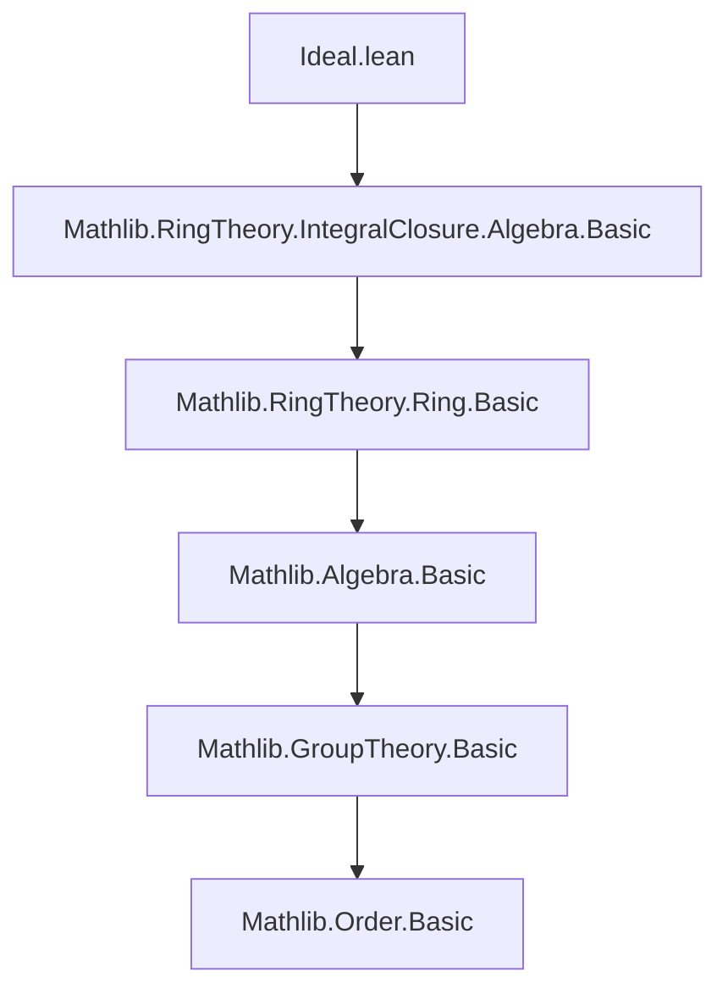

### Technical Brief: `Ideal.lean` — Integrality over Ideals in Lean 4

---

#### **1. Key Definitions & Theorems**

| Name | Type / Signature | Purpose |
|------|------------------|---------|
| `coeff_mem_pow_of_mem_adjoin_C_mul_X` | `{I : Ideal R} → {P : R[X]} → P ∈ Algebra.adjoin R { C r * X | r ∈ I } → ∀ i, P.coeff i ∈ I ^ i` | Shows that any polynomial in the subalgebra generated by $\{rX \mid r \in I\}$ has $i$-th coefficient in $I^i$. Core technical lemma for coefficient control. |
| `exists_monic_aeval_eq_zero_forall_mem_pow_of_isIntegral` | `{I : Ideal R} → {x : S} → IsIntegral (Algebra.adjoin R { C r * X | r ∈ I }) (C x * X) → ∃ p : R[X], p.Monic ∧ aeval x p = 0 ∧ ∀ i, p.coeff i ∈ I^{deg(p) - i}` | Main lifting lemma: if $x$ is integral over the subalgebra generated by $IX$, then $x$ satisfies a monic polynomial over $R$ with coefficients in powers of $I$. |
| `exists_monic_aeval_eq_zero_forall_mem_pow_of_mem_map` | `[IsIntegral R S] → {I : Ideal R} → {x : S} → x ∈ I.map (algebraMap R S) → ∃ p : R[X], ...` | Specialization: if $x \in IS$, then $x$ is integral over $I$ in the strong sense (coefficients in $I^{\deg - i}$). Uses induction on the submodule definition of $IS$. |
| `exists_monic_aeval_eq_zero_forall_mem_of_mem_map` | `[IsIntegral R S] → {I : Ideal R} → {x : S} → x ∈ I.map (algebraMap R S) → ∃ p : R[X], p.Monic ∧ aeval x p = 0 ∧ ∀ i ≠ \deg p, p.coeff i ∈ I` | Weaker but more standard formulation: non-leading coefficients lie in $I$ (not higher powers). Derived from the previous lemma via $I^n \subseteq I$ for $n \ge 1$. |

> **Note**: All three existence lemmas are variants of the *Rees* or *integral over an ideal* condition, matching [Stacks Project Tag 00H2](https://stacks.math.columbia.edu/tag/00H2).

---

#### **2. Naming Conventions**

- **Prefixes**:
  - `coeff_mem_pow_of_...`: coefficient membership in powers of ideals.
  - `exists_monic_aeval_eq_zero_forall_mem_pow_of_...`: existence of monic polynomial with coefficient constraints.
  - `isIntegral_...`: properties of integral elements over subalgebras/modules.
- **Suffixes**:
  - `_of_mem_adjoin_C_mul_X`: refers to the generating set $\{rX \mid r \in I\}$.
  - `_of_mem_map`: refers to membership in $I \cdot S = I.map (algebraMap R S)$.
  - `_of_isIntegral`: refers to an assumption of integrality over a subalgebra.

---

#### **3. Tactic Stack**

| Tactic | Usage Frequency | Role |
|--------|-----------------|------|
| `induction ... using Algebra.adjoin_induction` | High | Structural induction on elements of an adjoined subalgebra. |
| `aesop` | Medium | Handles routine goals involving linear arithmetic, ideal operations, and simple algebraic rewrites. |
| `simp +contextual` | High | Simplification with contextual information (e.g., `coeff_C`, `coeff_X`, `map_pow`). |
| `rw [coeff_mul]`, `rw [hq]`, etc. | High | Rewriting using coefficient lemmas and previously defined terms. |
| `refine`, `exact`, `apply` | High | Goal-directed proof construction, especially for existential statements. |
| `Finset.sum_congr`, `sum_mem` | Medium | Managing sums over finite sets, especially for ideal membership. |
| `cases subsingleton_or_nontrivial R` | Low | Edge-case handling for degenerate rings. |

---

#### **4. Proof Logic**

The logical flow follows a **two-stage strategy**:

1. **Algebraic Setup**:
   - Define the subalgebra $A = R\{rX \mid r \in I\} \subseteq R[X]$.
   - Show that if $x \in IS$, then $x$ is integral over $A$ (via `isIntegral_algebraMap` and induction on the definition of $IS$).

2. **Coefficient Control**:
   - Use `coeff_mem_pow_of_mem_adjoin_C_mul_X` to lift coefficient bounds from $A$ to powers $I^i$.
   - Construct a monic polynomial $q$ from the minimal polynomial over $A$ by reindexing coefficients (via `∑ C (...) * X^i`).
   - Prove:
     - $q$ is monic (via leading coefficient computation),
     - $q(x) = 0$ (via evaluation map compatibility),
     - $q_i \in I^{\deg q - i}$ (via coefficient lemma).

3. **Derivation of Standard Form**:
   - From the strong version (`pow`), deduce the weaker version (`mem`) using $I^n \subseteq I$ for $n \ge 1$.

---

#### **5. Imports & Dependencies**

| Module | Role |
|--------|------|
| `Mathlib.RingTheory.IntegralClosure.Algebra.Basic` | Provides foundational definitions: `IsIntegral`, `aeval`, `algebraMap`, `Subalgebra.adjoin`, `Polynomial.algebra`. |
| `Mathlib.RingTheory.Ideal.Basic` (implicit) | Used for `Ideal.pow`, `Ideal.mul_mem_mul`, `Ideal.pow_le_self`. |
| `Mathlib.RingTheory.Polynomial.Basic` (implicit) | For `coeff`, `natDegree`, `monic`, `aeval`, `eval₂_eq_sum_range`. |
| `Mathlib.Algebra.Module.Submodule.Basic` (implicit) | For `Submodule.span_induction`, used in `mem_map` proofs. |

---

#### **6. Mermaid Diagrams**

##### **Dependency Graph (Module-Level)**



##### **Theoretical Overview (File-Level)**

```mermaid
flowchart LR
  A[IS = I·S] --> B[x ∈ IS]
  B --> C[IsIntegral A (C x * X)]
  C --> D[∃ p monic, aeval x p = 0]
  D --> E[p.coeff i ∈ I^{deg−i}]
  E --> F[p.coeff i ∈ I for i < deg]
  style A fill:#f9f,stroke:#333
  style F fill:#bbf,stroke:#333
```

##### **Proof Structure (High-Level)**

```mermaid
graph TD
  Start[Given x ∈ IS] --> Step1[Show x integral over A = R{rX}]
  Step1 --> Step2[Apply isIntegral_algebraMap + induction]
  Step2 --> Step3[Construct q from p over A]
  Step3 --> Step4[Prove q monic & q(x)=0]
  Step4 --> Step5[Bound coeffs via coeff_mem_pow_of_mem_adjoin]
  Step5 --> Strong[Strong form: coeff ∈ I^{deg−i}]
  Strong --> Weak[Weak form: coeff ∈ I for i < deg]
```

---

#### **7. Summary**

This file formalizes the classical result that **elements of $IS$ are integral over $I$**, with explicit control over coefficient powers. It bridges module-theoretic constructions ($IS$) with polynomial integrality, following the approach of [Stacks Project 00H2]. The proofs rely heavily on structural induction over adjoined subalgebras and careful manipulation of polynomial coefficients using ideal arithmetic. The result is foundational for further development in *integral closure of ideals*, *Rees algebras*, and *blowup algebras* in Lean.
