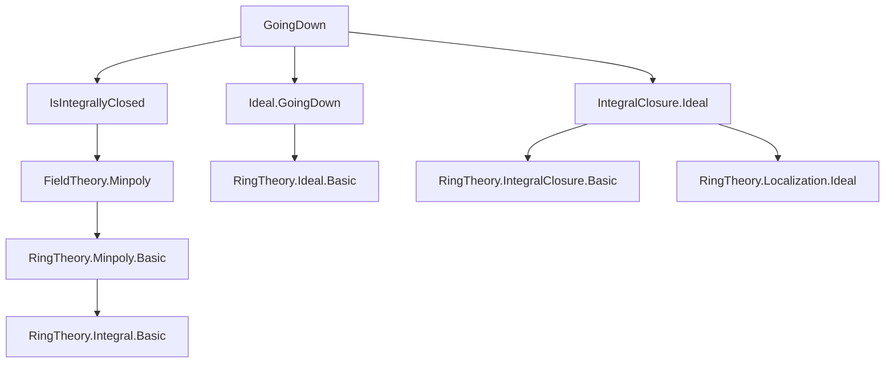
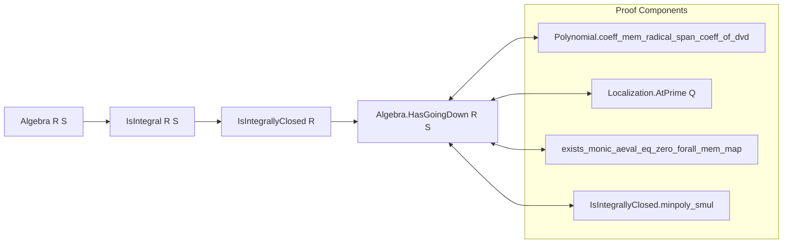

**Technical Brief: `GoingDown.lean` — Going Down for Integrally Closed Domains**

---

### 1. **Key Definitions & Theorems**

| Name | Type / Signature | Purpose |
|------|------------------|---------|
| `Polynomial.coeff_mem_radical_span_coeff_of_dvd` | `(p q : R[X]) (hp : p.Monic) (hq : q.Monic) (H : q ∣ p) (i : ℕ) (hi : i ≠ q.natDegree) → q.coeff i ∈ (Ideal.span { p.coeff i | i < p.natDegree }).radical` | Core technical lemma: coefficients of a monic divisor (except top-degree) lie in the radical of the ideal generated by lower-degree coefficients of the dividend. |
| `Algebra.HasGoingDown` | `Class` (instance) | States that for an integral extension $ R \subseteq S $, the *going down* property holds if $ R $ is integrally closed. |
| `instance Algebra.HasGoingDown` | `[IsDomain S] [FaithfulSMul R S] [Algebra.IsIntegral R S] [IsIntegrallyClosed R] : Algebra.HasGoingDown R S` | Main theorem: integral extensions over integrally closed domains satisfy going down. |

---

### 2. **Naming Conventions**

- **Prefixes**:
  - `coeff_`: refers to polynomial coefficients (`coeff_mem_radical_span_coeff_of_dvd`)
  - `map_`: refers to ideal or polynomial maps under ring homomorphisms (`map_dvd`, `map_mul`, `algebraMap`)
  - `mem_`: membership in ideals or radicals (`mem_radical`, `mem_sInf`, `mem_map_algebraMap_iff`)
  - `natDegree_`: degree-related operations (`natDegree_scaleRoots`, `natDegree_map`)
- **Suffixes**:
  - `_of_`: indicates dependency on a condition (`coeff_mem_radical_span_coeff_of_dvd`, `mem_of_pow_mem`)
  - `_eq_`: equality or equivalence (`comap_map_eq_self_iff_of_isPrime`, `isUnit_iff`)
- **Other patterns**:
  - `is_`: properties of structures (`isDomain`, `isIntegrallyClosed`, `isPrime`, `isUnit`)
  - `under`: localization at prime ideal (`Ideal.under`, `Localization.AtPrime`)

---

### 3. **Tactic Stack**

Frequently used tactics in this file:

| Tactic | Role |
|--------|------|
| `ext` | Extensionality for polynomials/ideals (e.g., proving equality of polynomials by coefficients) |
| `simp` / `simp only` | Simplification using definitional equalities and lemmas (e.g., `minpoly.monic`, `aeval_algebraMap_apply`) |
| `rw` / `congr` | Rewriting and congruence closure for substitutions (e.g., `congr(($ha).natDegree).symm`) |
| `obtain` / `have` | Introducing intermediate results or witnesses (e.g., `obtain ⟨j, hj, a, ha⟩`) |
| `simpa` | Simplify and apply a hypothesis (e.g., `simpa using hx`) |
| `by_contra!` | Proof by contradiction with negation handling |
| `exact` / `refine` | Finishing or partially filling goals (e.g., `refine ⟨P.under S, ?_, inferInstance, …⟩`) |
| `aesop` (not present here) — *absent* in this file |
| `ring` (not present) — *absent* in this file |

---

### 4. **Proof Logic**

The proof proceeds as follows:

1. **Setup**:
   - Assume $ R \subseteq S $ is an integral extension, $ R $ integrally closed, $ S $ a domain, and $ \text{Algebra}~R~S $ faithful.
   - Goal: Show *going down* holds: for primes $ \mathfrak{p}_1 \subseteq \mathfrak{p}_2 \subseteq S $, and $ \mathfrak{q}_1 = \mathfrak{p}_1 \cap R $, find $ \mathfrak{q}_2 \supseteq \mathfrak{q}_1 $ with $ \mathfrak{q}_2 \cap R = \mathfrak{p}_2 \cap R $.

2. **Localization**:
   - Localize at prime $ Q $ of $ S $ to reduce to local case: work in $ S_Q $.
   - Reduce to showing $ (p S_Q) \cap R \subseteq p $, where $ p = \mathfrak{p}_2 \cap R $.

3. **Element-wise argument**:
   - Take $ x \in S $ such that $ x \cdot a \in p S $ for some $ a \notin Q $.
   - Use integrality: get monic $ f \in R[T] $ with $ f(a) = 0 $ and $ f $ vanishing on elements of $ p $.

4. **Coefficient analysis**:
   - Use `Polynomial.coeff_mem_radical_span_coeff_of_dvd` to show certain coefficients of the minimal polynomial of $ a $ lie in the radical of $ p $.
   - Since $ R $ is integrally closed, minimal polynomial divides any polynomial annihilating $ a $, and coefficients not in $ p $ yield contradiction unless $ x \in p $.

5. **Prime ideal property**:
   - Use primality to lift radical membership to actual membership (via power membership).

6. **Conclusion**:
   - Construct the desired prime $ P \subseteq S $ via localization correspondence.

---

### 5. **Imports**

| Import | Purpose |
|--------|---------|
| `Mathlib.FieldTheory.Minpoly.IsIntegrallyClosed` | Minimal polynomials over integrally closed domains; key for divisibility and coefficient properties |
| `Mathlib.RingTheory.Ideal.GoingDown` | General definitions and lemmas about going up/down properties |
| `Mathlib.RingTheory.IntegralClosure.Algebra.Ideal` | Integral closure, ideal extension/compression, and interaction with localization |

---

### 6. **Mermaid Diagrams**

#### **Dependency Graph (File-Level)**

#### **Overview of Theoretical Flow**

---

### 7. **Mathematical Context Summary**

This file formalizes a classical result in commutative algebra:

> **Theorem (Going Down for Integrally Closed Domains)**  
> Let $ R \subseteq S $ be an integral extension of commutative rings. If $ R $ is integrally closed in its field of fractions, then the extension $ R \subseteq S $ satisfies the *going down* property.

The proof crucially uses:
- Minimal polynomials over integrally closed domains are well-behaved (monic, divisibility).
- Localization at primes to reduce to local cases.
- Radical membership criteria via polynomial coefficient analysis.

The formalization is aligned with the Stacks Project tag [00H8](https://stacks.math.columbia.edu/tag/00H8).

--- 

Let me know if you'd like a formalized statement in natural language or a proof sketch in LaTeX.
