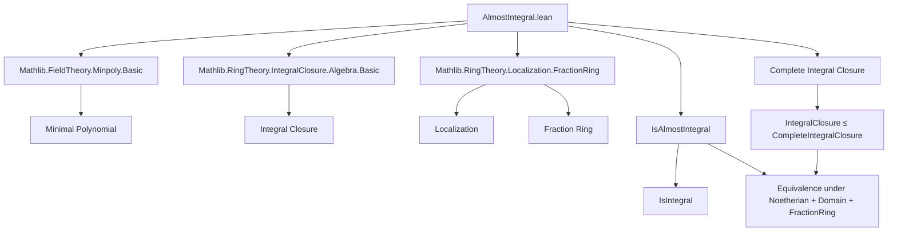
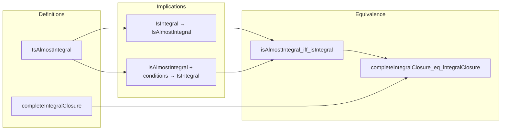

**Technical Brief: `AlmostIntegral.lean`**

---

### 1. **Key Definitions & Theorems**

| Name | Type / Signature | Purpose |
|------|------------------|---------|
| `IsAlmostIntegral R s` | `Prop` | Defines *almost integral* elements: $ s \in S $ is almost integral if $ \exists r \in R^0 $ such that $ r \cdot s^n \in \operatorname{range}(\text{algebraMap } R \to S) $ for all $ n \in \mathbb{N} $. |
| `completeIntegralClosure R S` | `Subalgebra R S` | Subalgebra of $ S $ consisting of all almost integral elements over $ R $. |
| `mem_completeIntegralClosure` | `x ∈ completeIntegralClosure R S ↔ IsAlmostIntegral R x` | Characterization of membership in the complete integral closure. |
| `IsIntegral.isAlmostIntegral_of_exists_smul_mem_range` | `{s : S} → IsIntegral R s → (∃ t ∈ R⁰, t • s ∈ range) → IsAlmostIntegral R s` | Shows integrality + existence of a single denominator clearing $ s $ implies almost integrality. |
| `IsIntegral.isAlmostIntegral_of_isLocalization` | `{s : S} → IsIntegral R s → M ≤ R⁰ → IsLocalization M S → IsAlmostIntegral R s` | Extends previous lemma to localizations where denominators lie in $ R^0 $. |
| `IsIntegral.isAlmostIntegral` | `{s : S} → IsFractionRing R S → IsIntegral R s → IsAlmostIntegral R s` | In the setting of a fraction field, all integral elements are almost integral. |
| `integralClosure_le_completeIntegralClosure` | `integralClosure R S ≤ completeIntegralClosure R S` | The integral closure is contained in the complete integral closure. |
| `IsAlmostIntegral.isIntegral_of_nonZeroDivisors_le_comap` | `{s : S} → IsAlmostIntegral R s → [IsNoetherianRing R] → R⁰ ≤ S⁰.comap algebraMap → IsIntegral R s` | Under Noetherian hypothesis and faithfulness condition, almost integrality implies integrality. |
| `IsAlmostIntegral.isIntegral` | `{s : S} → [IsNoetherianRing R] [IsDomain S] [FaithfulSMul R S] → IsAlmostIntegral R s → IsIntegral R s` | Special case of above with standard assumptions (Noetherian, domain, faithful). |
| `isAlmostIntegral_iff_isIntegral` | `{s : S} → [IsNoetherianRing R] [IsDomain R] [IsFractionRing R S] → IsAlmostIntegral R s ↔ IsIntegral R s` | Equivalence of almost integrality and integrality in the fraction field setting. |
| `completeIntegralClosure_eq_integralClosure` | `[IsNoetherianRing R] [IsDomain R] [IsFractionRing R S] → completeIntegralClosure R S = integralClosure R S` | In the above setting, the complete integral closure coincides with the usual integral closure. |

---

### 2. **Naming Conventions**

- **Predicates**: `IsAlmostIntegral`, `IsIntegral`, `IsLocalization`, `IsFractionRing`, `IsNoetherianRing`, `IsDomain`, `FaithfulSMul`, `comap`, `range`, `algebraMap`.
- **Constants/Constructors**:
  - `R⁰`: multiplicative set of non-zero divisors.
  - `algebraMap R S`: structure map $ R \to S $.
  - `completeIntegralClosure`, `integralClosure`: standard algebraic constructions.
  - `mem_`, `le_`, `eq_`: standard Lean naming for membership, inclusion, equality lemmas.
- **Suffixes**:
  - `_mem'`: used for subalgebra membership proofs (e.g., `mul_mem'`, `add_mem'`).
  - `_of_`: indicates derivation from a hypothesis (e.g., `isAlmostIntegral_of_exists_smul_mem_range`).
  - `_iff_`: bi-implication lemmas.
  - `_le_`, `_eq_`: inclusion/equality lemmas.

---

### 3. **Tactic Stack**

Frequently used tactics in proofs:

| Tactic | Usage |
|--------|-------|
| `intro`, `rintro`, `obtain` | Introducing hypotheses and destructing existentials. |
| `refine`, `exact`, `apply` | Constructing proofs via type inference. |
| `rw`, `simp`, `simp_rw` | Rewriting using definitions and simplification rules. |
| `induction` | Structural induction (e.g., `strong_induction_on` for natural numbers). |
| `cases` | Case analysis on disjunctions or inductive types. |
| `ring`, `linarith`, `lia` | Solving polynomial or linear arithmetic goals. |
| `change`, `convert`, `congr` | Adjusting goal shape or congruence reasoning. |
| `have`, `suffices`, `by_cases` | Intermediate lemma introduction. |
| `set`, `let` | Introducing local definitions (e.g., `let f := ...`). |
| `exact_mod_cast`, `subst`, `subst_var` | Handling type coercions and substitutions. |
| `subsingleton.elim`, `subsingleton_iff`, `subsingleton_of_subsingleton` | For uniqueness arguments (not heavily used here). |

---

### 4. **Proof Logic**

- **Structure of proofs**:
  - Most proofs follow a *constructive* pattern: extract witnesses (e.g., denominators), verify properties via algebraic manipulation.
  - **Induction** is used in `IsIntegral.isAlmostIntegral_of_exists_smul_mem_range` to handle arbitrary powers $ s^n $ using the minimal polynomial.
  - **Localization theory** is leveraged heavily: `IsLocalization.exists_mk'_eq`, `IsLocalization.injective`, and `Localization.Away` constructions.
  - **Faithfulness and Noetherian assumptions** are used to lift almost integrality to integrality via module-finiteness arguments (`Module.Finite.iff_fg`, `FG`, `of_injective`, etc.).
  - **Equivalence proofs** (`_iff_`) are typically split into two directions, each citing earlier lemmas.

- **Typical flow**:
  1. Extract data from `IsAlmostIntegral` or `IsIntegral`.
  2. Construct a denominator or use localization to clear denominators.
  3. Use algebraic identities (`mul_pow`, `add_pow`, `smul_mul_comm`, etc.) to verify closure properties.
  4. Apply module-theoretic lemmas (e.g., finite generation, injectivity) to conclude integrality.

---

### 5. **Imports**

| Module | Purpose |
|--------|---------|
| `Mathlib.FieldTheory.Minpoly.Basic` | Minimal polynomials, evaluation, degree, monicity. |
| `Mathlib.RingTheory.IntegralClosure.Algebra.Basic` | Integral closure, integral elements, algebraic structure. |
| `Mathlib.RingTheory.Localization.FractionRing` | Localization, fraction rings, `IsLocalization`, `IsFractionRing`, `Localization.Away`. |

---

### 6. **Mermaid Diagrams**

#### **Dependency Graph (High-Level)**

#### **Overview of File Structure**

---

### 7. **Domain-Specific AI Agent Insights**

- **Key Concepts to Encode**:
  - Almost integrality as a *denominator-clearing* condition.
  - Role of `R⁰` (non-zero divisors) as denominators.
  - Interplay between localization, fraction fields, and integrality.
  - Noetherian + domain + faithful assumptions bridge almost integrality ↔ integrality.

- **Common Proof Patterns**:
  - Use of `strong_induction_on` with minimal polynomial.
  - Localization-based denominator construction.
  - Module-finiteness arguments via injective linear maps.

- **Critical Lemmas for Automation**:
  - `IsIntegral.isAlmostIntegral_of_exists_smul_mem_range`
  - `IsAlmostIntegral.isIntegral_of_nonZeroDivisors_le_comap`
  - `isAlmostIntegral_iff_isIntegral`

- **Suggested Tactics for AI Reasoning**:
  - Prioritize `obtain` + `refine` for witness construction.
  - Use `simp only [smul_mul_assoc, mul_pow]` for algebraic simplifications.
  - Apply `induction n using Nat.strong_induction_on` when minimal polynomial is involved.

--- 

Let me know if you'd like a formalized tactic automation strategy or a proof sketch generator for this theory.
