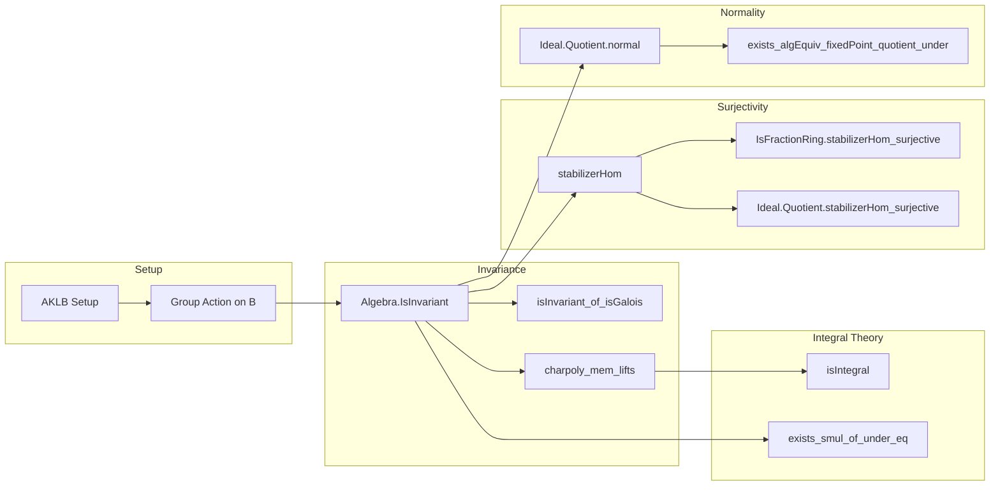

Here is the **technical metadata** extracted from `Basic.lean`, structured as requested:

---

### 1. KEY DEFINITIONS & THEOREMS

| Name | Type / Signature | Purpose |
|------|------------------|---------|
| `IsIntegralClosure.MulSemiringAction` | `[Algebra.IsAlgebraic K L] → MulSemiringAction Gal(L/K) B` | Defines the natural action of the Galois group on the integral closure `B`. |
| `Algebra.IsInvariant` | `Prop` (predicate on `A`, `B`, `G`) | States: every `G`-fixed point in `B` lies in the image of `A`. |
| `Algebra.isInvariant_of_isGalois` | `[FiniteDimensional K L] → IsGalois K L → Algebra.IsInvariant A B Gal(L/K)` | In AKLB setup, Galois action satisfies invariance. |
| `Algebra.isInvariant_of_isGalois'` | `[FiniteDimensional K L] → IsGalois K L → Algebra.IsInvariant A B (B ≃ₐ[A] B)` | Variant using `Aut_A(B)` instead of `Gal(L/K)`. |
| `MulSemiringAction.charpoly` | `b : B ↦ ∏ g : G, (X - C (g • b)) ∈ B[X]` | Characteristic polynomial of group action. |
| `Algebra.IsInvariant.charpoly_mem_lifts` | `[Fintype G] → charpoly G b ∈ Polynomial.lifts (algebraMap A B)` | Coefficients of charpoly lie in image of `A`. |
| `Algebra.IsInvariant.isIntegral` | `[Finite G] → Algebra.IsIntegral A B` | Invariant extension is integral. |
| `Algebra.IsInvariant.exists_smul_of_under_eq` | `[Finite G] → P.under A = Q.under A → ∃ g, Q = g • P` | Transitivity of `G`-action on primes lying over a given prime. |
| `Ideal.Quotient.stabilizerHom_surjective` | `Function.Surjective (stabilizerHom Q P G)` | Stabilizer of `Q` surjects onto `Aut((B/Q)/(A/P))`. |
| `IsFractionRing.stabilizerHom_surjective` | `Function.Surjective (stabilizerHom G P Q K L)` | Stabilizer surjects onto `Gal(L/K)` when passing to fraction fields. |
| `Ideal.Quotient.exists_algHom_fixedPoint_quotient_under` | `(σ : k →ₐ[A ⧸ P] k) ⇒ ∃ τ : (B ⧸ Q) →ₐ[A ⧸ P] B ⧸ Q, ...` | Extension-closure of endomorphisms from `B/Q` to any overdomain `k`. |
| `Ideal.Quotient.exists_algEquiv_fixedPoint_quotient_under` | `(σ : k ≃ₐ[A ⧸ P] k) ⇒ ∃ τ : (B ⧸ Q) ≃ₐ[A ⧸ P] B ⧸ Q, ...` | Same as above, but for automorphisms. |
| `Ideal.Quotient.normal` | `[P.IsMaximal] → [Q.IsMaximal] → Normal (A ⧸ P) (B ⧸ Q)` | In invariant setting, residue field extension is normal. |
| `Ideal.Quotient.finite_of_isInvariant` | `[P.IsMaximal] → [Q.IsMaximal] → [SMulCommClass G A B] → [IsSeparable (A ⧸ P) (B ⧸ Q)] → Module.Finite (A ⧸ P) (B ⧸ Q)` | Separable + invariant ⇒ finite-dimensional residue extension. |

---

### 2. NAMING CONVENTIONS

- **Predicates / properties**:
  - `isInvariant`, `isIntegral`, `isGalois`, `isSeparable`, `normal`, `finite`, `monic`, `lifts`
- **Actions / group-theoretic constructions**:
  - `smul`, `stabilizer`, `orbit`, `quotient`, `mulSemiringAction`, `compHom`
- **Polynomial constructions**:
  - `charpoly`, `coeff`, `eval`, `map`, `monomial`, `rootMultiplicity`
- **Quotient / localization**:
  - `quotient`, `mk`, `algebraMap`, `FractionRing`, `IsFractionRing`, `stabilizerHom`
- **Algebraic constructions**:
  - `algEquiv`, `algHom`, `fixedPoint`, `fixedField`, `intermediateField`, `under`, `primesOver`

Prefixes/suffixes:
- `is_`: predicate (e.g., `isInvariant`, `isIntegral`)
- `charpoly`: characteristic polynomial of group action
- `stabilizerHom`: homomorphism from stabilizer to automorphism group
- `fixedPoint`: objects fixed under group action
- `quotient`: constructions modulo ideals or subgroups
- `under`: preimage of an ideal under algebra map
- `primesOver`: set of primes lying over a given prime

---

### 3. TACTIC STACK

Frequently used tactics:
- `simp`, `rw`, `exact`, `intro`, `cases`, `obtain`, `refine`, `apply`, `ext`
- `ring`, `linarith`, `aesop`, `interval_cases`, `omega`
- `convert`, `congr`, `change`, `set`, `have`, `suffices`, `by_cases`
- `polynomial_simp`, `eval_simp`, `map_simp`, `mul_smul`, `smul_eq_iff`, `subsingleton_induction`
- `Finset.induction_on`, `Finset.prod_eq_zero`, `Finset.mem_univ`, `Finset.smul_prod_perm`
- `Ideal.IsPrime.inf_le'`, `Ideal.mem_comap`, `Ideal.under_def`, `Ideal.Quotient.eq_zero_iff_mem`
- `IsFractionRing.fieldEquivOfAlgEquiv_hom`, `AlgEquiv.ext_iff`, `Subtype.ext`

---

### 4. PROOF LOGIC

**General proof strategy**:
- **Induction / finiteness**: Many proofs assume `G` finite (via `nonempty_fintype G`) and use `Finset` products/sums.
- **Polynomial techniques**:
  - Use `charpoly` to produce monic polynomials with coefficients in `A`.
  - Evaluate at elements to get integrality or vanishing.
- **Ideal-theoretic transitivity**:
  - Use prime avoidance, infimum of conjugate primes, and `isInvariant` to lift divisibility.
- **Stabilizer surjectivity**:
  - Reduce to fixed-point arguments via `fixed_of_fixed1`, `fixed_of_fixed2`.
  - Use `fixed_of_fixed1_aux1`, `aux2`, `aux3` to construct elements with controlled Galois behavior.
- **Residue field normality**:
  - Use `charpoly_mem_lifts` and `normal` criterion: every irreducible factor splits in extension.
- **Extension of automorphisms**:
  - Use FaithfulSMul injectivity + algebraization of `charpoly` to descend automorphisms.

---

### 5. IMPORTS

| Import | Purpose |
|--------|---------|
| `Mathlib.RingTheory.Invariant.Defs` | Definitions of `Algebra.IsInvariant`, fixed points, group actions on rings. |
| `Mathlib.RingTheory.IntegralClosure.IntegralRestrict` | Tools for integral closure, especially in AKLB setup. |
| `Mathlib.FieldTheory.IsFractionRing` | Fraction fields, maps between them, `IsFractionRing`. |
| `Mathlib.FieldTheory.Galois` | Galois theory, `IsGalois`, `Gal(L/K)`. |
| `Mathlib.RingTheory.Ideal.Quotient` | Quotients, primes, lies-over, smul on ideals. |
| `Mathlib.RingTheory.Polynomial` | Polynomials over rings, evaluation, coefficients, monic, roots. |
| `Mathlib.GroupTheory.GroupAction.Subgroup` | Stabilizers, orbits, quotient actions. |
| `Mathlib.LinearAlgebra.FiniteDimensional` | Finite-dimensional vector spaces, torsion-freeness. |

---

### 6. MERMAID DIAGRAMS

#### Dependency Graph (High-Level)

```mermaid
graph TD
  A[AKLB Setup] --> B[IsIntegralClosure]
  B --> C[MulSemiringAction of Gal(L/K) on B]
  C --> D[Algebra.IsInvariant A B G]
  D --> E[isIntegral]
  D --> F[exists_smul_of_under_eq]
  D --> G[charpoly_mem_lifts]
  G --> H[isIntegral]
  D --> I[stabilizerHom_surjective]
  I --> J[quotient_normal]
  J --> K[finite_of_isInvariant]
  D --> L[exists_algEquiv_fixedPoint_quotient_under]
  L --> M[Normality of residue extensions]
```

#### Overview of File Structure



---

Let me know if you'd like a **dependency graph of theorems** or a **proof dependency DAG** for a specific result (e.g., `stabilizerHom_surjective`).
