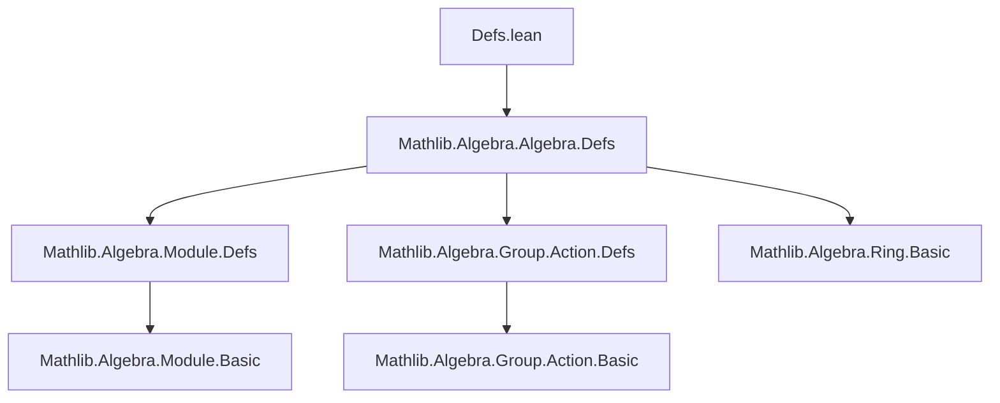

**Technical Brief: `Defs.lean` — Invariant Extensions of Rings**

---

### 1. **Key Definitions & Theorems**

| Name | Type / Signature | Purpose |
|------|------------------|---------|
| `Algebra.IsInvariant` | `class IsInvariant : Prop`<br>`isInvariant : ∀ b : B, (∀ g : G, g • b = b) → ∃ a : A, algebraMap A B a = b` | Defines when a group action $G \curvearrowright B$ is *invariant* over $A$: every $G$-fixed element of $B$ lies in the image of $A$ under the structure map. |
| `smul_algebraMap` (implicit reference) | `SMulCommClass A B G → ∀ a : A, ∀ g : G, g • algebraMap A B a = algebraMap A B a` | States that elements in the image of $A$ are $G$-fixed (used as the converse direction to `isInvariant`). Not defined here but referenced in comment. |

> Note: The `mk_iff` attribute enables automatic equivalence between `IsInvariant` and its defining property.

---

### 2. **Naming Conventions**

- **Prefixes**:
  - `is_`: Used for predicate classes (e.g., `IsInvariant`).
- **Suffixes**:
  - None prominent in this file; standard Lean naming (`algebraMap`, `smul`, `•`) dominates.
- **Variables**:
  - `A`, `B`, `G`: Standard for base ring, extension ring, and group.
  - Typeclass constraints use standard algebraic notation: `[CommSemiring A]`, `[Semiring B]`, `[Group G]`, `[MulSemiringAction G B]`.

---

### 3. **Tactic Stack**

- **No explicit tactics** appear in definitions or proofs in this file (only a class definition).
- Expected tactics in related files (e.g., proofs using `IsInvariant`):
  - `aesop`, `simp`, `intro`, `cases`, `exact`, `rw [isInvariant]`, `apply exists.intro`, `ring` (for ring equalities), `smul_comm` or `smul_left_injective` (for action reasoning).

---

### 4. **Proof Logic**

- **Logical structure** of `IsInvariant`:
  - Universal quantification over $b \in B$,
  - Implication: if $b$ is $G$-fixed, then $b$ is in the image of $A$.
- **Typical proof strategy** (in downstream files):
  - **Forward direction**: Assume $b$ is fixed, apply `isInvariant b h_fixed` to get witness $a$.
  - **Backward direction**: Show that algebra map images are fixed (via `SMulCommClass` + `smul_algebraMap`).
  - Often combined with Galois descent or fixed-point lemmas in number-theoretic contexts.

---

### 5. **Imports**

- **Primary dependency**:
  ```lean
  Mathlib.Algebra.Algebra.Defs
  ```
- **Implicit dependencies** (via typeclasses):
  - `Mathlib.Algebra.Module.Defs` (for `SMul`, `•`)
  - `Mathlib.Algebra.Group.Action.Defs` (for `MulSemiringAction`)
  - `Mathlib.Algebra.Algebra.Basic` (for `algebraMap`, `SMulCommClass`)

---

### 8. **Mermaid Diagrams**

#### **Dependency Graph (Module-Level)**



#### **Conceptual Overview of Theory**

```mermaid
graph LR
  subgraph Setup
    A[Base Ring A] -->|algebraMap| B[Extension Ring B]
    G[Group G] -->|MulSemiringAction| B
  end

  subgraph Property
    IsInvariant[IsInvariant A B G] -->|def| FixedPoints[Fixed points of B under G]
    FixedPoints -->|subset| ImageA[Image of A in B]
  end

  subgraph Application
    NumberTheory[Algebraic Number Theory]
    NumberTheory --> GaloisGroup[Gal(L/K)]
    NumberTheory --> RingsOfIntegers[𝓞_K ⊆ 𝓞_L]
  end

  IsInvariant --> NumberTheory
```

---

**Summary**: This file introduces the foundational predicate `IsInvariant` for group actions on ring extensions, setting up a key condition for descent (e.g., Galois descent in algebraic number theory). It is minimal, declarative, and designed for composition with existing `Mathlib` algebraic infrastructure.
