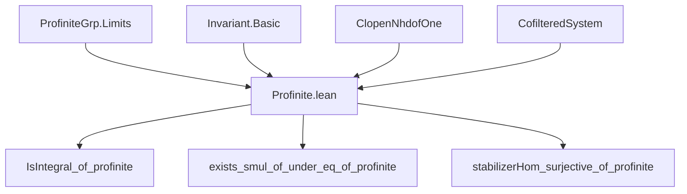

**Technical Brief: Profinite Invariant Theory in Lean 4**

---

### 1. **Key Definitions & Theorems**

| Name | Type / Signature | Purpose |
|------|------------------|---------|
| `Algebra.IsInvariant` | `Prop` | States that the fixed points under `G`-action on `B` equal `A`: $ A = B^G $. |
| `FixedPoints.subalgebra A B G` | `Subalgebra A B` | The subalgebra of $ G $-invariants in $ B $. |
| `stabilizer_isOpen G x` | `IsOpen (MulAction.stabilizer G x)` | For continuous action on discrete $ B $, stabilizers of elements are open subgroups. |
| `ProfiniteGrp.of G` | `ProfiniteGrp ⥤ ProfiniteGrp` | The canonical embedding of a profinite group into its profinite completion (identity in this case). |
| `Ideal.Quotient.stabilizerHom Q P G` | `MulAction.stabilizer G Q →ₙ* (B ⧸ Q) ≃ₐ[A ⧸ P] B ⧸ Q` | Natural map from stabilizer of $ Q $ to automorphisms of the quotient extension. |

#### Main Theorems

| Name | Type | Purpose |
|------|------|---------|
| `Algebra.IsInvariant.isIntegral_of_profinite` | `[Algebra.IsInvariant A B G] → Algebra.IsIntegral A B` | Generalizes integral closure from finite to profinite groups: $ B/A $ is integral. |
| `Algebra.IsInvariant.exists_smul_of_under_eq_of_profinite` | `[Algebra.IsInvariant A B G] → P, Q : Ideal B, P.IsPrime, Q.IsPrime, P.under A = Q.under A → ∃ g, Q = g • P` | $ G $ acts transitively on primes lying over a given prime in $ A $. |
| `Ideal.Quotient.stabilizerHom_surjective_of_profinite` | `[Algebra.IsInvariant A B G] → P : Ideal A, Q : Ideal B, Q.IsPrime, Q.LiesOver P → Function.Surjective (stabilizerHom Q P G)` | Stabilizer of $ Q $ surjects onto $ \mathrm{Aut}_{A/P}(B/Q) $. |

#### Auxiliary Functors & Lemmas

| Name | Type | Purpose |
|------|------|---------|
| `Ideal.Quotient.stabilizerHomSurjectiveAuxFunctor P Q σ` | `OpenNormalSubgroup G ⥤ Type*` | Functor assigning to each open normal $ N \trianglelefteq G $ the set of lifts of $ \sigma $ modulo $ N $. |
| `Ideal.Quotient.stabilizerHomSurjectiveAuxFunctor_aux` | `N ≤ N' ⇒ x ∈ stab(G/N, Q.under B'_N) ⇒ map(x) ∈ stab(G/N', Q.under B'_{N'})` | Ensures functoriality of the lift system. |
| `Finite ((stabilizerHomSurjectiveAuxFunctor ...).obj N)` | `Finite` instance | Finiteness of each fiber (needed for cofiltered system section existence). |
| `Nonempty ((stabilizerHomSurjectiveAuxFunctor ...).obj N)` | `Nonempty` instance | Each finite quotient has a lift (via finite-group case + `exists_algEquiv_fixedPoint_quotient_under`). |

---

### 2. **Naming Conventions**

- **Prefixes**:
  - `is_`: Predicate definitions (`isIntegral`, `isOpen`, `isPrime`, `LiesOver`).
  - `stabilizer_`: Stabilizer-related constructions (`stabilizerHom`, `stabilizer_isOpen`).
  - `under`: Pullback of ideals along algebra maps (`P.under A`, `Q.under B'`).
  - `quotient_`: Quotient constructions (`Ideal.Quotient.stabilizerHom`, `Ideal.Quotient.mk`).
  - `smul_`: Action-related (`exists_smul_of_under_eq`, `pointwise_smul_eq_comap`).

- **Suffixes**:
  - `_of_profinite`: Generalization from finite to profinite groups.
  - `_of_`: Parameterized version (e.g., `of_under_eq`, `of_algebraMap_eq`).
  - `_aux`: Internal helper lemmas/functors.

- **Category-theoretic**:
  - `obj`, `map`, `hom`, `inv`, `comp`: Standard morphism components.
  - `Subtype.val`, `Subtype.prop`: Projection and property for subtypes.

---

### 3. **Tactic Stack**

| Tactic | Usage |
|--------|-------|
| `obtain ⟨x, hx⟩` / `obtain ⟨x, rfl⟩` | Existential elimination and equality substitution. |
| `lift x to B' N.1.1 using ...` | Use continuity + discrete topology to reduce to fixed points. |
| `rw [← this]` / `congr! 2` / `ext` | Equality proofs via extensionality and rewriting. |
| `simp only [...]` / `simp` | Simplify using pointwise action, comap identities, and algebra maps. |
| `exact DFunLike.congr_fun ...` | Use function extensionality for algebra maps. |
| `have h : ... := fun x hx n ↦ hx ⟨_, ...⟩` | Construct inclusion of fixed-point subalgebras. |
| `lift ... using ...` | Leverage continuity of action and discreteness of $ B $. |
| `nonempty_sections_of_finite_cofiltered_system` | Key existence tool for profinite limits. |
| `change ... ↔ ...` | Rewriting goal to match known lemmas. |

---

### 4. **Proof Logic**

- **General Strategy**:
  1. **Reduction to finite quotients**: Use that profinite $ G = \varprojlim G/N $ over open normal $ N $.
  2. **Construct compatible systems**: Define functors over $ \mathsf{OpenNormalSubgroup}(G) $ whose sections correspond to desired global objects (e.g., lifts of automorphisms).
  3. **Apply cofiltered limit section existence**: Use `nonempty_sections_of_finite_cofiltered_system` (requires finiteness + nonemptiness of each stage).
  4. **Reconstruct global object**: Use the canonical isomorphism $ G \cong \varprojlim G/N $ to extract a global element/automorphism.
  5. **Verify properties**: Use continuity, discreteness, and openness of stabilizers to check conditions hold globally.

- **Inductive/Case Structure**:
  - Not induction on natural numbers, but *inverse system induction* over open normal subgroups.
  - Cases on membership in stabilizers or equality of ideals under algebra maps.

---

### 5. **Imports & Dependencies**

| Module | Role |
|--------|------|
| `Mathlib.RingTheory.Invariant.Basic` | Base theory of invariant subrings and finite group actions. |
| `Mathlib.Topology.Algebra.ClopenNhdofOne` | Open normal subgroups and neighborhood bases at identity. |
| `Mathlib.Topology.Algebra.Category.ProfiniteGrp.Limits` | Limits in profinite groups, especially $ G \cong \varprojlim G/N $. |
| `Mathlib.CategoryTheory.CofilteredSystem` | General theory of cofiltered limits and sections. |

---

### 6. **Mermaid Diagrams**

#### Dependency Graph (High-Level)



#### Overview of Proof Flow for `stabilizerHom_surjective_of_profinite`

```mermaid
graph LR
  A[Given σ : (B/Q) ≃ₐ[A/P] B/Q] --> B[Define functor F(N) = lifts of σ mod N]
  B --> C[Show each F(N) is finite & nonempty]
  C --> D[Apply cofiltered system section existence]
  D --> E[Obtain section s : N ↦ lift_N]
  E --> F[Define a = lim← s_N ∈ G via ProfiniteGrp.isoLimittoFiniteQuotientFunctor]
  F --> G[Show a ∈ stabilizer G Q]
  G --> H[Show stabilizerHom(a) = σ]
```

#### Ideal Lattice & Action Diagram (Conceptual)

```mermaid
graph LR
  A[A] -->|algebra| B[B]
  A -->|quotient| A/P
  B -->|quotient| B/Q
  A/P -->|algebra| B/Q
  G -->|continuous action| B
  G -->|stabilizer| G_Q
  G_Q -->|surjects| Aut_{A/P}(B/Q)
```

---

### 7. **Mathematical Context Summary**

This file extends classical Galois-theoretic results (e.g., transitivity of Galois group action on primes, surjectivity of decomposition group onto automorphism group of residue fields) from finite to **profinite** groups. It crucially uses:

- **Profinite topology**: $ G $ compact, Hausdorff, totally disconnected.
- **Discrete topology on $ B $**: Ensures continuity ⇔ local constancy ⇔ stabilizers open.
- **Cofiltered limit techniques**: To descend finite-group results to profinite case.

The results are foundational for arithmetic geometry (e.g., decomposition groups in Galois representations) and profinite Galois cohomology.

--- 

Let me know if you'd like a formalized summary in `leanpkg` format or a dependency graph for the entire `Mathlib` invariant theory module.
