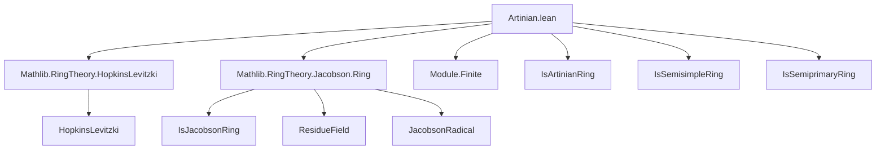
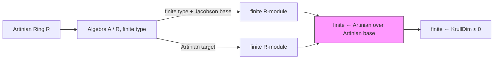

**Technical Brief: `Artinian.lean`**

---

### 1. **Key Definitions & Theorems**

| Name | Type / Signature | Purpose |
|------|------------------|---------|
| `Module.Finite R A` | `Module R A → Prop` | States that $A$ is a finitely generated $R$-module. |
| `IsArtinianRing A` | `Ring A → Prop` | $A$ satisfies the descending chain condition on ideals (Artinian ring). |
| `IsJacobsonRing R` | `Ring R → Prop` | $R$ is a Jacobson ring: every prime ideal is an intersection of maximal ideals. |
| `Algebra.FiniteType R A` | `Algebra R A → Prop` | $A$ is a finitely generated $R$-algebra. |
| `Ring.jacobson A` | `Ideal A` | Jacobson radical of $A$, intersection of all maximal ideals. |
| `IsSemisimpleRing A` | `Ring A → Prop` | $A$ is semisimple (Artinian with zero Jacobson radical). |
| `IsSemiprimaryRing A` | `Ring A → Prop` | $A$ has nilpotent Jacobson radical and semisimple quotient. |

#### Main Theorems

| Name | Statement | Purpose |
|------|-----------|---------|
| `Module.finite_of_isSemisimpleRing` | `[IsJacobsonRing R] [IsSemisimpleRing A] → Module.Finite R A` | Finite generation over Jacobson base for semisimple algebras. |
| `Module.finite_of_isArtinianRing` | `[IsJacobsonRing R] [IsArtinianRing A] → Module.Finite R A` | Finite generation when base is Jacobson and target is Artinian. |
| `Module.finite_iff_isArtinianRing` | `[IsArtinianRing R] → Module.Finite R A ↔ IsArtinianRing A` | Equivalence between finite module structure and Artinian property over Artinian base. |
| `Module.finite_iff_krullDimLE_zero` | `[IsArtinianRing R] → Module.Finite R A ↔ Ring.KrullDimLE 0 A` | Connects finite module structure to Krull dimension zero (characterization of Artinian rings in Noetherian case). |

---

### 2. **Naming Conventions**

- **Prefixes**:
  - `finite_`: indicates results about finite module/algebra structure.
  - `isArtinianRing_`, `isJacobsonRing_`, `isSemisimpleRing_`: predicates on rings.
  - `krullDimLE_`: Krull dimension bounds.

- **Suffixes**:
  - `_of_`: implication from assumptions to conclusion (e.g., `finite_of_isArtinianRing`).
  - `_iff_`: biconditional statements.

- **Other patterns**:
  - `equivPi`, `restrictScalars`, `tfae`: standard homological/algebraic constructions.
  - `fieldOfSubtypeIsMaximal`: instance for residue fields at maximal ideals.

---

### 3. **Tactic Stack**

- `aesop`: used for automated reasoning in context with algebraic structures.
- `ring`: simplifies ring expressions.
- `simp_rw`: rewrites using simplification lemmas with rewriting control.
- `equiv`: handles module/ring isomorphisms and scalar restriction.
- `IsArtinianRing.tfae`: used for equivalence of multiple Artinian characterizations.
- `IsSemiprimaryRing.finite_of_isArtinian`: specialized lemma for semiprimary rings.

---

### 4. **Proof Logic**

- **Structure**: Proofs rely heavily on:
  - **Tower law** for module finiteness (`isArtinian_of_tower`).
  - **Jacobson radical decomposition**: reducing to semisimple or Artinian quotients.
  - **Chain of equivalences**: using `tfae` (there and back again) for Artinian conditions.
  - **Indirect reduction**: e.g., proving finite generation via semisimplicity of $A / \operatorname{Jac}(A)$.

- **Typical flow**:
  1. Use `finite_of_isSemisimpleRing` on $A / \operatorname{Jac}(A)$.
  2. Lift via `IsSemiprimaryRing.finite_of_isArtinian`.
  3. Apply `tfae` to relate Artinian, Noetherian, Krull dim 0.
  4. Use `isArtinian_of_tower` for base-change arguments.

---

### 5. **Imports**

| Import | Purpose |
|--------|---------|
| `Mathlib.RingTheory.HopkinsLevitzki` | Hopkins–Levitzki theorem: Artinian ⇒ Noetherian for modules over semiprimary rings. |
| `Mathlib.RingTheory.Jacobson.Ring` | Jacobson rings, radicals, residue fields, and related lemmas. |

---

### 8. **Mermaid Diagrams**

#### Dependency Graph (Module-Level)

#### Overview of Theory Flow

---

**Summary**: This module establishes foundational equivalences between module-finiteness and ring-theoretic Artinian properties for algebras over Artinian (or Jacobson) bases. It leverages deep structure theorems (Hopkins–Levitzki, Jacobson theory) and Lean’s algebraic hierarchy to formalize classical commutative algebra results.
