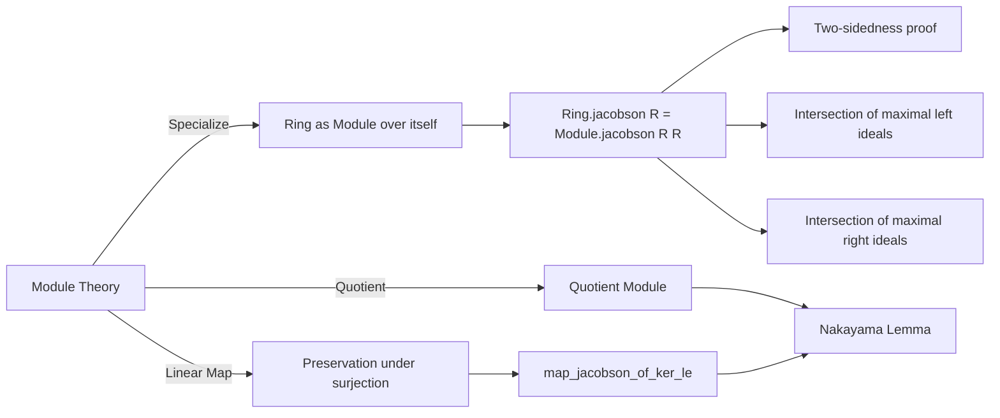

**Technical Brief: Radical.lean — Jacobson Radical Formalization in Lean 4**

---

### 1. KEY DEFINITIONS & THEOREMS

| Name | Type / Signature | Purpose |
|------|------------------|---------|
| `Module.jacobson R M` | `Submodule R M` | Intersection of all maximal submodules (i.e., coatoms) of an $R$-module $M$. Defined as `sInf { m : Submodule R M | IsCoatom m }`. |
| `Ring.jacobson R` | `Ideal R` | Jacobson radical of ring $R$, defined as `Module.jacobson R R`. Equals intersection of all maximal left ideals; proven to be two-sided. |
| `jacobson_quotient_jacobson` | `jacobson R (M ⧸ jacobson R M) = ⊥` | The Jacobson radical of the quotient by its own Jacobson radical is zero. |
| `jacobson_lt_top` | `[Nontrivial M] → jacobson R M < ⊤` | Jacobson radical is *proper* in nontrivial coatomic modules (e.g., finite modules). |
| `map_jacobson_of_ker_le` | `LinearMap.ker f ≤ jacobson R M ⇒ map f (jacobson R M) = jacobson R₂ M₂` | Surjective linear maps with kernel in Jacobson radical preserve Jacobson radical. |
| `jacobson_smul_lt_top` | `[Nontrivial M] → Ring.jacobson R • N < ⊤` | Jacobson radical acts strictly contractively on submodules. |
| `FG.eq_bot_of_le_jacobson_smul` | `N.FG ∧ N ≤ Ring.jacobson R • N ⇒ N = ⊥` | **Nakayama’s Lemma** (noncommutative, module-theoretic form). |

---

### 2. NAMING CONVENTIONS

- **Prefixes**:
  - `jacobson_`: for definitions and properties of the Jacobson radical.
  - `map_`, `comap_`: for behavior under linear maps (pushforward/pullback).
  - `le_`, `eq_`, `ne_`, `bot_`, `top_`: standard order-theoretic predicates.
  - `FG.`: for properties involving *finitely generated* submodules.

- **Suffixes**:
  - `_of_le`, `_of_ker_le`, `_of_bijective`, `_of_eq_bot`: indicate hypotheses (e.g., inclusion, kernel condition, bijectivity, triviality).
  - `_lt_top`, `_smul_lt`: emphasize strict inequality or scalar multiplication behavior.

- **Module vs Ring**:
  - `Module.jacobson` and `Ring.jacobson` are distinct but related; the latter is a specialization.

---

### 3. TACTIC STACK

| Tactic | Usage Frequency | Purpose |
|--------|-----------------|---------|
| `rw` / `simp_rw` | Very High | Rewriting definitions (`jacobson`, `sInf`, `iInf`, `comap`, `map`, `pi`, etc.). |
| `conv_rhs` | Medium | Right-hand side rewriting in equalities. |
| `exact`, `apply`, `refine` | High | Constructing proofs via lemmas and universal properties. |
| `simp` / `simp only` | Medium | Simplifying goals using `@[simp]` lemmas (e.g., `mkQ_map_self`, `comap_bot`). |
| `le_antisymm` | Medium | Proving equality of submodules/ideals via mutual inequality. |
| `contrapose!` | Low | For contrapositive reasoning (e.g., Nakayama). |
| `rwa`, `rintro`, `intro` | Medium | Handling hypotheses and quantifiers. |
| `set_like.ext'`, `SetLike.ext'_iff.mp` | Low | Extensionality for set-like objects (ideals, submodules). |
| `exact?` / `aesop` | Not observed | Not used in this file. |

---

### 4. PROOF LOGIC

The proofs follow a **structured order-theoretic and homological pattern**:

1. **Definition via infimum**: Most definitions use `sInf`/`iInf` over sets of maximal submodules/ideals.
2. **Reduction to linear algebra**: Properties of Jacobson radical are reduced to behavior under linear maps using:
   - `map`/`comap` adjunction (`map_le_iff_le_comap`).
   - Kernel-image conditions (`ker f ≤ jacobson R M`).
3. **Surjectivity & bijectivity**: Key lemmas require surjectivity (or bijectivity) to interchange `map` and `iInf`.
4. **Quotient handling**: Use of quotient maps (`mkQ`) and their kernels to relate radicals of modules and quotients.
5. **Nakayama-style arguments**: Use of strict inequality (`< ⊤`) and finite generation to force equality to `⊥`.

**Typical proof skeleton**:
```lean
conv_rhs => rw [jacobson, sInf_eq_iInf', map_iInf_of_ker_le ...]
exact le_iInf fun m ↦ sInf_le (isCoatom_... m.2)
```
or:
```lean
le_antisymm (map_jacobson_le _) (by rw [...]; exact le_iInf ...)
```

---

### 5. IMPORTS & DEPENDENCIES

| Import | Purpose |
|--------|---------|
| `Mathlib.LinearAlgebra.Quotient.Basic` | Quotient modules, maps `mkQ`, universal property. |
| `Mathlib.RingTheory.Finiteness.Basic` | Finitely generated modules (`FG`), `Module.Finite`. |
| `Mathlib.RingTheory.Ideal.Maps` | Ideal maps (`comap`, `map`), surjectivity conditions. |
| `Mathlib.RingTheory.Ideal.Quotient.Defs` | Quotient rings, two-sided ideals, `Ideal.Quotient.mk`. |

**Core dependencies**:
- `Submodule`, `Ideal`, `LinearMap`, `RingHom`, `AddCommGroup`, `Module`.
- `IsCoatom`, `IsCoatomic`, `Nontrivial`, `sInf`, `iInf`.

---

### 6. MERMAID DIAGRAMS

#### Dependency Graph (Module Theory Layer)

```mermaid
graph TD
  A[Module R M] --> B[Submodule R M]
  B --> C[IsCoatom m]
  C --> D[Module.jacobson R M = sInf {m | IsCoatom m}]
  D --> E[map/comap behavior]
  E --> F[Quotient M ⧸ N]
  F --> G[jacobson_quotient_jacobson = ⊥]
  D --> H[Nakayama Lemma]
  H --> I[FG.eq_bot_of_le_jacobson_smul]
```

#### Overview of Radical Theory Flow



---

### 7. SUMMARY

This file formalizes the **Jacobson radical** for both modules and rings in a noncommutative setting, leveraging:
- **Order-theoretic foundations** (coatoms, infima),
- **Homological algebra** (maps, quotients, kernels),
- **Finiteness conditions** (finite generation, coatomicity).

It culminates in a clean, reusable version of **Nakayama’s Lemma**, suitable for noncommutative algebra and representation theory.

The formalization is highly modular, with clear separation between:
- `Module.jacobson` (general),
- `Ring.jacobson` (special case),
- `Submodule.jacobson_smul_*` (action-theoretic consequences).

No external libraries beyond Mathlib are required.
