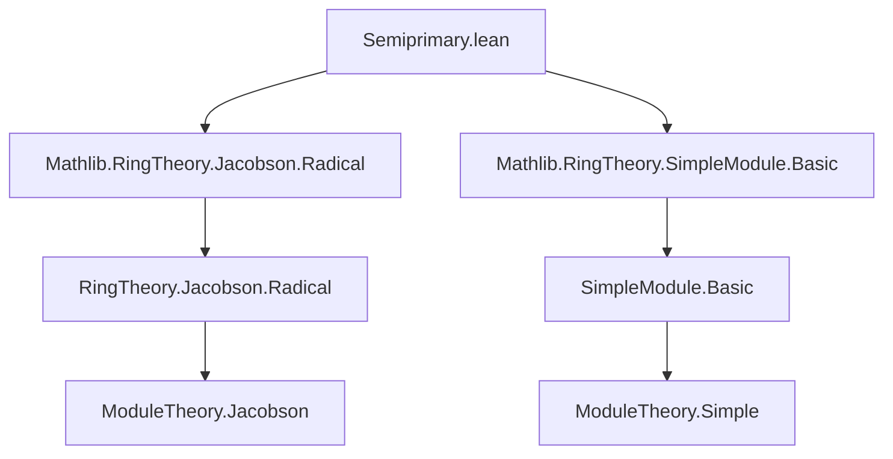

**Technical Brief: `Semiprimary.lean`**

---

### 1. **Key Definitions & Theorems**

| Name | Type / Signature | Purpose |
|------|------------------|---------|
| `IsSemiprimaryRing` | `class IsSemiprimaryRing : Prop` | Defines a *semiprimary ring*: a ring $ R $ where the Jacobson radical $ J(R) $ is nilpotent and the quotient $ R / J(R) $ is semisimple. |
| `IsSimpleModule.jacobson_eq_bot` | `[IsSimpleModule R M] ⇒ Module.jacobson R M = ⊥` | The Jacobson radical of a simple module is zero. |
| `IsSemisimpleModule.jacobson_eq_bot` | `[IsSemisimpleModule R M] ⇒ Module.jacobson R M = ⊥` | The Jacobson radical of a semisimple module is zero. |
| `IsSemisimpleRing.jacobson_eq_bot` | `[IsSemisimpleRing R] ⇒ Ring.jacobson R = ⊥` | A semisimple ring has zero Jacobson radical. |
| `IsSemisimpleModule.jacobson_le_ker` | `[IsSemisimpleModule R₂ M₂] ⇒ Module.jacobson R M ≤ LinearMap.ker f` | Jacobson radical annihilates the domain of a linear map into a semisimple module. |
| `IsSemisimpleModule.jacobson_le_annihilator` | `[IsSemisimpleModule R M] ⇒ Ring.jacobson R ≤ Module.annihilator R M` | Jacobson radical annihilates every semisimple module. |
| `IsSemisimpleRing.isReduced` | `[CommRing R] [IsSemisimpleRing R] ⇒ IsReduced R` | A commutative semisimple ring is reduced (no nonzero nilpotents). |

---

### 2. **Naming Conventions**

- **Prefixes**:
  - `is_`: for properties (e.g., `isSimpleModule`, `isSemisimpleModule`, `isSemisimpleRing`, `isNilpotent`).
  - `jacobson_`: for Jacobson radical–related results (`jacobson_eq_bot`, `jacobson_le_ker`, `jacobson_le_annihilator`).
- **Suffixes**:
  - `_eq_bot`: when proving equality to the bottom element (`⊥`) of a lattice (e.g., zero ideal/module).
  - `_le_ker`, `_le_annihilator`: when bounding the Jacobson radical above a kernel or annihilator.
- **Class names**:
  - `IsSemiprimaryRing`, `IsSemisimpleRing`, `IsSemisimpleModule`, `IsSimpleModule`: standard `Is_` pattern for structural properties.

---

### 3. **Tactic Stack**

- `simp_rw`: used to rewrite using definitional equalities (e.g., `jacobson_eq_bot`).
- `rw`: standard rewriting.
- `le_bot_iff.mp`: to prove inclusion into the bottom element.
- `sInf_le ...`: for proving inclusion in an infimum (used in `jacobson_eq_bot` for simple modules).
- `fun m ↦ ...`: lambda abstraction for element-wise reasoning.
- `dfinsupp`-related tactics: implicit in `DFinsupp.injective_pi_lapply`, `LinearMap.pi`, etc.
- `aesop` not explicitly used here — proof is mostly `simp`/`rw`-driven.

---

### 4. **Proof Logic**

- **Structure**: Most proofs follow a *decomposition strategy*:
  - Use structural characterizations (e.g., `isSemisimpleModule_iff_exists_linearEquiv_dfinsupp`) to reduce to direct sums of simple modules.
  - Prove the property for simple modules (e.g., `jacobson_eq_bot`), then lift via products/injectivity.
- **Induction**: Not used here — proofs rely on module-theoretic decompositions and universal properties.
- **Lattice reasoning**: Inclusion proofs (`≤`) use lattice-theoretic lemmas like `le_sInf`, `le_comap_jacobson`.
- **Element-wise reasoning**: For annihilator proofs, elements $ r \in J(R) $, $ m \in M $ are considered via `mem_annihilator.mpr`.

---

### 5. **Imports**

- `Mathlib.RingTheory.Jacobson.Radical`: provides `Ring.jacobson`, `Module.jacobson`, `le_comap_jacobson`, etc.
- `Mathlib.RingTheory.SimpleModule.Basic`: provides `IsSimpleModule`, `IsSemisimpleModule`, and foundational lemmas.

These imports define the core objects (Jacobson radical, simple/semisimple modules/rings) used in the formalization.

---

### 6. **Mermaid Diagrams**

#### **Dependency Graph (Module-Level)**



#### **Overview of Theory Flow**

```mermaid
flowchart LR
  J[Ring Jacobson Radical] -->|nilpotent| S[Semiprimary Ring]
  J -->|quotient| Q[R / J(R)]
  Q -->|semisimple| S
  M[Module M] -->|simple| J_bot[Module.jacobson M = ⊥]
  M -->|semisimple| J_bot
  J_bot -->|annihilates| Ann[Annihilator contains J(R)]
  S -->|commutative| Red[Reduced Ring]
```

---

### 7. **Additional Notes**

- The `mk_iff` attribute on `IsSemiprimaryRing` enables automatic equivalence between the class and its two conditions (`isSemisimpleRing` and `isNilpotent`).
- The `instance` for `IsReduced` is marked `priority := low` to avoid interference with higher-priority instances.
- The file focuses on *module-theoretic* characterizations of semisimplicity and semiprimaryness, aligning with modern ring theory approaches (e.g., via Jacobson radical behavior on modules).

--- 

Let me know if you'd like a formalization roadmap for extending this theory (e.g., to *left* semiprimary rings, or to *artinian*/*noetherian* conditions).
