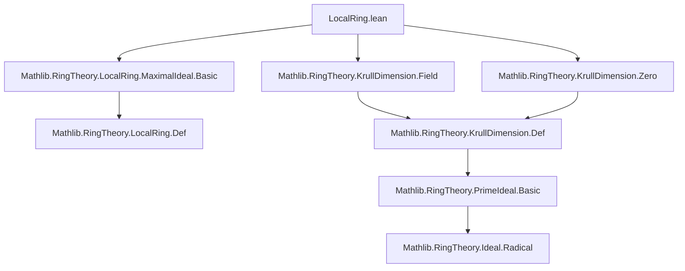

**Technical Brief: `LocalRing.lean` — Krull Dimension of Local Rings**

---

### 1. **Key Definitions & Theorems**

| Name | Type / Statement | Purpose |
|------|------------------|---------|
| `ringKrullDim_eq_one_iff_of_isLocalRing_isDomain` | `ringKrullDim R = 1 ↔ ¬ IsField R ∧ ∀ x ≠ 0, maximalIdeal R ≤ radical (span {x})` | Characterizes local domains of Krull dimension 1 via maximality of the maximal ideal over principal radicals. |
| `IsLocalRing.maximalIdeal R` | `Ideal R` | The unique maximal ideal of a local ring `R`. |
| `Ideal.radical I` | `Ideal R` | The radical of an ideal `I`, defined as the infimum of all prime ideals containing `I`. |
| `Ring.krullDimLE n R` | `Prop` | States that every chain of prime ideals in `R` has length ≤ `n`. |
| `Ring.krullDimLE_one_iff_of_noZeroDivisors` | `Ring.KrullDimLE 1 R ↔ ...` | A criterion for Krull dimension ≤ 1 in domains (used in proof). |

---

### 2. **Naming Conventions**

- **Prefixes**:
  - `ringKrullDim_`: Relates to Krull dimension of a ring.
  - `IsLocalRing.`: Accesses properties of the unique maximal ideal in a local ring.
  - `Ideal.`: Standard ideal-theoretic operations (`radical`, `span`, `le`, etc.).
- **Suffixes**:
  - `_eq_zero_of_isField`: Characterizes zero Krull dimension for fields.
  - `_eq_one_iff_of_isLocalRing_isDomain`: Specific structural equivalence for 1-dimensional local domains.

---

### 3. **Tactic Stack**

Frequently used tactics in the proof:
- `refine`: To construct proofs by splitting into subgoals.
- `rw [Ideal.radical_eq_sInf]`: Rewriting using definition of radical.
- `suffices ... by ...`: To reduce to a stronger hypothesis.
- `le_antisymm`: To prove equality of ideals or dimensions.
- `exact`, `intro`, `apply`, `simp_all`, `by_contradiction`, `convert`, `le_trans`, `le_of_eq`.
- `Ring.krullDimLE_iff.mpr`, `Ring.krullDimLE_one_iff_of_noZeroDivisors.mpr`: Applying characterization lemmas.

No heavy automation (e.g., `aesop`, `linarith`) — proof is mostly structural and ideal-theoretic.

---

### 4. **Proof Logic**

The proof proceeds in two directions:

#### (→) Direction (`ringKrullDim R = 1 ⇒ ...`):
- **Step 1**: Show `¬ IsField R`: If `R` were a field, Krull dimension would be 0, contradicting `= 1`.
- **Step 2**: For any nonzero `x`, show `maximalIdeal R ≤ radical (span {x})`:
  - Use `radical_eq_sInf` to reduce to showing `maximalIdeal R ≤ J` for any prime `J` containing `x`.
  - Show any prime `J` containing nonzero `x` must be maximal (via Krull dim ≤ 1 + no zero divisors).
  - In a local ring, the only maximal ideal is `maximalIdeal R`, so `J = maximalIdeal R`.

#### (←) Direction (`¬ IsField R ∧ ... ⇒ ringKrullDim R = 1`):
- Show `ringKrullDim R ≤ 1` using `Ring.krullDimLE_one_iff_of_noZeroDivisors`.
  - For any prime ideal `I`, pick nonzero `x ∈ I` (possible since `R` is a domain and `I ≠ 0`).
  - Use hypothesis to get `maximalIdeal R ≤ radical (span {x}) ≤ I`, so `I = maximalIdeal R`.
- Show `ringKrullDim R > 0`: Since `R` is not a field, Krull dim ≠ 0.
- Conclude `ringKrullDim R = 1` via `le_antisymm`.

---

### 5. **Imports & Dependencies**

| Import | Role |
|--------|------|
| `Mathlib.RingTheory.LocalRing.MaximalIdeal.Basic` | Defines `IsLocalRing`, `maximalIdeal`, basic properties. |
| `Mathlib.RingTheory.KrullDimension.Field` | Krull dimension of fields (dim = 0). |
| `Mathlib.RingTheory.KrullDimension.Zero` | Characterization of Krull dim ≤ 0 (i.e., Artinian/von Neumann regular / fields in domains). |

Also relies on:
- `Mathlib.RingTheory.NoZeroDivisors` (implicit via `[IsDomain R]`)
- `Mathlib.RingTheory.PrimeIdeal.Basic` (for prime ideals, radical, etc.)

---

### 6. **Mermaid Diagrams**

#### **Dependency Graph (Module-Level)**



#### **Theoretical Overview (This File)**

```mermaid
flowchart LR
  A[CommRing R] --> B[IsLocalRing R]
  A --> C[IsDomain R]
  B --> D[maximalIdeal R]
  C --> E[noZeroDivisors]
  D & E & F[ringKrullDim R = 1] --> G[Characterization]
  G --> H[∀ x ≠ 0, maximalIdeal R ≤ radical(span{x})]
  G --> I[¬ IsField R]
```

---

### 7. **Summary**

This file establishes a precise algebraic characterization of 1-dimensional Noetherian-like local domains (though Noetherian is not assumed — only domain + local). It connects Krull dimension, fieldness, and the behavior of the maximal ideal with respect to principal radical ideals — a foundational step toward dimension theory in local algebra.

Let me know if you'd like a formalized summary in Lean docstring format or a generalization to higher dimensions.
