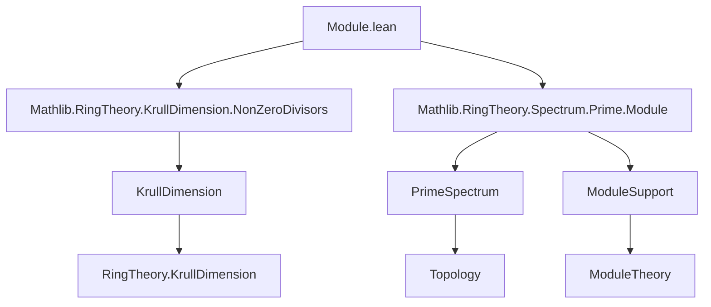

**Technical Brief: `Module.lean` — Krull Dimension of Modules**

---

### 1. **Key Definitions & Theorems**

| Name | Type / Signature | Purpose |
|------|------------------|---------|
| `supportDim` | `noncomputable def supportDim : WithBot ℕ∞` | Defines the Krull dimension of an $R$-module $M$ as the Krull dimension of its support (a topological space). |
| `supportDim_eq_bot_of_subsingleton` | `supportDim R M = ⊥` if $M$ is subsingleton | Characterizes when the support dimension is bottom (i.e., $-\infty$ in $\mathbb{N}_\infty$). |
| `supportDim_ne_bot_of_nontrivial` | `supportDim R M ≠ ⊥` if $M$ is nontrivial | Complement of above: nonzero dimension iff module is nontrivial. |
| `supportDim_eq_bot_iff_subsingleton` | `↔ Subsingleton M` | Biconditional refinement of above. |
| `supportDim_ne_bot_iff_nontrivial` | `↔ Nontrivial M` | Biconditional refinement. |
| `supportDim_eq_ringKrullDim_quotient_annihilator` | `[Module.Finite R M] ⇒ supportDim R M = ringKrullDim (R ⧸ annihilator R M)` | Key structural result: for finitely generated modules, support dimension equals Krull dimension of the quotient by the annihilator. |
| `supportDim_self_eq_ringKrullDim` | `supportDim R R = ringKrullDim R` | Special case: module = ring itself. |
| `supportDim_le_ringKrullDim` | `supportDim R M ≤ ringKrullDim R` | General upper bound. |
| `supportDim_quotient_eq_ringKrullDim` | `supportDim R (R ⧸ I) = ringKrullDim (R ⧸ I)` | Applies previous result to quotient modules. |
| `supportDim_le_of_injective` | `f : M →ₗ N`, injective ⇒ `supportDim R M ≤ supportDim R N` | Monotonicity under monomorphisms. |
| `supportDim_le_of_surjective` | `f : M →ₗ N`, surjective ⇒ `supportDim R N ≤ supportDim R M` | Monotonicity under epimorphisms. |
| `supportDim_eq_of_equiv` | `M ≃ₗ N ⇒ supportDim R M = supportDim R N` | Invariance under linear isomorphism. |
| `support_of_supportDim_eq_zero` | `[IsLocalRing R] ∧ dim = 0 ⇒ support = {maximalIdeal}` | In local rings, zero support dimension ⇔ support is singleton at maximal ideal. |

---

### 2. **Naming Conventions**

- **Prefixes**:
  - `supportDim_`: for definitions/lemmas about module support dimension.
  - `support_`: for support-related facts (e.g., `support_eq_zeroLocus`, `support_eq_empty_iff`).
  - `annihilator_`: for annihilator-related facts (e.g., `annihilator_eq_bot`, `Ideal.annihilator_quotient`).
- **Suffixes**:
  - `_eq_bot`: when equality to bottom element (`⊥`) is proven.
  - `_ne_bot`: when inequality from bottom is shown.
  - `_iff_`: biconditional characterizations.
  - `_le_`: monotonicity lemmas.
  - `_eq_of_`: invariance under equivalence/equivalence-like maps.

---

### 3. **Tactic Stack**

Frequent tactics used in proofs:

- `simp` / `simp only`: simplification using definitional equalities and lemmas.
- `rw`: rewriting using equalities (especially `supportDim_eq_ringKrullDim_quotient_annihilator`, `ringKrullDim_quotient`, etc.).
- `exact`: for direct proof completion.
- `apply`: for applying lemmas with matching conclusion.
- `push _ ∈ _ at _`: for moving membership conditions into context.
- `by_contra`, `push _ ∈ _`: for contradiction arguments.
- `le_antisymm`: to prove equality of dimensions via two inequalities.
- `simpa`: refined simplification with target simplification.
- `have`, `use`, `exists_prop`: for existential reasoning in Krull dimension positivity proofs.

---

### 4. **Proof Logic**

- **Structure**: Most proofs follow a pattern:
  1. **Unfold definitions** (`supportDim`, `krullDim`, `support`).
  2. **Apply known ring-theoretic correspondences** (e.g., `support_eq_zeroLocus`, `ringKrullDim_quotient`).
  3. **Use monotonicity of Krull dimension** under inclusion or surjection/injection of supports.
  4. **Leverage module-theoretic properties** (e.g., finite generation, annihilator behavior).
  5. **Local ring arguments**: use `IsLocalRing.le_maximalIdeal`, `closedPoint_mem_support`, and properties of `maximalIdeal`.

- **Inductive/Case-based reasoning** is minimal; most arguments are algebraic and topological (via prime spectrum).

---

### 5. **Imports**

- `Mathlib.RingTheory.KrullDimension.NonZeroDivisors`: for Krull dimension background.
- `Mathlib.RingTheory.Spectrum.Prime.Module`: for support theory and prime spectrum of modules.

These imports indicate the module lies at the intersection of:
- Krull dimension theory,
- Module support theory,
- Prime spectrum topology.

---

### 6. **Mermaid Diagrams**

#### **Dependency Graph (Module-Level)**



#### **Overview of Theory Flow**

```mermaid
flowchart LR
  subgraph Definitions
    D1[Module.support R M] --> D2[PrimeSpectrum R]
    D2 --> D3[SupportDim R M := krullDim (support R M)]
  end

  subgraph Key Equivalences
    D3 --> E1[supportDim R M = ringKrullDim (R / ann M)] 
    E1 --> E2[if M fg]
  end

  subgraph Monotonicity
    E3[inj f : M → N] --> E4[supportDim M ≤ supportDim N]
    E5[surj f : M → N] --> E6[supportDim N ≤ supportDim M]
  end

  subgraph Local Rings
    D3 --> F1[supportDim = 0] --> F2[support = {maximalIdeal}]
  end
```

---

### 7. **Summary**

This module formalizes the **Krull dimension of modules** via their support, establishing foundational properties such as:
- Equivalence with Krull dimension of $R / \operatorname{Ann}(M)$ for finitely generated $M$,
- Monotonicity under injective/surjective maps,
- Invariance under isomorphism,
- A precise description in local rings when dimension is zero.

It serves as a bridge between module theory and commutative algebra via topological (prime spectrum) and order-theoretic (Krull dimension) tools.

--- 

Let me know if you'd like a formalized dependency graph for the entire `Mathlib` or a comparison with other dimension theories (e.g., length, grade).
