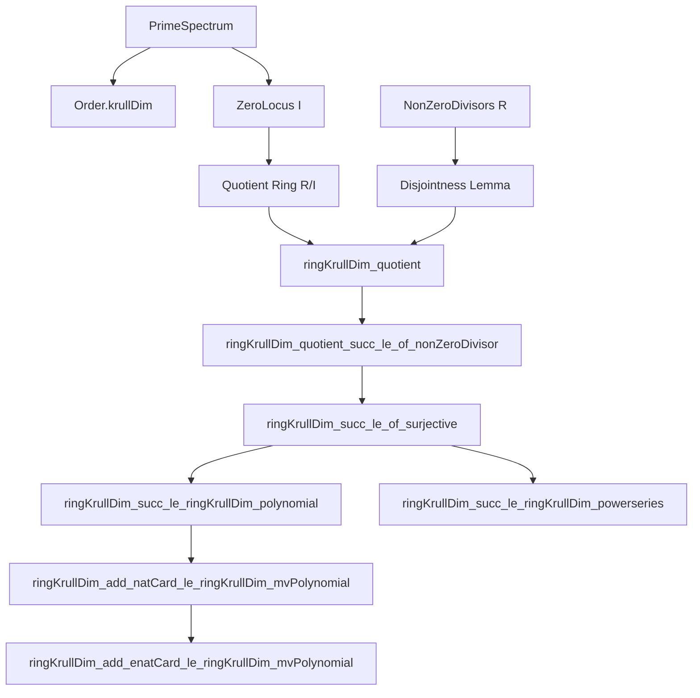

**Technical Brief: `NonZeroDivisors.lean`**

---

### 1. KEY DEFINITIONS & THEOREMS

| Name | Type / Signature | Purpose |
|------|------------------|---------|
| `ringKrullDim` | `CommRing R → WithBot ℕ` | Krull dimension of a commutative ring, defined as the Krull dimension of its prime spectrum (as a poset). |
| `R⁰` | `NonZeroDivisors R` | The submonoid of non-zero-divisors in `R`. |
| `ringKrullDim_quotient` | `I : Ideal R → ringKrullDim (R ⧸ I) = Order.krullDim (PrimeSpectrum.zeroLocus I)` | Relates Krull dimension of a quotient to the Krull dimension of the corresponding closed subset of `PrimeSpectrum R`. |
| `ringKrullDim_quotient_succ_le_of_nonZeroDivisor` | `{r : R} → r ∈ R⁰ → ringKrullDim (R ⧸ ⟨r⟩) + 1 ≤ ringKrullDim R` | Main result: quotient by a non-zero-divisor drops Krull dimension by *at most* 1. |
| `ringKrullDim_succ_le_of_surjective` | `(f : R →+* S) → Function.Surjective f → r ∈ R⁰ → f r = 0 → ringKrullDim S + 1 ≤ ringKrullDim R` | Generalization of the above to surjective maps whose kernel contains a non-zero-divisor. |
| `ringKrullDim_succ_le_ringKrullDim_polynomial` | `ringKrullDim R + 1 ≤ ringKrullDim R[X]` | Krull dimension increases by at least 1 upon adjoining one indeterminate. |
| `ringKrullDim_add_natCard_le_ringKrullDim_mvPolynomial` | `[Finite σ] → ringKrullDim R + Nat.card σ ≤ ringKrullDim (MvPolynomial σ R)` | Krull dimension increases by at least the cardinality of a finite index set in multivariate polynomial rings. |
| `ringKrullDim_add_enatCard_le_ringKrullDim_mvPolynomial` | `ringKrullDim R + ENat.card σ ≤ ringKrullDim (MvPolynomial σ R)` | Extension to arbitrary (possibly infinite) index sets, using extended natural cardinality. |
| `ringKrullDim_succ_le_ringKrullDim_powerseries` | `ringKrullDim R + 1 ≤ ringKrullDim (PowerSeries R)` | Krull dimension increases by at least 1 upon passing to formal power series. |
| `ringKrullDim_mvPolynomial_of_isEmpty` | `[IsEmpty σ] → ringKrullDim (MvPolynomial σ R) = ringKrullDim R` | Trivial case: no variables → no change in Krull dimension. |

---

### 2. NAMING CONVENTIONS

- **Prefixes**:
  - `ringKrullDim_`: All main theorems about Krull dimension of rings.
  - `nonZeroDivisors`: Scoped namespace for non-zero-divisor-related lemmas.
- **Suffixes**:
  - `_le_`: Inequality direction (e.g., `succ_le_of_nonZeroDivisor`).
  - `_of_`: Condition on input (e.g., `of_surjective`, `of_isEmpty`).
  - `_mvPolynomial`, `_polynomial`, `_powerseries`: Target ring construction.
- **Notation**:
  - `R⁰`: Standard notation for non-zero-divisors.
  - `⟨r⟩`, `Ideal.span {r}`: Principal ideal generated by `r`.
  - `R ⧸ I`: Quotient ring.

---

### 3. TACTIC STACK

Frequently used tactics in this file:

| Tactic | Role |
|--------|------|
| `rw`, `grw`, `simp`, `simp_rw` | Rewriting definitions (e.g., `ringKrullDim`, `PrimeSpectrum.zeroLocus`, `ENat.card`). |
| `have`, `obtain`, `refine`, `exact` | Intermediate lemma construction and proof structuring. |
| `by_cases`, `cases` | Case analysis on equality or finiteness (e.g., `I = ⊤`, `finite_or_infinite σ`). |
| `induction` | Structural induction on finite types (`Finite.induction_empty_option`). |
| `trans`, `le_trans`, `ge` | Chaining inequalities. |
| `push_cast`, `norm_cast` | Managing coercions between `ℕ`, `ℤ`, `ℝ≥0∞`, `WithBot ℕ`. |
| `convert`, `exact`, `apply` | Typeclass inference and equality chaining. |
| `nontriviality`, `simp_all` | Simplifying goals with nontriviality assumptions. |

---

### 4. PROOF LOGIC

**General proof strategy**:

1. **Reduction to prime spectrum**:
   - Use `ringKrullDim_quotient` to identify Krull dimension of a quotient with the Krull dimension of a closed subset of `PrimeSpectrum R`.
2. **Chain lifting**:
   - Lift chains of primes in `R/I` to chains in `R` by adding a prime minimal over `I`.
   - For non-zero-divisors, use `Ideal.exists_minimalPrimes_le` and `Ideal.disjoint_nonZeroDivisors_of_mem_minimalPrimes` to ensure strictness of the lifted chain.
3. **Surjective maps**:
   - Reduce to the quotient case via `Ideal.Quotient.lift` and `ringKrullDim_le_of_surjective`.
4. **Polynomial / power series / multivariate polynomial cases**:
   - Apply `ringKrullDim_succ_le_of_surjective` to the constant coefficient map `R[X] → R`, `PowerSeries R → R`, or `MvPolynomial σ R → R`, using that the indeterminate(s) are non-zero-divisors (`X_mem_nonzeroDivisors`, `MvPowerSeries.X_mem_nonzeroDivisors`).
5. **Inductive extension to multivariate case**:
   - Use `Finite.induction_empty_option` to build up from 0 to finite `σ`, applying the univariate case (`ringKrullDim_succ_le_ringKrullDim_polynomial`) at each step.
   - For infinite `σ`, use `ENat.card σ = ⊤` and show dimension is unbounded above by finite sums.

---

### 5. IMPORTS (Primary Dependencies)

| Module | Role |
|--------|------|
| `Mathlib.RingTheory.Ideal.MinimalPrime.Localization` | Minimal primes, localization, disjointness from non-zero-divisors. |
| `Mathlib.RingTheory.KrullDimension.Basic` | Definition and basic properties of Krull dimension. |
| `Mathlib.RingTheory.MvPowerSeries.NoZeroDivisors` | Non-zero-divisor properties of multivariate power series. |
| `Mathlib.RingTheory.PowerSeries.Basic` | Formal power series ring structure. |
| `Mathlib.RingTheory.Spectrum.Prime.RingHom` | Prime spectrum, maps induced by ring homomorphisms. |
| `Mathlib.Algebra.MvPolynomial.CommRing` | Multivariate polynomial ring structure and equivalences. |

---

### 6. MERMAID DIAGRAMS

#### Dependency Graph (Theoretical)



#### File Overview

```mermaid
flowchart LR
  A[NonZeroDivisors.lean] --> B[Main Theorem: dim R/⟨r⟩ + 1 ≤ dim R]
  A --> C[General Surjective Case]
  A --> D[Polynomial Ring: dim R[X] ≥ dim R + 1]
  A --> E[Power Series Ring]
  A --> F[MvPolynomial: finite σ]
  A --> G[MvPolynomial: arbitrary σ]
  B --> D
  B --> E
  B --> F
  F --> G
```

---

### 7. DOMAIN-SPECIFIC INSIGHTS

- **Non-zero-divisors** are central: they ensure that adding a generator to an ideal strictly increases the height of primes (via disjointness from minimal primes).
- **Krull dimension behaves additively** under polynomial/multivariate polynomial extensions, mirroring geometric intuition (e.g., dimension of affine space = dimension of base + number of variables).
- **Extended naturals (`WithBot ℕ`, `ENat`)** are essential for handling infinite Krull dimensions and infinite index sets.
- **Equivalences** (`ringEquiv`, `renameEquiv`, `optionEquivLeft`) are used to reduce multivariate cases to univariate or smaller finite cases.

--- 

Let me know if you'd like a formalization roadmap or a tactic-level trace of a specific proof.
