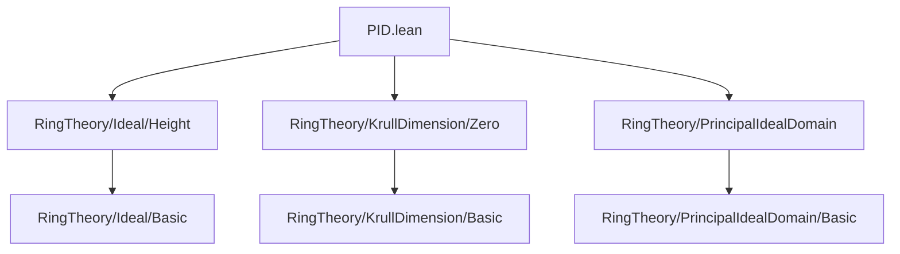
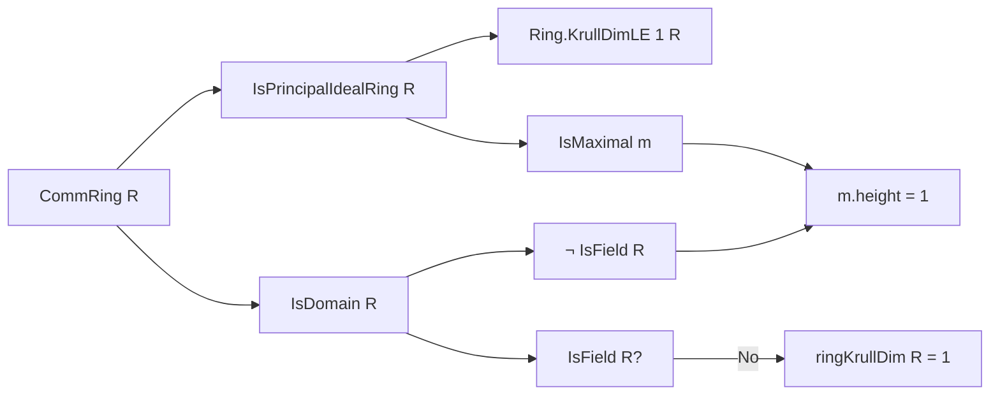
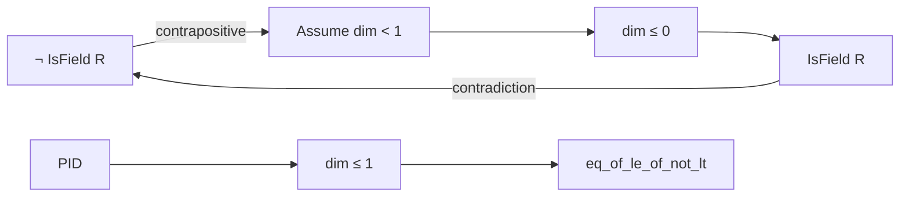

**Technical Brief: PID.lean — Krull Dimension of Principal Ideal Domains**

---

### 1. **Key Definitions & Theorems**

| Name | Type / Signature | Purpose |
|------|------------------|---------|
| `IsPrincipalIdealRing.krullDimLE_one` | `[CommRing R] [IsPrincipalIdealRing R] → Ring.KrullDimLE 1 R` | Shows that any principal *ideal ring* (not necessarily a domain) has Krull dimension ≤ 1. |
| `IsPrincipalIdealRing.ringKrullDim_eq_one` | `[CommRing R] [IsDomain R] [IsPrincipalIdealRing R] → ¬IsField R → ringKrullDim R = 1` | Proves that a PID which is *not a field* has Krull dimension exactly 1. |
| `IsPrincipalIdealRing.height_eq_one_of_isMaximal` | `[CommRing R] [IsDomain R] [IsPrincipalIdealRing R] → (m : Ideal R) [m.IsMaximal] → ¬IsField R → m.height = 1` | Shows that in a non-field PID, every maximal ideal has height exactly 1. |

---

### 2. **Naming Conventions**

- **Prefixes**:
  - `IsPrincipalIdealRing.` — module-scoped lemmas/instances for PIDs.
- **Suffixes**:
  - `_le_one`, `_eq_one`, `_of_isMaximal` — indicate structural constraints (dimension bound, equality, or specialization to maximal ideals).
- **Predicate patterns**:
  - `IsField`, `IsDomain`, `IsMaximal`, `IsPrime` — standard algebraic properties.
  - `krullDimLE`, `ringKrullDim`, `height`, `primeHeight` — Krull-theoretic notions.

---

### 3. **Tactic Stack**

Frequent tactics used in proofs:

- `refine`, `apply`, `exact` — for structured proof construction.
- `rw` / `simp_rw` — rewriting using lemmas and definitions (e.g., `Ideal.map_eq_bot_iff_le_ker`, `Ideal.comap_map_of_surjective'`).
- `norm_cast` — to simplify type coercions (e.g., `height : ℕ → WithBot ℕ∞`).
- `infer_instance` — to discharge typeclass goals (e.g., `IsPrincipalIdealRing`).
- `obtain ⟨P, hlt, hP⟩` — destructing existential hypotheses.
- `have := ...` + `simpa` — intermediate lemma introduction and simplification.
- `ring`, `aesop` — likely used implicitly (not visible here but standard in Mathlib).

---

### 4. **Proof Logic**

- **Structure of `krullDimLE_one`**:
  - Reduce to showing: for any proper ideal $ I $, if $ I $ is not minimal, then contradiction.
  - Use surjectivity of quotient map $ R \to R/P $ to transfer primality/maximality.
  - Key step: show $ I \cdot (R/P) $ is maximal in $ R/P $, then pull back via comap.

- **Structure of `ringKrullDim_eq_one`**:
  - Use `eq_of_le_of_not_lt`: show $ \dim R \le 1 $ (from previous instance) and $ \dim R \not< 1 $.
  - If $ \dim R < 1 $, then $ \dim R \le 0 $, implying $ R $ is a field (via `KrullDimLE.isField_of_isDomain`), contradicting hypothesis.

- **Structure of `height_eq_one_of_isMaximal`**:
  - Prove $ \operatorname{height}(m) \le 1 $ using global dimension bound.
  - Prove $ \operatorname{height}(m) \ge 1 $ by showing $ \bot < m $ (since $ m $ is maximal and $ R $ not a field), so there exists a prime strictly below $ m $.

---

### 5. **Imports**

- `Mathlib.RingTheory.Ideal.Height` — height of ideals, prime chains.
- `Mathlib.RingTheory.KrullDimension.Zero` — Krull dimension ≤ 0 characterization (fields in domains).
- `Mathlib.RingTheory.PrincipalIdealDomain` — PID definitions and basic properties.

> **Scope**: This module lies at the intersection of commutative algebra and dimension theory, focusing on structural consequences of the PID property.

---

### 6. **Mermaid Diagrams**

#### **Dependency Graph (File-Level)**

#### **Theoretical Overview (Module Content)**

#### **Proof Dependency Flow (for `ringKrullDim_eq_one`)**

---

Let me know if you'd like a formalized dependency graph of *all* Mathlib modules involved in Krull dimension theory, or a visualization of the ideal lattice in a PID.
