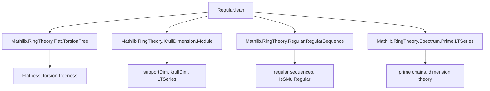

### Technical Brief: Krull Dimension and Regular Sequences in `Regular.lean`

---

#### **1. Key Definitions & Theorems**

| Name | Type / Signature | Purpose |
|------|------------------|---------|
| `supportDim` | `Module R M → WithBot ℕ` | Krull dimension of the support of a module $M$ over a Noetherian ring $R$. |
| `IsRegular M rs` | `List R → Prop` | `$r₁, …, rₙ$` is an $M$-regular sequence: each $r_i$ is a non-zero-divisor on $M/(r₁,…,r_{i-1})M$. |
| `QuotSMulTop x M` | `Module R M` | Quotient module $M / xM$, implemented as `Quot (x • ⊤)` (i.e., quotient by the submodule generated by $x$). |
| `annihilator R M` | `Ideal R` | $\mathrm{Ann}_R(M) = \{r \in R \mid rM = 0\}$. |
| `maximalIdeal R` | `Ideal R` | Unique maximal ideal in a local ring $R$. |
| `jacobson R` | `Ideal R` | Jacobson radical of $R$, intersection of all maximal ideals. |

##### Main Theorems

| Name | Statement | Significance |
|------|-----------|--------------|
| `supportDim_le_supportDim_quotSMulTop_succ_of_mem_jacobson` | $x \in \mathrm{J}(R)$ ⇒ $\dim M \le \dim(M/xM) + 1$ | First inequality in Krull dimension drop under Jacobson radical elements. |
| `supportDim_quotSMulTop_succ_le_of_notMem_minimalPrimes` | $x \notin \bigcup \mathrm{Min}(\mathrm{Ann}(M))$ ⇒ $\dim(M/xM) + 1 \le \dim M$ | Second inequality under non-vanishing on minimal primes. |
| `supportDim_quotSMulTop_succ_eq_of_notMem_minimalPrimes_of_mem_jacobson` | Combined equality under both conditions | Equality case: dimension drops exactly by 1. |
| `supportDim_quotSMulTop_succ_eq_supportDim_mem_jacobson` | $x$ regular & $x \in \mathrm{J}(R)$ ⇒ equality | Special case for regular elements in Jacobson radical. |
| `supportDim_le_supportDim_quotSMulTop_succ` | $x \in \mathfrak{m}$ (maximal ideal of local ring) ⇒ $\dim M \le \dim(M/xM) + 1$ | Local ring version of first inequality (Stacks 0B52). |
| `supportDim_quotSMulTop_succ_eq_supportDim` | $x$ regular & $x \in \mathfrak{m}$ ⇒ equality | Equality in local case (Stacks 0B52 equality case). |
| `supportDim_add_length_eq_supportDim_of_isRegular` | $r_1,\dots,r_n$ regular ⇒ $\dim(M/(r_1,\dots,r_n)M) + n = \dim M$ | **Main result**: dimension drops by length of regular sequence. |
| `ringKrullDim_add_length_eq_ringKrullDim_of_isRegular` | Same for ring Krull dimension: $\dim(R/(r_1,\dots,r_n)) + n = \dim R$ | Classical Krull dimension version. |

---

#### **2. Naming Conventions**

- **Prefixes**:
  - `supportDim_`: properties about module support dimension.
  - `ringKrullDim_`: properties about ring Krull dimension.
  - `quotSMulTop_`: operations involving $M/xM$.
  - `quotient_`: operations involving $R/I$.
- **Suffixes**:
  - `_le_`, `_ge_`, `_eq_`: inequality/equality direction.
  - `_of_`: condition on input (e.g., `of_mem_jacobson`, `of_notMem_minimalPrimes`).
  - `_succ`: “successor” (i.e., +1) in dimension drop.
  - `_add_length`: dimension drop equals length of list.
- **Special**:
  - `isRegular`: regular sequence.
  - `mem_jacobson`, `mem_maximalIdeal`: membership in Jacobson radical or maximal ideal.
  - `nonZeroDivisors`, `minimalPrimes`: structural module/ring data.

---

#### **3. Tactic Stack**

| Tactic | Usage Frequency | Purpose |
|--------|------------------|---------|
| `simp` / `simp_rw` | High | Simplify module/ideal expressions, especially `quotSMulTop`, `annihilator`, `support`. |
| `rw` | High | Rewrite using equivalences, definitions, or previously proven lemmas. |
| `induction` | Medium | Structural induction on `List rs` in `supportDim_add_length_eq_supportDim_of_isRegular`. |
| `exact`, `apply`, `refine` | High | Proof construction, especially with `iSup_le_iff`, `le_antisymm`. |
| `nontriviality` | Medium | Ensure modules are nontrivial to avoid degenerate dimension $-\infty$. |
| `grw` | Medium | `gcongr` + `rw`: used in `supportDim_le_supportDim_quotSMulTop_succ_of_mem_jacobson` to simplify dimension expressions. |
| `cases`, `obtain`, `let` | Medium | Extract witnesses (e.g., maximal ideals, chains), define auxiliary objects (`q'`). |
| `aesop` / `linarith` | Low | Not used heavily; proofs are mostly algebraic and order-theoretic. |
| `with_bot.coe_le_coe.mpr` | Medium | Translate inequalities in `WithBot ℕ`. |

---

#### **4. Proof Logic**

- **Inductive structure** for regular sequences:
  - Base case (`nil`) uses `quotEquivOfEqBot`.
  - Inductive step (`cons x rs'`):
    1. Show $x \in \mathfrak{m}$ (maximal ideal) using regularity.
    2. Reduce to $M/xM$ via equivalence `quotOfListConsSMulTopEquivQuotSMulTopInner`.
    3. Apply inductive hypothesis on $rs'$.
    4. Use equality `supportDim_quotSMulTop_succ_eq_supportDim` for $x$.

- **Dimension inequalities**:
  - Use chains of primes in support (via `LTSeries`).
  - For $x \in \mathrm{J}(R)$: lift chains from $M/xM$ to $M$ using maximal ideals containing Jacobson radical.
  - For $x \notin \bigcup \mathrm{Min}(\mathrm{Ann}(M))$: extend chains in $M/xM$ by adding a minimal prime below the head.

- **Equality via antisymmetry**:
  - Combine `supportDim_le_...` and `supportDim_quotSMulTop_succ_le_...` to get equality.

- **Local ring simplifications**:
  - Use `maximalIdeal_le_jacobson` to reduce Jacobson conditions to maximal ideal membership.

---

#### **5. Imports & Dependencies**

| Module | Role |
|--------|------|
| `Mathlib.RingTheory.Flat.TorsionFree` | For `IsSMulRegular` and flatness-related lemmas. |
| `Mathlib.RingTheory.KrullDimension.Module` | Core definitions: `supportDim`, `krullDim`, `LTSeries`. |
| `Mathlib.RingTheory.Regular.RegularSequence` | `IsRegular`, `IsSMulRegular`, regular sequence machinery. |
| `Mathlib.RingTheory.Spectrum.Prime.LTSeries` | Chains of prime ideals (`LTSeries`), used for Krull dimension. |

**Key auxiliary theories**:
- `Module.support`, `annihilator`, `QuotSMulTop`, `PrimeSpectrum`, `Pointwise`, `IsLocalRing`.

---

#### **6. Mermaid Diagrams**

##### **Dependency Graph (Top-Level)**



##### **Overview of Main Proof Flow**

```mermaid
flowchart LR
  A[IsRegular M rs] --> B[Base case: rs = []]
  A --> C[Inductive step: rs = x :: rs']
  C --> D[x ∈ maximalIdeal R]
  D --> E[quotSMulTop equivalence]
  E --> F[supportDim_quotSMulTop_succ_eq_supportDim]
  F --> G[Apply IH to rs']
  G --> H[Add lengths: dim + 1 + n = dim + (n+1)]
  H --> I[Conclusion: dim(M/(rs)M) + |rs| = dim M]
```

##### **Key Inequality Proof Strategy**

```mermaid
flowchart LR
  J[x ∈ Jacobson] --> K[SupportDim M ≤ SupportDim(M/xM) + 1]
  L[x ∉ minimalPrimes] --> M[SupportDim(M/xM) + 1 ≤ SupportDim M]
  K & M --> N[Equality via antisymmetry]
  O[x regular & in maximalIdeal] --> P[x ∈ Jacobson & not in minimalPrimes]
  P --> N
```

---

#### **7. Summary**

This file formalizes the foundational relationship between Krull dimension and regular sequences in Noetherian (local) rings. It establishes:

- **Dimension drop by 1** for regular elements in the Jacobson radical (or maximal ideal in local case).
- **Exact drop by $n$** for length-$n$ regular sequences.
- **Equivalence of module and ring Krull dimensions** in the quotient by regular sequences.

The proofs rely heavily on:
- Chain-of-primes techniques (`LTSeries`),
- Module support theory,
- Local ring structure (`maximalIdeal`, `jacobson`),
- Induction on regular sequences.

This is a key component of the formalization of *depth*, *regular local rings*, and *complete intersections* in Mathlib.
