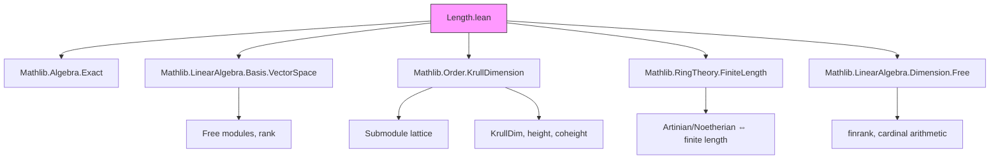

### Technical Brief: `Length.lean` — Module Length in Lean 4

---

#### **1. Key Definitions & Theorems**

| Name | Type / Signature | Purpose |
|------|------------------|---------|
| `Module.length` | `def Module.length (R M) [Ring R] [Module R M] : ℕ∞` | Defines the *length* of an $R$-module $M$ as the Krull dimension of its submodule lattice, adjusted to avoid $\bot$ (i.e., $-\infty$). |
| `Module.length_eq_zero_iff` | `lemma` | Characterizes modules of length 0: $ \text{length}(M) = 0 \iff M $ is a subsingleton (i.e., at most one element). |
| `Module.length_pos_iff` | `lemma` | $ 0 < \text{length}(M) \iff M $ is nontrivial. |
| `Module.length_compositionSeries` | `lemma` | If a composition series exists with head $\bot$ and tail $\top$, its length equals the module length. |
| `Module.length_ne_top_iff` | `lemma` | $ \text{length}(M) \neq \top \iff M $ is of finite length (i.e., both Artinian and Noetherian). |
| `Module.length_eq_add_of_exact` | `lemma` | **Additivity in exact sequences**: If $0 \to N \xrightarrow{f} M \xrightarrow{g} P \to 0$ is exact, then $\text{length}(M) = \text{length}(N) + \text{length}(P)$. |
| `Module.length_prod` | `@[simp] lemma` | Length of a product: $\text{length}(M \times N) = \text{length}(M) + \text{length}(N)$. |
| `Module.length_pi_of_fintype` | `@[simp] lemma` | Length of a finite product (dependent): $\text{length}(\prod_{i:\iota} M_i) = \sum_i \text{length}(M_i)$. |
| `Module.length_finsupp` | `@[simp] lemma` | Length of finitely supported functions: $\text{length}( \iota \to_0 M ) = |\iota| \cdot \text{length}(M)$. |
| `Module.length_of_free` | `lemma` | For free modules: $\text{length}(M) = \text{rank}(M) \cdot \text{length}(R)$. |
| `Module.length_eq_rank` | `lemma` | Over a division ring $K$, $\text{length}_K(M) = \text{rank}_K(M)$ (as extended natural numbers). |
| `Module.length_eq_one_iff` | `lemma` | $\text{length}(M) = 1 \iff M$ is simple. |

---

#### **2. Naming Conventions**

- **Prefixes**:
  - `length_`: All lemmas/defs related to module length.
  - `is_`: For properties like `isFiniteLength`, `isNoetherian`, `isArtinian`.
  - `coheight`, `height`: Used for submodule lattice order-theoretic notions.
- **Suffixes**:
  - `_iff`: Biconditional characterizations.
  - `_le_of_`, `_lt_of_`: Inequalities derived from structural maps (injective/surjective).
  - `_of_`: Special cases (e.g., `of_free`, `of_finite`).
- **Pattern**: `Module.length_X` for module-length-specific results; `Submodule.height_X` for submodule-specific order-theoretic lemmas.

---

#### **3. Tactic Stack**

Frequently used tactics in proofs:

| Tactic | Role |
|--------|------|
| `rw` / `simp_rw` | Rewriting using lemmas (especially `coe_length`, `length_eq_*`, `krullDim_*`). |
| `apply WithBot.coe_injective` | Proving equality in $\mathbb{N}_\infty$ by lifting to `WithBot ℕ∞`. |
| `exact` / `assumption` | Closing trivial goals. |
| `obtain ⟨...⟩` / `cases` | Extracting data from existential quantifiers (e.g., composition series). |
| `simp` / `congr` | Simplifying expressions, especially with `length_eq_zero`, `length_prod`, etc. |
| `apply le_antisymm` | Proving equality in $\mathbb{N}_\infty$ via mutual inequality. |
| `by_cases` / `by_contra` | Splitting on finiteness or infiniteness (e.g., `IsFiniteLength`). |
| `exact .of_finiteDimensional` | Using order-theoretic characterizations of Noetherian/Artinian. |
| `simpa using` | Simplifying and applying a proof term. |

---

#### **4. Proof Logic**

The logical flow across most proofs follows this pattern:

1. **Reduction to order-theoretic setting**:
   - Translate module-theoretic notions (e.g., composition series, length) into lattice-theoretic ones (Krull dimension, height, coheight).
   - Use `coe_length`, `length_eq_height`, `length_eq_coheight`.

2. **Case analysis**:
   - On whether the module is finite-length (`IsFiniteLength`), Artinian/Noetherian, or infinite-dimensional.
   - Use `length_ne_top_iff`, `length_eq_top_iff_infiniteDimensionalOrder`.

3. **Exact sequence decomposition**:
   - For `length_eq_add_of_exact`, construct composition series for $N$ and $P$, lift them to $M$ via `map`/`comap`, and use Jordan–Hölder to compare refinements.

4. **Inductive/structural decomposition**:
   - For products, finite sums, and `finsupp`, reduce to known cases using linear equivalences (`LinearEquiv.length_eq`) and cardinal arithmetic.

5. **Free modules**:
   - Use basis isomorphism $M \cong R^{(\kappa)}$, then apply `length_finsupp` and arithmetic in $\mathbb{N}_\infty$.

---

#### **5. Imports & Dependencies**

| Import | Role |
|--------|------|
| `Mathlib.Algebra.Exact` | For `Function.Exact`, exact sequences. |
| `Mathlib.LinearAlgebra.Basis.VectorSpace` | Bases, free modules, rank. |
| `Mathlib.Order.KrullDimension` | Krull dimension, height, coheight, composition series. |
| `Mathlib.RingTheory.FiniteLength` | Artinian/Noetherian modules, finite length. |
| `Mathlib.LinearAlgebra.Dimension.Free` | Rank, `finrank`, free module structure. |

**Core theory**: This file sits at the intersection of **module theory**, **order theory**, and **homological algebra**, formalizing the interplay between composition series, Krull dimension, and additive invariants.

---

#### **6. Mermaid Diagrams**

##### **Dependency Graph (Module-Level)**



##### **Overview of Theory Flow**

```mermaid
flowchart LR
  SubmoduleLattice[Submodule R M lattice] --> KrullDim[KrullDim = length]
  KrullDim --> Height[height(N) = length(N)]
  KrullDim --> Coheight[coheight(N) = length(M/N)]

  ExactSeq[Exact sequence 0→N→M→P→0] --> Additivity[length(M) = length(N)+length(P)]

  CompositionSeries[Composition series] --> LengthComp[Length = series length]
  LengthComp --> JordanHolder[Jordan–Hölder uniqueness]

  FreeModule[Free module M ≅ R^(κ)] --> RankFormula[length(M) = κ·length(R)]

  DivisionRing[K division ring] --> RankEquality[length = rank]

  style SubmoduleLattice fill:#bbf,stroke:#333
  style ExactSeq fill:#f96,stroke:#333
  style FreeModule fill:#6f9,stroke:#333
```

---

#### **7. Summary**

This file formalizes the **length function** on modules as a fundamental invariant, connecting:
- **Order theory** (Krull dimension of submodule lattice),
- **Homological algebra** (additivity in exact sequences),
- **Structure theory** (composition series, simplicity, freeness),
- **Cardinal arithmetic** (ranks, finite/infinite cases).

It serves as a foundational module for further development in representation theory, homological algebra, and dimension theory in Lean.
