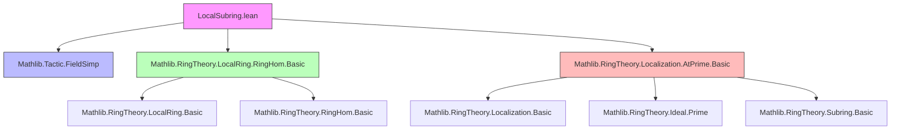

### Technical Brief: `LocalSubring.lean`

---

#### **1. Key Definitions & Theorems**

| Name | Type / Signature | Purpose |
|------|------------------|---------|
| `LocalSubring R` | `Structure` | Class of *local subrings* of a commutative ring `R`: a subring equipped with a proof that it is a local ring. |
| `toSubring : LocalSubring R → Subring R` | Projection | Underlying subring of a local subring. |
| `copy S s hs` | `LocalSubring R` | Rebuilds a local subring with a definitionaly equal carrier. Used to fix definitional equalities. |
| `map f s` | `LocalSubring S` | Pushforward of a local subring along a ring homomorphism `f : R →+* S` (requires `S` nontrivial). |
| `range f` | `LocalSubring S` | Image of a ring homomorphism from a *local* ring `R` as a local subring of `S`. |
| `PartialOrder (LocalSubring R)` | Instance | Domination order: `A ≤ B` iff `A ≤ B` as subrings and the inclusion is a *local homomorphism* (i.e., maps maximal ideal into maximal ideal). |
| `le_def` | `A ≤ B ↔ ∃ h : A.1 ≤ B.1, IsLocalHom (Subring.inclusion h)` | Explicit characterization of the domination order. |
| `toSubring_mono` | `Monotone toSubring` | `toSubring` preserves the domination order. |
| `ofPrime A P` | `LocalSubring K` | Localization of a subring `A ≤ K` (with `K` a field) at a prime ideal `P ≤ A`, embedded as a local subring of `K`. |
| `ofPrimeEquiv` | `Localization.AtPrime P ≃ₐ[A] (ofPrime A P).toSubring` | Isomorphism between the abstract localization and the concrete subring of `K`. |
| `instance : IsLocalization.AtPrime (ofPrime A P).toSubring P` | Instance | Confirms that `ofPrime A P` satisfies the universal property of localization at `P`. |

---

#### **2. Naming Conventions**

- **Prefixes**:
  - `ofPrime`: constructs a local subring from prime localization.
  - `map`, `range`: standard categorical/image constructions.
  - `copy`: definitional adjustment.
- **Suffixes**:
  - `inclusion`: used for canonical inclusions between subrings.
  - `Equiv`, `algEquiv`: for algebra isomorphisms.
- **Predicates**:
  - `isLocalRing`, `IsLocalHom`: properties of rings/homomorphisms.
  - `le_`, `toSubring_`: projections/relations in the domination order.

---

#### **3. Tactic Stack**

Frequently used tactics in proofs:
- `aesop`: for automated reasoning in algebraic structures (e.g., field arithmetic, ring homomorphism properties).
- `simp` / `simp_rw`: simplification using definitional equalities and algebraic lemmas.
- `ext`: extensionality for subtypes, sets, functions.
- `congr`: congruence reasoning, especially for equalities in fields.
- `intro`, `exact`, `refine`: standard proof construction.
- `have H : … := by …`: local auxiliary lemmas.
- `rw [← eq]`: rewriting using equivalences or definitions.

---

#### **4. Proof Logic**

- **Structure proofs** rely heavily on:
  - **Extensionality** (`ext`) to show equality of subrings or local subrings.
  - **Definitional lifting**: e.g., `hs ▸ S.2` to transport the `IsLocalRing` instance along propositional equality.
- **Order proofs**:
  - Use `⟨h, h'⟩` to construct witnesses for existential quantifiers in the domination order.
  - `le_antisymm` reduces to subring antisymmetry + `toSubring_injective`.
- **Localization proofs**:
  - Use `IsLocalization.exists_mk'_eq` to decompose elements in the localization.
  - Reduce equalities in the localization to equalities in the original ring using `mk'_eq_iff_eq`.
  - Use `AlgEquiv.ofInjective` to construct algebra isomorphisms from injective algebra maps.

---

#### **5. Imports**

| Module | Purpose |
|--------|---------|
| `Mathlib.Tactic.FieldSimp` | Simplification for fields (e.g., inverses, division). |
| `Mathlib.RingTheory.LocalRing.RingHom.Basic` | Local rings and local homomorphisms. |
| `Mathlib.RingTheory.Localization.AtPrime.Basic` | Localization at prime ideals, especially in fields. |

---

#### **6. Theory Overview & Dependencies**

##### **Dependency Graph (Mermaid)**



##### **Overview Diagram (Mermaid)**

```mermaid
graph LR
  A[CommRing R] -->|Subring| B[Subring R]
  B -->|IsLocalRing| C[LocalSubring R]
  C -->|toSubring| B

  R -->|f : R →+* S| S
  C -->|map f| D[LocalSubring S]

  K[Field K] <--|A ≤ K| A[Subring K]
  A -->|P : Ideal A, P.IsPrime| P
  P -->|ofPrime A P| C_K[LocalSubring K]

  C_K -->|Algebra A| C_K
  C_K -->|IsLocalization| P

  style A fill:#bfb,stroke:#333
  style C fill:#f9f,stroke:#333
  style C_K fill:#f9f,stroke:#333
```

---

#### **7. Summary**

This file introduces the notion of **local subrings** of a commutative ring and studies their behavior under ring homomorphisms and localization. The central construction is `ofPrime`, which embeds the localization of a subring at a prime ideal into the ambient field as a local subring. It equips the class of local subrings with a **domination order**, generalizing the usual inclusion order by requiring local homomorphisms. The theory connects abstract localization (via `Localization.AtPrime`) with concrete subrings of fields, and provides an explicit algebra isomorphism (`ofPrimeEquiv`) between them.

This forms the foundation for further development in valuation theory, especially in the context of valuations and their associated valuation rings.
