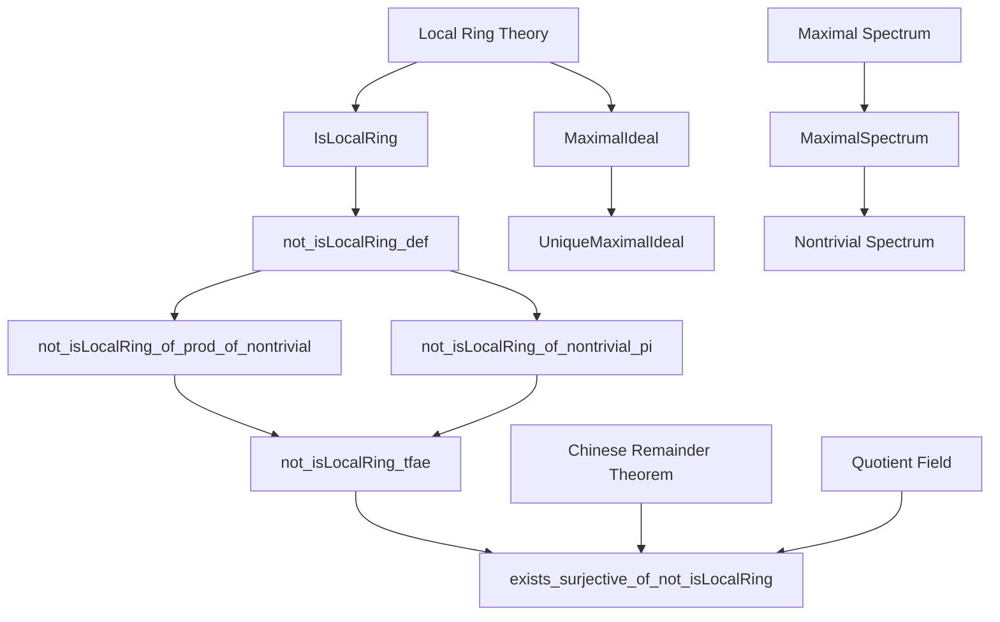
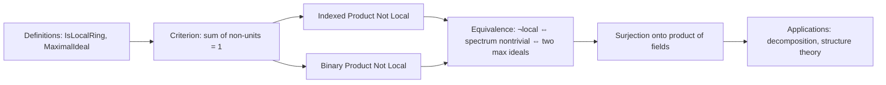

**Technical Brief: `NonLocalRing.lean`**

---

### 1. Key Definitions & Theorems

| Name | Type / Signature | Purpose |
|------|------------------|---------|
| `not_isLocalRing_def` | `{a b : R} → ¬IsUnit a → ¬IsUnit b → a + b = 1 → ¬IsLocalRing R` | Provides a *witness-based* criterion for non-locality: if two non-units sum to 1, the ring is not local. |
| `not_isLocalRing_of_nontrivial_pi` | `[Nontrivial ι] → (∀ i, Semiring (R i)) → (∀ i, Nontrivial (R i)) → ¬IsLocalRing (Π i, R i)` | Shows that any indexed product of at least two nontrivial semirings is not local. |
| `not_isLocalRing_of_prod_of_nontrivial` | `[Semiring R₁] → [Semiring R₂] → [Nontrivial R₁] → [Nontrivial R₂] → ¬IsLocalRing (R₁ × R₂)` | Special case of the above for binary products: product of two nontrivial semirings is not local. |
| `not_isLocalRing_tfae` | `[CommSemiring R] → [Nontrivial R] → List.TFAE [...]` | Establishes equivalence of three characterizations of non-locality: (1) not local, (2) maximal spectrum nontrivial, (3) existence of two distinct maximal ideals. |
| `exists_surjective_of_not_isLocalRing` | `[CommRing R] → [Nontrivial R] → ¬IsLocalRing R → ∃ K₁ K₂ fields, ∃ f : R →+* K₁ × K₂, Surjective f` | Constructs a surjective homomorphism from a non-local commutative ring onto a product of two fields, using quotient maps by distinct maximal ideals. |

---

### 2. Naming Conventions

- **Prefix `not_isLocalRing_`**: All main theorems asserting non-locality use this prefix.
- **Suffix `_def`**: Used for a *definition-style* equivalence or criterion (here, a sufficient condition).
- **`_tfae`**: Stands for *“the following are equivalent”* — standard in Mathlib for TFAE (To Be Equivalently Assessed) proofs.
- **`_of_`**: Indicates structural derivation (e.g., `of_nontrivial_pi`, `of_prod_of_nontrivial`).
- **`_hom` / `toRingHom`**: Standard for ring homomorphisms derived from universal properties.

---

### 3. Tactic Stack

- `tfae_have`, `tfae_finish`: For managing the chain of equivalences in `not_isLocalRing_tfae`.
- `simp`, `dsimp`, `ext`, `split`: Used heavily in constructive arguments (e.g., verifying sums equal 1, checking non-unit status).
- `fun h ↦ ...`: Lambda abstraction for contradiction-style proofs (e.g., assuming a non-unit is a unit and deriving `not_isUnit_zero`).
- `obtain ⟨...⟩ := ...`: Destructuring existential or product hypotheses.
- `apply Function.Surjective.comp ...`: Composition of surjectivity facts.

---

### 4. Proof Logic

- **Structure**: Most proofs follow a *contrapositive + witness* pattern:
  - To prove `¬IsLocalRing R`, assume `IsLocalRing R` and derive a contradiction.
  - For `not_isLocalRing_def`, use the known fact: in a local ring, if $a + b = 1$, then at least one of $a, b$ is a unit (`isUnit_or_isUnit_of_add_one`).
- **Product cases** (`not_isLocalRing_of_nontrivial_pi`, `not_isLocalRing_of_prod_of_nontrivial`):
  - Construct explicit non-units $e_1, e_2$ (e.g., characteristic functions or idempotents like $(1,0), (0,1)$).
  - Show $e_1 + e_2 = 1$, and neither $e_i$ is a unit.
- **Equivalence proof (`not_isLocalRing_tfae`)**:
  - Uses `List.TFAE` infrastructure.
  - Chain of implications:  
    `¬local ⇒ spectrum nontrivial ⇒ two max ideals ⇒ ¬local`.
  - Key lemmas: `of_singleton_maximalSpectrum`, `eq_maximalIdeal`, `not_subsingleton_iff_nontrivial`.
- **Existence of surjection (`exists_surjective_of_not_isLocalRing`)**:
  - From two distinct maximal ideals $m_1 \ne m_2$, use:
    - `Ideal.quotientInfEquivQuotientProd` (Chinese Remainder Theorem for coprime ideals).
    - `Ideal.Quotient.mk_surjective` and field quotients (`Ideal.Quotient.field`).
  - Compose maps to get surjection $R \twoheadrightarrow R/m_1 \times R/m_2$.

---

### 5. Imports (Primary Dependencies)

| Import | Role |
|--------|------|
| `Mathlib.Algebra.Ring.Pi` | Indexed product of rings/semirings, evaluation maps, unit criteria. |
| `Mathlib.Algebra.Ring.Prod` | Binary product ring structure, projections, unit criteria. |
| `Mathlib.RingTheory.LocalRing.MaximalIdeal.Basic` | Local ring theory, maximal ideal uniqueness, `isUnit_or_isUnit_of_add_one`. |
| `Mathlib.RingTheory.Spectrum.Maximal.Basic` | Maximal spectrum (`MaximalSpectrum`), topology, subsingleton/nontriviality criteria. |

---

### 6. Mermaid Diagrams

#### Dependency Graph (Theoretical)

#### File Overview Flow

--- 

This file serves as a foundational piece in the structural theory of rings, clarifying how non-locality manifests in products and spectra, and enabling decomposition via quotient fields.
