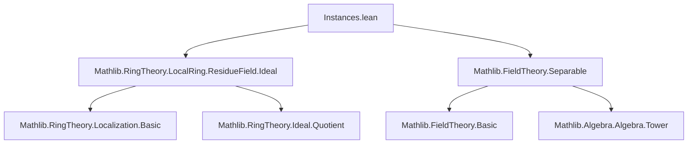
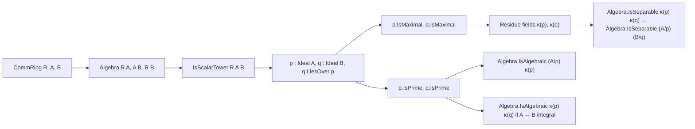

**Technical Brief: `Instances.lean` — Instances on Residue Fields**

---

### 1. **Key Definitions & Theorems**

| Name | Type / Signature | Purpose |
|------|------------------|---------|
| `ResidueField` | `p : Ideal A [p.IsMaximal] → Field` | Residue field at a maximal ideal; defined via `Ideal.Quotient.field` instance. |
| `liesOver` | `q : Ideal B [q.LiesOver p]` | Captures the lying-over relation: `q ∩ A = p`. |
| `Algebra.IsSeparable` | `Algebra.IsSeparable K L` | Separability of algebra extension $K \to L$. |
| `Algebra.IsAlgebraic` | `Algebra.IsAlgebraic K L` | Algebraicity of extension $K \to L$. |
| `instance isSeparable_residueField_iff` | `[p.IsMaximal] [q.IsMaximal] → (Algebra.IsSeparable p.ResidueField q.ResidueField ↔ Algebra.IsSeparable (A ⧸ p) (B ⧸ q))` | Equivalence of separability between residue fields and quotient rings. |
| `instance isAlgebraic_residueField` | `[p.IsPrime] → Algebra.IsAlgebraic (A ⧸ p) p.ResidueField` | Residue field is algebraic over the quotient by a prime ideal. |
| `instance isAlgebraic_liesOver_prime` | `[p.IsPrime] [q.IsPrime] [Algebra.IsIntegral A B] → Algebra.IsAlgebraic p.ResidueField q.ResidueField` | Lying-over primes with integral extension imply algebraicity of residue fields. |

---

### 2. **Naming Conventions**

- **Prefixes**:
  - `is_`: e.g., `isSeparable`, `isAlgebraic`, `isMaximal`, `isPrime` — predicate-style properties.
  - `bijective_algebraMap_quotient_residueField`: descriptive name for canonical bijection from quotient to residue field.
- **Suffixes**:
  - `_residueField`: refers to residue field constructions.
  - `_quotient`: refers to quotient ring constructions (e.g., `A ⧸ p`).
- **Notation**:
  - `p.ResidueField` and `q.ResidueField` — notation for residue fields.
  - `A ⧸ p`, `B ⧸ q` — quotient rings.

---

### 3. **Tactic Stack**

| Tactic | Usage Frequency | Purpose |
|--------|-----------------|---------|
| `refine` | High | Construct proofs by filling in holes with `?_`. |
| `ext` | Medium | Extensionality for ring homomorphisms. |
| `simp` / `simp only` | Very High | Simplify using definitional equalities and lemmas (e.g., `RingHom.algebraMap_toAlgebra`, `IsScalarTower.algebraMap_apply`). |
| `apply` | Medium | Apply lemmas or instances. |
| `obtain ⟨x, rfl⟩` | Medium | Use surjectivity/injectivity to get representatives. |
| `symm` | Low | Invert equivalences or implications. |
| `inferInstance` | Medium | Automatically infer typeclass instances. |
| `convert` / `congr` | Not present | — |
| `ring` / `abel` | Not present | — |

---

### 4. **Proof Logic**

- **Structure**:
  - Proofs rely heavily on **canonical isomorphisms** between:
    - Quotient rings $A / \mathfrak{p}$ and residue fields $\kappa(\mathfrak{p})$,
    - Via `bijective_algebraMap_quotient_residueField`.
  - **Key technique**: Use `Algebra.IsSeparable.of_equiv_equiv` to transport separability across equivalences.
  - For algebraicity: Use transitivity of algebraicity along towers and localization properties.
  - **Surjectivity/injectivity** of structure maps (e.g., `Ideal.Quotient.mk_surjective`, `injective_algebraMap_quotient_residueField`) are used to reduce to concrete elements.

- **Typical flow**:
  1. Reduce to quotient ring level using bijections.
  2. Apply known properties (e.g., separability, integrality) in the tower.
  3. Use `simp` with `algebraMap_toAlgebra` and `IsScalarTower.algebraMap_apply` to align maps.

---

### 5. **Imports & Dependencies**

| Module | Purpose |
|--------|---------|
| `Mathlib.RingTheory.LocalRing.ResidueField.Ideal` | Defines residue fields, localization at primes, and basic properties. |
| `Mathlib.FieldTheory.Separable` | Defines separable algebra extensions and key lemmas (e.g., `of_equiv_equiv`). |

**Core dependencies**:
- `CommRing`, `Algebra`, `IsScalarTower`
- `Ideal.Quotient`, `IsLocalization`
- `IsMaximal`, `IsPrime`, `LiesOver`
- `IsSeparable`, `IsAlgebraic`, `IsIntegral`

---

### 6. **Mermaid Diagrams**

#### **Dependency Graph (Module-Level)**

#### **Conceptual Overview of the File**

---

### 7. **Summary**

This module establishes foundational results about how separability and algebraicity behave under passage to residue fields in a tower of commutative rings. It leverages the canonical bijection between quotients at maximal ideals and residue fields to transfer properties, and uses localization and tower arguments for prime ideals. The proofs are largely mechanical, relying on `simp`-friendly lemmas and typeclass inference.

--- 

Let me know if you'd like a formalized dependency graph or a summary of missing lemmas for future work.
