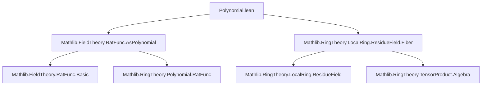

**Technical Brief: `Polynomial.lean` — Residue Fields of Polynomial Algebras**

---

### 1. **Key Definitions & Theorems**

| Name | Type / Signature | Purpose |
|------|------------------|---------|
| `residueFieldMapCAlgEquiv` | `J.ResidueField ≃ₐ[I.ResidueField] RatFunc I.ResidueField` | Constructs an algebra isomorphism between the residue field of the extended prime ideal $J = I \cdot R[X]$ in $R[X]$ and the rational function field over the residue field $\kappa(I)$. |
| `fiberEquivQuotient` | `p.Fiber S ≃ₐ[p.ResidueField] p.ResidueField[X] / (ker f).map (algebraMap R p.ResidueField)` | Identifies the fiber product $\kappa(p) \otimes_R (R[X]/I)$ with the quotient of polynomial ring over the residue field modulo the extended ideal. |
| `Ideal.exists_mem_span_singleton_map_residueField_eq` | `∃ p ∈ I, Ideal.span {p.map ...} = I.map ...` | In $\kappa(P)[X]$, any ideal $I$ extends to a principal ideal generated by the image of some $p \in I$, leveraging that $\kappa(P)[X]$ is a PID. |

---

### 2. **Naming Conventions**

- **Prefixes**:
  - `residueField_`: relates to residue fields $\kappa(-)$.
  - `fiber_`: pertains to fiber constructions over primes.
  - `map_`: indicates maps induced by ring homomorphisms (e.g., `mapRingHom`, `mapAlgHom`).
- **Suffixes**:
  - `_equiv`: denotes equivalence/isomorphism (e.g., `residueFieldMapCAlgEquiv`).
  - `_algebraMap`: refers to canonical algebra maps (e.g., `algebraMap R S`).
  - `_symm`: inverse of an equivalence (e.g., `residueFieldMapCAlgEquiv_symm_X`).
- **Variables**:
  - `I`, `J`: ideals, often prime.
  - `p`, `P`: prime ideals in base ring $R$.
  - `f`: algebra map $R[X] \to S$.
  - `hJ`: hypothesis that $J = I \cdot R[X]$.

---

### 3. **Tactic Stack**

Frequent tactics used in proofs:

| Tactic | Role |
|--------|------|
| `simp` / `simp only` | Simplification using definitional equalities and lemmas (e.g., `algebraMap_apply`, `aeval`). |
| `rw` / `rwa` | Rewriting using equalities, often with assumptions like `hJ`. |
| `ext` | Extensionality for ring homomorphisms, functions, or ideals. |
| `aesop` | Automated reasoning for first-order logic + simplifier. |
| `exact` / `refine` | Constructing proofs term-by-term, especially for universal properties. |
| `obtain` / `have` / `replace` | Intermediate lemma extraction and substitution. |
| `convert` / `congr` | Congruence closure for equality proofs. |
| `dsimp`, `change` | Simplifying or changing goal type before rewriting. |
| `intro`, `contrapose!` | Logical manipulations in implication/contradiction steps. |

---

### 4. **Proof Logic**

The logical flow across main results follows a pattern:

1. **Construct candidate maps** using universal properties:
   - For `residueFieldMapCAlgEquiv`: use `Ideal.ResidueField.lift` and `RatFunc.liftAlgHom`.
   - For `fiberEquivQuotient`: use `Algebra.TensorProduct.lift` and `Ideal.Quotient.liftₐ`.

2. **Verify well-definedness**:
   - Show denominators avoid the prime ideal (e.g., `x ∉ J` implies some coefficient $\notin I$).
   - Check kernel containment for quotient maps.

3. **Prove bijectivity**:
   - Use injectivity of algebra maps (e.g., `IsFractionRing.injective_comp_algebraMap`).
   - Surjectivity via `map_surjective`, `hf` (surjectivity of $f$), or localization properties.

4. **Simplify and verify commutativity**:
   - Use `simp` with lemmas like `residueFieldMapCAlgEquiv_algebraMap`.
   - Prove symmetry of diagrams (e.g., `commutes`, `algebraMap` compatibility).

5. **Leverage structural properties**:
   - $\kappa(P)[X]$ is a PID → principal ideal generation.
   - Localization preserves exactness and allows clearing denominators.

---

### 5. **Imports & Dependencies**

| Import | Purpose |
|--------|---------|
| `Mathlib.FieldTheory.RatFunc.AsPolynomial` | Rational functions as localization of polynomial ring; used for `RatFunc`, `aeval`, etc. |
| `Mathlib.RingTheory.LocalRing.ResidueField.Fiber` | Fiber constructions over local rings/residue fields; foundational for `p.Fiber S`. |
| `Mathlib.RingTheory.Polynomial.Basic` (implicit via `Polynomial`) | Polynomial ring structure, coefficients, evaluation, mapping. |
| `Mathlib.RingTheory.Ideal.Quotient` | Quotient rings, algebra structure on quotients. |
| `Mathlib.RingTheory.Localization` | Localization, integer normalization, units, map properties. |

---

### 6. **Mermaid Diagrams**

#### **Dependency Graph (Module-Level)**



#### **Overview of Theory Flow**

```mermaid
graph LR
  R[CommRing R] --> R[X][Polynomial R]
  I[Prime Ideal I ⊲ R] --> I[X][Extended Ideal I·R[X]]
  J[Prime J ⊲ R[X], J.LiesOver I] --> κJ[Residue Field κ(J)]
  κI[Residue Field κ(I)] --> RatFunc[κ(I)(X)]
  κJ -- ≃ₐ[κ(I)] --> RatFunc

  R --> S[Algebra S]
  p[Prime p ⊲ R] --> Fiber[p.Fiber S]
  R[X] --> R[X]//I[Quotient R[X]/I]
  κ(p) --> κ(p)[X]
  κ(p)[X] --> Quotient[κ(p)[X] / (ker f).map]
  Fiber -- ≃ₐ[κ(p)] --> Quotient
```

#### **Key Structural Insight**

- **Residue field of polynomial extension**:
  $$
  \kappa(I \cdot R[X]) \cong \kappa(I)(X)
  $$
  via evaluation at $X$, using that $X$ is transcendental over $\kappa(I)$.

- **Fiber product decomposition**:
  $$
  \kappa(p) \otimes_R (R[X]/I) \cong \kappa(p)[X] \big/ \langle I \rangle_{\kappa(p)[X]}
  $$
  where $\langle I \rangle_{\kappa(p)[X]}$ is the extension of $I$ to $\kappa(p)[X]$.

- **Principal generation in residue polynomial ring**:
  $$
  I \cdot \kappa(P)[X] = \langle p \rangle \quad \text{for some } p \in I
  $$
  due to $\kappa(P)[X]$ being a PID.

---

Let me know if you'd like a formalized summary in Lean or a diagram for the proof of `Ideal.exists_mem_span_singleton_map_residueField_eq`.
