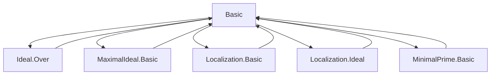
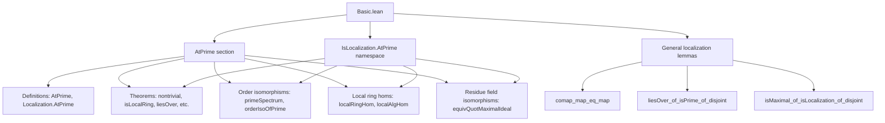

Here is the **technical metadata** extracted from the provided `Basic.lean` file, focusing on definitions, naming conventions, proof tactics, logic flow, imports, and theory structure.

---

### 1. **Key Definitions & Theorems**

| Name | Type / Signature | Purpose |
|------|------------------|---------|
| `IsLocalization.AtPrime` | `abbrev IsLocalization.AtPrime (P : Ideal R) [P.IsPrime] (S : Type*) [CommSemiring S] [Algebra R S] := IsLocalization P.primeCompl S` | Expresses that `S` is the localization of `R` at the complement of a prime ideal `P`. |
| `Localization.AtPrime` | `abbrev Localization.AtPrime (P : Ideal R) [P.IsPrime] := Localization P.primeCompl` | The canonical localization of `R` at `P.primeCompl`, implemented as a quotient type. |
| `IsLocalization.AtPrime.nontrivial` | `theorem AtPrime.nontrivial [IsLocalization.AtPrime S P] : Nontrivial S` | Shows that localizations at prime complements are nontrivial. |
| `IsLocalization.AtPrime.isLocalRing` | `theorem AtPrime.isLocalRing [IsLocalization.AtPrime S P] : IsLocalRing S` | Proves that such a localization is a **local ring**. |
| `Localization.AtPrime.isLocalRing` | `instance AtPrime.isLocalRing : IsLocalRing (Localization P.primeCompl)` | Instance version of the above. |
| `IsLocalization.AtPrime.orderIsoOfPrime` | `def orderIsoOfPrime : { p : Ideal S // p.IsPrime } ≃o { p : Ideal R // p.IsPrime ∧ p ≤ P }` | Order-preserving bijection between prime ideals in the localization and primes ≤ `P`. |
| `IsLocalization.AtPrime.primeSpectrumOrderIso` | `def primeSpectrumOrderIso : PrimeSpectrum S ≃o Set.Iic ⟨P, hP⟩` | Prime spectrum of localization is order-isomorphic to the interval `(-∞, P]` in `Spec R`. |
| `IsLocalization.AtPrime.isUnit_to_map_iff` | `theorem isUnit_to_map_iff (x : R) : IsUnit (algebraMap R S x) ↔ x ∈ P.primeCompl` | Characterizes units in the localization via membership in the complement of `P`. |
| `IsLocalization.AtPrime.to_map_mem_maximal_iff` | `theorem to_map_mem_maximal_iff (x : R) : algebraMap R S x ∈ maximalIdeal S ↔ x ∈ P` | Relates maximal ideal membership in localization to membership in `P`. |
| `IsLocalization.AtPrime.comap_maximalIdeal` | `theorem comap_maximalIdeal : (maximalIdeal S).comap (algebraMap R S) = P` | The comap of the maximal ideal is exactly `P`. |
| `IsLocalization.AtPrime.liesOver_maximalIdeal` | `instance liesOver_maximalIdeal : maximalIdeal S.LiesOver P` | The maximal ideal of the localization lies over `P`. |
| `IsLocalization.AtPrime.isUnit_mk'_iff` | `theorem isUnit_mk'_iff (x : R) (y : P.primeCompl) : IsUnit (mk' S x y) ↔ x ∈ P.primeCompl` | Units in localization are exactly those `mk'` with numerator outside `P`. |
| `IsLocalization.AtPrime.mk'_mem_maximal_iff` | `theorem mk'_mem_maximal_iff (x : R) (y : P.primeCompl) : mk' S x y ∈ maximalIdeal S ↔ x ∈ P` | Membership in maximal ideal characterized by numerator in `P`. |
| `Localization.localRingHom` | `def localRingHom (I : Ideal R) [I.IsPrime] (J : Ideal P) [J.IsPrime] (f : R →+* P) (h : I = J.comap f) : Localization.AtPrime I →+* Localization.AtPrime J` | Induced map on localizations from a ring hom whose comap preserves the relevant prime. |
| `Localization.localAlgHom` | `def localAlgHom (I : Ideal S) [I.IsPrime] (J : Ideal P) [J.IsPrime] (f : S →ₐ[R] P) (h : I = J.comap f) : Localization.AtPrime I →ₐ[R] Localization.AtPrime J` | Algebra version of `localRingHom`. |
| `equivQuotMaximalIdeal` | `def equivQuotMaximalIdeal : R ⧸ p ≃+* Rₚ ⧸ maximalIdeal Rₚ` | Isomorphism between residue fields: localization preserves residue fields. |
| `equivQuotientMapMaximalIdeal` | `def equivQuotientMapMaximalIdeal : S ⧸ pS ≃+* Sₚ ⧸ pSₚ` | Generalization of above to extensions `S → Sₚ`. |

---

### 2. **Naming Conventions**

- **Prefixes / Suffixes**:
  - `AtPrime`: Used for definitions and theorems specific to localization at a prime ideal.
  - `isUnit_`, `mem_maximalIdeal`, `comap_`, `map_`, `mk'_`: Standard ring-theoretic operations.
  - `orderIso`, `primeSpectrumOrderIso`: For order-isomorphisms on spectra.
  - `equivQuotMaximalIdeal`, `equivQuotientMapMaximalIdeal`: For isomorphisms on quotient rings modulo maximal ideals.
  - `localRingHom`, `localAlgHom`: For induced maps on localizations.
  - `liesOver`: For the `LiesOver` relation between ideals in extensions.

- **Suffixes**:
  - `_iff`: Biconditional characterizations (e.g., `isUnit_to_map_iff`).
  - `_iff_mem`: When equivalence is with membership in a set (e.g., `mk'_mem_maximal_iff`).
  - `_of_`: When a property is derived from a hypothesis (e.g., `isDomain_of_local_atPrime`).
  - `mapPiEvalRingHom`: Specialization of `localRingHom` to product projections.

---

### 3. **Tactic Stack**

Frequently used tactics in proofs:

| Tactic | Usage |
|--------|-------|
| `aesop` | Automated reasoning for basic logic, set theory, and algebra. |
| `simp only [...]` | Simplification with explicit lemmas, often to reduce to definitions. |
| `rw [...]` | Rewriting using equalities or equivalences. |
| `rcases`, `obtain`, `cases'` | Existential elimination and decomposition of hypotheses. |
| `convert`, `congr_arg` | Goal-directed equality proofs, especially for structure morphisms. |
| `ext` | Extensionality for ideals, sets, functions. |
| `apply`, `exact`, `intro` | Basic proof steps. |
| `ring`, `abel` | For commutative ring identities (less frequent here). |
| `simpa` | Simplify and discharge goal using assumptions. |
| `have`, `suffices` | Intermediate claims and logical reductions. |
| `nontrivial_of_ne`, `isUnit_iff_exists_inv`, `not_iff_not.mp` | Domain-specific lemmas for rings and units. |

---

### 4. **Proof Logic**

The proofs follow a **structured ring-theoretic pattern**:

1. **Reduction to definitions**:
   - Use `mk'`, `algebraMap`, `comap`, `map`, and `IsLocalization` properties.
   - Often reduce to `IsLocalization.eq_iff_exists`, `mem_map_of_mem`, `comap_map_of_isPrime_disjoint`.

2. **Case analysis on membership**:
   - Use `isUnit_iff_exists_inv`, `mem_nonunits_iff`, `not_iff_not` to toggle between unit/nonunit and membership in `P`/`P.primeCompl`.

3. **Ideal-theoretic manipulations**:
   - Use `Ideal.ext`, `Ideal.mem_comap`, `Ideal.map_comap_le`, `Ideal.le_comap_map`.
   - Leverage `disjoint_primeCompl`, `liesOver`, and `IsPrime` properties.

4. **Order-theoretic bijections**:
   - Use `orderIsoOfPrime`, `primeSpectrumOrderIso`, and `Set.ext` to show bijections on spectra.

5. **Residue field isomorphisms**:
   - Construct via `quotEquivOfEq`, `quotientKerEquivOfSurjective`, and verify surjectivity/injectivity using `mk'_spec`, `mk'_mul_cancel_left`.

6. **Uniqueness arguments**:
   - `localRingHom_unique`, `map_unique`: Use universal property of localization.

---

### 5. **Imports**

The module depends on:

- `Mathlib.RingTheory.Ideal.Over`
- `Mathlib.RingTheory.LocalRing.MaximalIdeal.Basic`
- `Mathlib.RingTheory.Localization.Basic`
- `Mathlib.RingTheory.Localization.Ideal`
- `Mathlib.RingTheory.Ideal.MinimalPrime.Basic`

These indicate the file sits in the **localization theory** and **local ring theory** ecosystem of Mathlib, especially around:

- Prime ideals and their complements,
- Localization at multiplicative sets,
- Local rings and maximal ideals,
- Prime spectrum and its topology.

---

### 6. **Mermaid Diagrams**

#### **Dependency Graph (Top-Level)**

#### **Overview of File Structure**

---

Let me know if you'd like a **dependency graph of theorems**, or a **proof dependency DAG** for a specific theorem (e.g., `equivQuotMaximalIdeal`).
