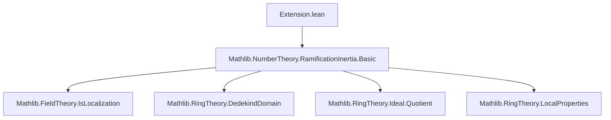
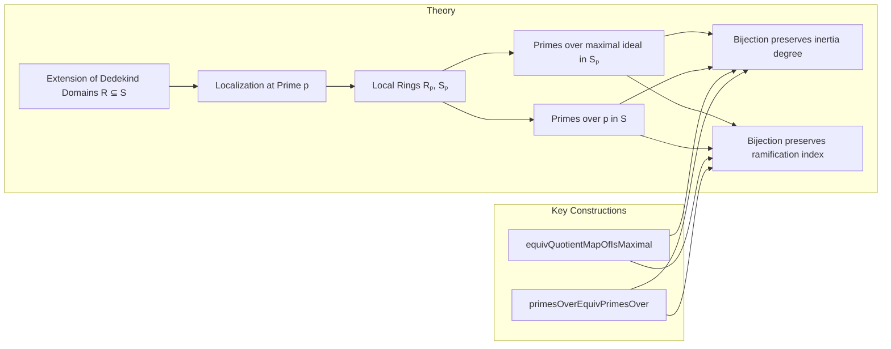

Here is the **technical metadata extraction** for the Lean 4 file `Extension.lean`, formatted as requested:

---

### 1. **Key Definitions & Theorems**

| Name | Type / Signature | Purpose |
|------|------------------|---------|
| `mem_primesOver_of_isPrime` | `{Q : Ideal Sₚ} [Q.IsMaximal] [Algebra.IsIntegral Rₚ Sₚ] → Q ∈ (maximalIdeal Rₚ).primesOver Sₚ` | Shows nonzero maximal ideals of `Sₚ` lie over the maximal ideal of `Rₚ`. |
| `equivQuotientMapOfIsMaximal` | `[p.IsPrime] [P.IsMaximal] → S ⧸ P ≃+* Sₚ ⧸ P.map (algebraMap S Sₚ)` | Constructs the canonical ring isomorphism between residue fields at corresponding primes. |
| `primesOverEquivPrimesOver` | `[hp : p ≠ ⊥] → p.primesOver S ≃o (maximalIdeal Rₚ).primesOver Sₚ` | Establishes an order-preserving bijection between primes of `S` over `p` and primes of `Sₚ` over `maximalIdeal Rₚ`. |
| `primesOverEquivPrimesOver_inertiagDeg_eq` | `[p.IsMaximal] [hp : p ≠ ⊥] → inertiaDeg preserved under the bijection` | Proves the bijection preserves inertia degree. |
| `primesOverEquivPrimesOver_ramificationIdx_eq` | `[hp : p ≠ ⊥] + torsion-freeness & Dedekind assumptions → ramification index preserved` | Proves the bijection preserves ramification index. |
| `inertiaDeg_map_eq_inertiaDeg` | `[p.IsMaximal] [P.IsMaximal] → inertiaDeg preserved under localization map` | Key technical lemma used in proving inertia degree preservation. |
| `ramificationIdx_map_eq_ramificationIdx` | `[hp : p ≠ ⊥] + torsion-freeness & Dedekind assumptions → ramification index preserved` | Key technical lemma used in proving ramification index preservation. |
| `algebraMap_equivQuotMaximalIdeal_symm_apply` | Commutativity of diagram involving residue field maps | Ensures compatibility of residue field extensions under localization. |

---

### 2. **Naming Conventions**

- **Prefixes**:
  - `mem_`: membership in a set of primes (e.g., `mem_primesOver_of_isPrime`)
  - `equivQuotientMapOfIsMaximal`: construction of isomorphism from maximal ideal condition
  - `primesOverEquivPrimesOver`: bijection between sets of primes over ideals
  - `inertiaDeg_`, `ramificationIdx_`: properties related to local invariants
  - `map_`, `comap_`: behavior under pushforward/pullback of ideals
  - `liesOver_`: conditions for lying over a given prime

- **Suffixes**:
  - `_eq`: equality of invariants (e.g., `inertiaDeg_map_eq_inertiaDeg`)
  - `_apply`: action on elements (e.g., `equivQuotientMapOfIsMaximal_apply_mk`)
  - `_symm_apply`: action of inverse equivalence on elements

- **Variables**:
  - `R`, `S`: base rings / domains
  - `p`: prime ideal in `R`
  - `Rₚ`, `Sₚ`: localizations at `p`
  - `P`, `Q`: prime/maximal ideals in `S`, `Sₚ`

---

### 3. **Tactic Stack**

Frequently used tactics in proofs:

| Tactic | Usage |
|--------|-------|
| `rw` | Rewriting definitions (e.g., `liesOver_iff`, `map_eq_maximalIdeal`) |
| `simp` / `simp only` | Simplifying using lemmas like `map_mul`, `mk'_spec`, `Quotient.mk_algebraMap` |
| `exact` / `refine` | Completing goals with known lemmas or partial proofs |
| `have` / `obtain` | Introducing intermediate facts or elements |
| `rwa` | Rewriting and applying assumptions (e.g., `rwa [← map_eq_maximalIdeal p]`) |
| `ext` | Extensionality for ring homomorphisms / equivalences |
| `cases` / `by_cases` | Case analysis (e.g., on `P = ⊥`) |
| `ring` / `linarith` | Not explicitly used here, but likely in background algebraic simplifications |
| `apply` / `exact` | For applying lemmas with matching types |

---

### 4. **Proof Logic**

The logical flow across most proofs follows this pattern:

1. **Setup**: Introduce assumptions (e.g., `P.LiesOver p`, `P.IsMaximal`, integrality).
2. **Reduction**: Reduce to known equivalences or use `liesOver_iff`, `map_eq_maximalIdeal`, etc.
3. **Intermediate Lemmas**:
   - Show that `P.map (algebraMap S Sₚ)` is prime/maximal.
   - Prove disjointness of `P` with the multiplicative set (via `disjoint_primeCompl_of_liesOver`).
   - Use properties of localization (e.g., `comap_map_eq_self_of_isMaximal`).
4. **Construction**:
   - Define maps (e.g., `equivQuotientMapOfIsMaximal`) using `quotEquivOfEq`, `quotientKerEquivOfSurjective`.
   - Prove bijectivity/injectivity/surjectivity using properties of localization and quotient maps.
5. **Preservation of Invariants**:
   - Use `inertiaDeg_algebraMap`, `ramificationIdx_algebra_tower`, and isomorphisms to reduce to known cases.
   - Apply `finrank_eq_of_equiv_equiv` for inertia degree.
   - Use torsion-freeness and Dedekind assumptions for ramification index.

Induction is not used; instead, the proofs rely heavily on:
- **Localization theory** (especially `IsLocalization.AtPrime`)
- **Ideal theory in Dedekind domains** (e.g., dimension ≤ 1, maximal ideals over primes)
- **Residue field arithmetic** (via `Ideal.Quotient.field` instance)

---

### 5. **Imports**

- `Mathlib.NumberTheory.RamificationInertia.Basic`: Core definitions and lemmas about ramification, inertia, localization at primes, and Dedekind domains.

This import provides:
- `IsLocalization.AtPrime`
- `primesOver`, `inertiaDeg`, `ramificationIdx`
- `liesOver`, `maximalIdeal`, `IsDedekindDomain`, `IsTorsionFree`, etc.

---

### 6. **Mermaid Diagrams**

#### **Dependency Graph (Module-Level)**



#### **Overview of File Structure**



#### **Commutative Diagram (Residue Fields)**

```mermaid
graph LR
  Rₚ ⧸ 𝓂 --> R ⧸ p
  Sₚ ⧸ 𝒫 --> S ⧸ P
  Rₚ ⧸ 𝓂 -.->|algebraMap| Sₚ ⧸ 𝒫
  R ⧸ p -.->|algebraMap| S ⧸ P
  Rₚ ⧸ 𝓂 -.iso.->|equivQuotMaximalIdeal.symm| R ⧸ p
  Sₚ ⧸ 𝒫 -.iso.->|equivQuotientMapOfIsMaximal.symm| S ⧸ P
```

---

Let me know if you'd like a **dependency graph of definitions/theorems**, or a **proof dependency DAG** for specific lemmas.
