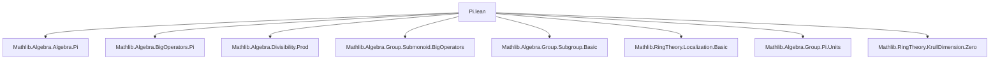
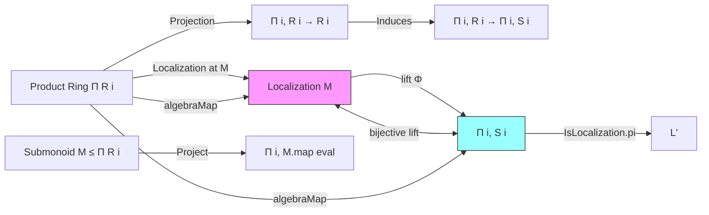
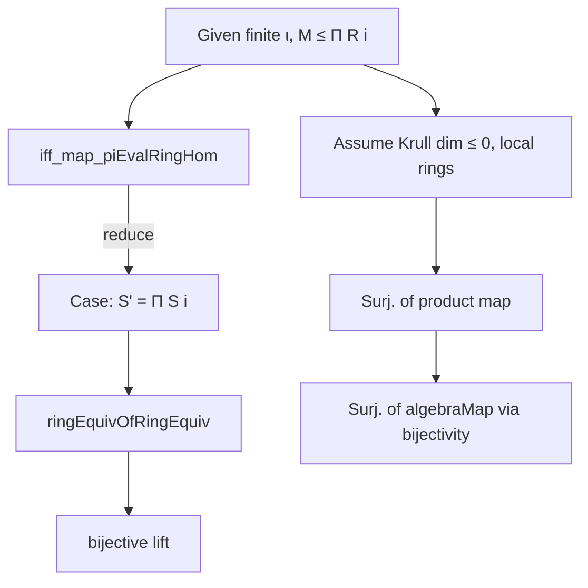

### Technical Brief: `Pi.lean` — Localization of Finite Products of Commutative Rings

---

#### **1. Key Definitions & Theorems**

| Name | Type / Signature | Purpose |
|------|------------------|---------|
| `IsLocalization.pi` | `instance (M : Π i, Submonoid (R i)) [∀ i, IsLocalization (M i) (S i)] : IsLocalization (.pi .univ M) (Π i, S i)` | Shows that the product of localizations is the localization of the product at the product monoid. |
| `iff_map_piEvalRingHom` | `IsLocalization M S' ↔ IsLocalization (.pi .univ fun i ↦ M.map (Pi.evalRingHom R i)) S'` | Equivalence between localizing the product at `M` and localizing each factor at the projected monoid, for finite index types. |
| `isUnit_piRingHom_algebraMap_comp_piEvalRingHom` | `y : M → IsUnit ((Pi.ringHom fun i ↦ (algebraMap (R i) (S i)).comp (Pi.evalRingHom R i)) y)` | Proves that elements of `M` map to units under the canonical product-of-localizations map. |
| `bijective_lift_piRingHom_algebraMap_comp_piEvalRingHom` | `[IsLocalization M S'] [Finite ι] → Function.Bijective (lift …)` | Main result: the canonical map from `Localization M → Π i, Localization (M.map eval)` is bijective. |
| `surjective_piRingHom_algebraMap_comp_piEvalRingHom` | `[∀ i, Ring.KrullDimLE 0 (R i)] [∀ i, IsLocalRing (R i)] → Surjective …` | Surjectivity of the canonical map under Krull dimension ≤ 0 and local ring assumptions. |
| `algebraMap_pi_surjective_of_isLocalization` | `[∀ i, Ring.KrullDimLE 0 (R i)] [∀ i, IsLocalRing (R i)] [IsLocalization M S'] [Finite ι] → Surjective (algebraMap …)` | Surjectivity of the structure map `Π R i → S'` under same hypotheses. |

---

#### **2. Naming Conventions**

- **Prefixes**:
  - `isUnit_`: asserts unit-ness of an element under a ring homomorphism.
  - `bijective_lift_`: refers to bijectivity of the induced map from localization.
  - `surjective_piRingHom_`: surjectivity of product ring homomorphisms.
  - `algebraMap_`: structure maps from base ring to localized ring.

- **Suffixes**:
  - `_comp_piEvalRingHom`: composition with `Pi.evalRingHom`, i.e., projection maps.
  - `_piRingHom`: involving `Pi.ringHom`, i.e., product of ring homomorphisms.

- **Notation**:
  - `M.map (Pi.evalRingHom R i)`: projection of monoid `M ≤ Π R i` onto the `i`-th factor.
  - `.pi .univ M`: product submonoid over all indices.

---

#### **3. Tactic Stack**

Frequently used tactics in proofs:

| Tactic | Usage |
|--------|-------|
| `choose` | Eliminating existential quantifiers (e.g., `choose rm h using …`). |
| `funext` | Extensionality for functions (e.g., proving equality of product elements). |
| `rw [Fintype.prod_apply]` | Rewriting product over finite type. |
| `simp_rw` / `simp` | Simplifying using definitional equalities (e.g., `pi_dvd_iff`, `prod_mem`). |
| `exact`, `refine`, `rwa` | Finishing proofs or constructing witnesses. |
| `by_cases` | Case analysis on membership or properties (e.g., `0 ∈ M`). |
| `ringEquivOfRingEquiv`, `Submonoid.map_equiv_eq_comap_symm` | Structural ring/monoid equivalence reasoning. |
| `Fintype.ofFinite` | Instantiating finiteness for finite types. |

---

#### **4. Proof Logic**

- **Structure of main proof (`bijective_lift_…`)**:
  1. Use `iff_map_piEvalRingHom` to reduce to the case where `S' = Π i, S i`.
  2. Apply `ringEquivOfRingEquiv` with identity on monoids (via `Submonoid.map_equiv_eq_comap_symm`).
  3. Conclude bijectivity using `bijective` of ring isomorphisms.

- **Surjectivity proofs (`surjective_piRingHom_…`, `algebraMap_pi_surjective_…`)**:
  1. Reduce to component-wise surjectivity via `Surjective.piMap`.
  2. For each component:
     - If `0 ∈ M' i`, then localization is zero ring → surjective trivially.
     - Otherwise, use `IsLocalization.atUnits` to get surjectivity of the structure map onto localization at units.
  3. Use bijectivity of the main lift to lift surjectivity back to `algebraMap`.

- **Inductive/structural reasoning**:
  - Relies heavily on universal properties of localization (`lift`, `map_units`, `exists_of_eq`).
  - Exploits finite product structure (`Fintype`, `Pi`, `prod_mem`, `pi_dvd_iff`).

---

#### **5. Imports & Dependencies**

| Module | Role |
|--------|------|
| `Mathlib.Algebra.Algebra.Pi` | Product of algebras, `Pi.ringHom`, `algebraMap` for products. |
| `Mathlib.Algebra.BigOperators.Pi` | Product over finite index types (`prod_mem`, `pi_dvd_iff`). |
| `Mathlib.Algebra.Divisibility.Prod` | Divisibility in products (`prod_dvd_iff`, etc.). |
| `Mathlib.Algebra.Group.Submonoid.BigOperators` | Monoid operations on products (`prod_mem`, `mem`). |
| `Mathlib.Algebra.Group.Subgroup.Basic` | Basic subgroup/monoid theory. |
| `Mathlib.RingTheory.Localization.Basic` | Core localization theory (`IsLocalization`, `lift`, `map_units`). |
| `Mathlib.Algebra.Group.Pi.Units` | Units in product rings (`Pi.isUnit_iff`). |
| `Mathlib.RingTheory.KrullDimension.Zero` | Krull dimension ≤ 0 and local ring properties. |

---

#### **6. Mermaid Diagrams**

##### **Dependency Graph (Module-Level)**

##### **Theoretical Overview (Data Flow)**

##### **Proof Strategy Flow**

---

#### **7. Summary**

This file establishes a foundational structural theorem: **localization commutes with finite products of commutative rings**, under mild hypotheses (finiteness of indexing type, Krull dimension ≤ 0, and localness). It leverages:
- The universal property of localization (`lift`, `map_units`),
- Product-specific lemmas (`Pi.isUnit_iff`, `pi_dvd_iff`, `prod_mem`),
- Structural equivalences (`ringEquivOfRingEquiv`, `Submonoid.map_equiv`).

The result is critical for reducing local properties of product rings to their components — a common technique in algebraic geometry and commutative algebra.

--- 

Let me know if you'd like a formalized dependency graph (e.g., `.lean`-level imports), or a visualization of the `IsLocalization` instance chain.
