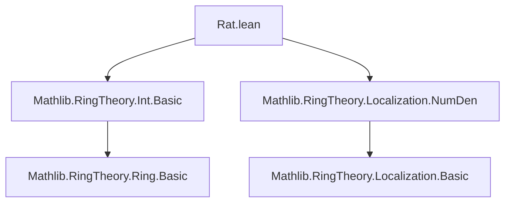
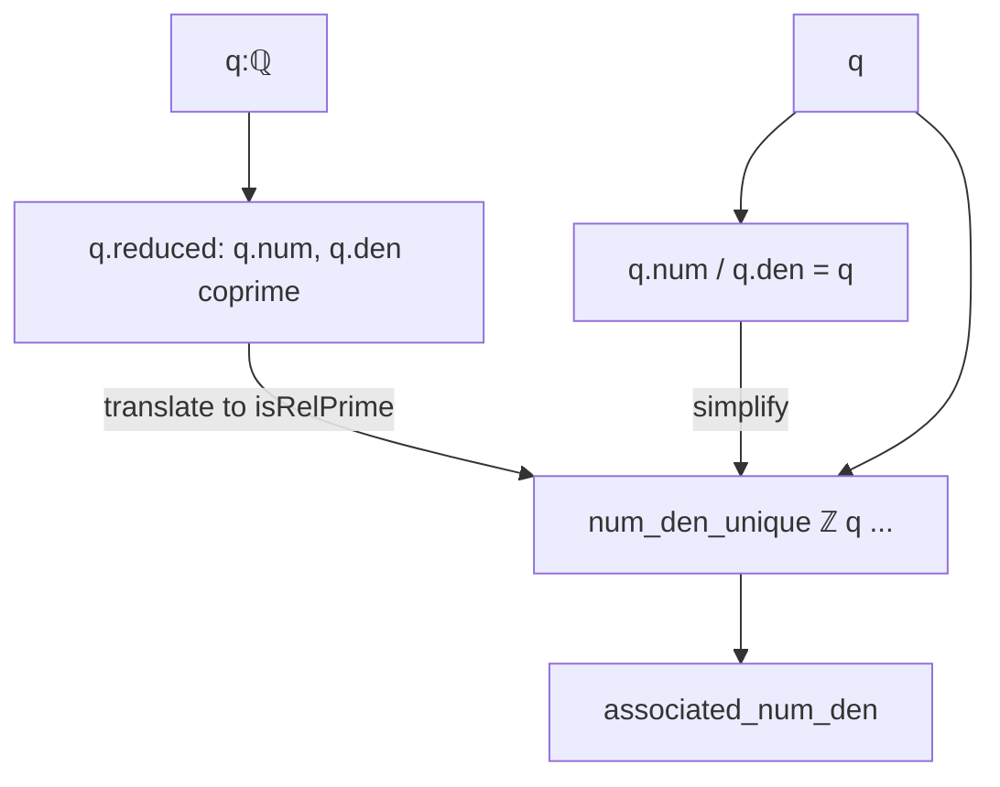

**Technical Brief: `Rat.lean` — Ring-theoretic Fractions in `ℚ`**

---

### 1. **Key Definitions & Theorems**

| Name | Type | Purpose |
|------|------|---------|
| `isLocalizationIsInteger_iff` | `q : ℚ → (IsLocalization.IsInteger ℤ q ↔ q ∈ Set.range Int.cast)` | Characterizes integers inside `ℚ` as those rationals that are integral over `ℤ` under the localization framework. |
| `associated_num_den` | `q : ℚ → Associated (IsFractionRing.num ℤ q) q.num ∧ Associated (IsFractionRing.den ℤ q) q.den` | Relates the abstract numerator/denominator from `IsFractionRing` (i.e., `IsLocalization`) to the concrete `Rat.num`/`Rat.den` via association (i.e., up to units in `ℤ`, i.e., ±1). |
| `isFractionRingDen` | `q : ℚ → (IsFractionRing.den ℤ q : ℤ).natAbs = q.den` | Shows that the denominator returned by `IsFractionRing.den` (viewed as an integer) has natural absolute value equal to the standard reduced denominator `q.den`. |
| `isFractionRingNum` | `q : ℚ → Associated (IsFractionRing.num ℤ q : ℤ) q.num` | Shows the numerator from `IsFractionRing` is associated (±) to the standard reduced numerator `q.num`. |

> **Note**: `Associated a b` means $a = u \cdot b$ for some unit $u$; in `ℤ`, units are `±1`.

---

### 2. **Naming Conventions**

- **Prefixes**:
  - `isFractionRing*`: Refers to the `IsFractionRing` interface (via `IsLocalization`) for `ℚ` over `ℤ`.
  - `associated_*`: Indicates equivalence up to units (e.g., `associated_num_den`).
- **Suffixes**:
  - `_iff`: Biconditional characterizations (`isLocalizationIsInteger_iff`).
  - `_num`, `_den`: Reference numerator/denominator components.

---

### 3. **Tactic Stack**

- `simp` / `simpa`: Dominant use for simplification using definitional equalities and lemmas like `num_div_den`, `isRelPrime_iff_isCoprime`, etc.
- `rw` (implicit via `simpa`/`simp_rw`): Rewriting using `q.reduced`, `q.associated_num_den`, etc.
- `exact` / `assumption`: Used implicitly in `by simpa ... using ...`.
- `ring`: Not present — arithmetic is handled via `simp` and `int`-specific lemmas.
- No heavy automation (e.g., `aesop`, `linarith`) — proofs are mostly direct simplifications leveraging structure lemmas.

---

### 4. **Proof Logic**

- **Structure**: Each proof leverages:
  1. **Definitional facts** about `ℚ` as the localization of `ℤ` at `ℤ \ {0\}`.
  2. **Uniqueness of num/den** (via `num_den_unique`) up to association.
  3. **Properties of reduced fractions**: `q.reduced` (coprimality of `num` and `den`) and `q.num_div_den`.
  4. **Translation between abstract and concrete representations**:
     - `IsFractionRing.num/den` ↔ `Rat.num/den`.
     - `Associated` ↔ equality up to sign.
- **Typical flow**:
  - Apply `num_den_unique` to get association.
  - Use `q.reduced` (coprime condition) to ensure uniqueness up to units.
  - Simplify using `Int.isCoprime_iff_nat_coprime`, `isRelPrime_iff_isCoprime`, and `Rat.num_div_den`.

---

### 5. **Imports**

| Module | Role |
|--------|------|
| `Mathlib.RingTheory.Int.Basic` | Basic properties of `ℤ`, units, natAbs, coprimality. |
| `Mathlib.RingTheory.Localization.NumDen` | Core theory of localization numerators/denominators, `num_den_unique`, `IsLocalization.IsInteger`. |

> These imports define `IsFractionRing`, `IsLocalization.IsInteger`, and the `num_den_unique` principle used throughout.

---

### 8. **Mermaid Diagrams**

#### **Dependency Graph (File-Level)**



#### **Conceptual Overview (Theory Flow)**

```mermaid
graph LR
  A[ℤ as commutative ring] -->|Localization at S = ℤ \ {0}| B[ℚ = Frac(ℤ)]
  B --> C[IsFractionRing ℤ ℚ]
  C --> D[Abstract num/den: IsFractionRing.num/den]
  D -->|uniqueness up to units| E[Concrete num/den: Rat.num/den]
  E -->|reduced form| F[q.num, q.den coprime]
  F -->|via num_den_unique| D
```

#### **Proof Dependency (for `associated_num_den`)**



---

**Summary**: This module bridges the *abstract* localization-theoretic construction of `ℚ` (as `IsFractionRing ℤ`) with the *concrete* representation used in `Rat` (via reduced numerators/denominators). It confirms that the standard `Rat.num`/`Rat.den` are canonical up to sign, and that integrality over `ℤ` coincides with being an integer. Proofs are short and rely on uniqueness of reduced fractions in a PID (`ℤ`).
