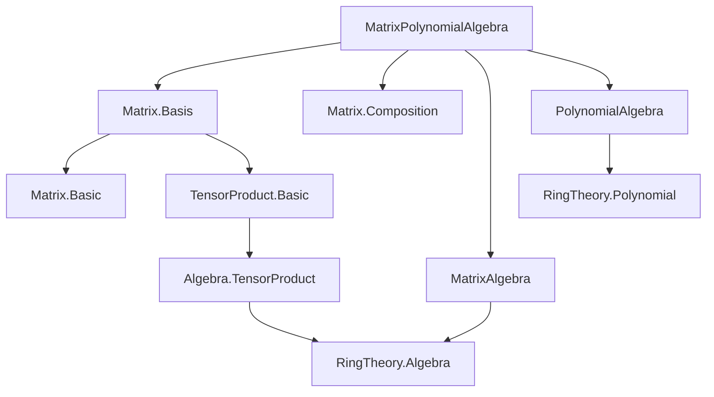

### Technical Brief: `MatrixPolynomialAlgebra.lean`

---

#### **1. Key Definitions & Theorems**

| Name | Type | Purpose |
|------|------|---------|
| `matPolyEquiv` | `Matrix n n R[X] ≃ₐ[R] (Matrix n n R)[X]` | Core algebra isomorphism between matrices of polynomials and polynomials of matrices. |
| `matPolyEquiv_coeff_apply` | `coeff (matPolyEquiv m) k i j = coeff (m i j) k` | Characterizes the isomorphism coefficient-wise: extracting coefficient $k$ of the matrix polynomial corresponds to coefficient $k$ of each entry. |
| `matPolyEquiv_symm_apply_coeff` | `coeff (matPolyEquiv.symm p i j) k = coeff p k i j` | Inverse direction: coefficient extraction commutes with applying the inverse isomorphism. |
| `matPolyEquiv_smul_one` | `matPolyEquiv (p • (1 : Matrix n n R[X])) = p.map (algebraMap R (Matrix n n R))` | Describes how scalar multiplication by a polynomial (times identity matrix) maps under `matPolyEquiv`. |
| `matPolyEquiv_map_smul` | `matPolyEquiv (p • M) = p.map (algebraMap _ _) * matPolyEquiv M` | Compatibility of `matPolyEquiv` with scalar multiplication (module structure). |
| `matPolyEquiv_eval_eq_map` | `(matPolyEquiv M).eval (scalar n r) = M.map (eval r)` | Evaluation at $r \in R$ commutes with `matPolyEquiv`. |
| `eval_det` | `Polynomial.eval r M.det = (Polynomial.eval (scalar n r) (matPolyEquiv M)).det` | Determinant commutes with evaluation and `matPolyEquiv`. |
| `RingHom.polyToMatrix` | `A[X] →+* Matrix n n R[X]` | Extension of a ring homomorphism $A \to M_n(R)$ to $A[X] \to M_n(R[X])$ via `matPolyEquiv.symm`. |

---

#### **2. Naming Conventions**

- **Prefixes**:
  - `matPolyEquiv_*`: All lemmas about the main isomorphism.
  - `polyToMatrix_*`: Lemmas about the induced ring homomorphism on polynomial rings.
- **Suffixes**:
  - `_coeff_apply`: Coefficient-wise behavior.
  - `_eval`: Evaluation behavior.
  - `_map`: Interaction with `map` (e.g., `map_C`, `map_smul`).
  - `_symm`: Behavior of the inverse isomorphism.
- **Functional style**:
  - `single i j p`: Matrix with $p$ at $(i,j)$ and zero elsewhere.
  - `diagonal f`: Diagonal matrix with entries $f(i)$.
  - `C : Matrix n n R → (Matrix n n R)[X]`: Constant polynomial embedding.

---

#### **3. Tactic Stack**

Frequently used tactics in proofs:
- `simp` (with many lemmas, especially `matPolyEquiv_*`, `coeff_*`, `single_*`, `diagonal_*`)
- `rw` (rewriting using `matPolyEquiv_coeff_apply`, `AlgEquiv.apply_symm_apply`, etc.)
- `ext` (extensionality for functions/matrix entries)
- `funext` (for proving equality of functions)
- `induction_on'` (polynomial induction on `p : R[X]`)
- `split_ifs` (case analysis on `if h : i = i' then ... else ...`)
- `congr` (for congruence closure, especially in tensor/matrix index reasoning)
- `dsimp`, `convert`, `apply ...injective`, `have t : ...`, `conv_rhs => rw [...]`

---

#### **4. Proof Logic**

- **Structure of proofs**:
  - Most proofs proceed by **polynomial induction** (`Polynomial.induction_on'`) or **matrix induction** (`Matrix.induction_on'`), reducing to `single i j p` or `single i j x`.
  - Tensor-based definitions (`matrixEquivTensor`, `Algebra.TensorProduct.comm`, `polyEquivTensor`) are used to *define* `matPolyEquiv`, but proofs are mostly *extensional*, avoiding the underlying tensor construction.
  - Key lemmas (`matPolyEquiv_coeff_apply_aux_1`, `aux_2`) prove behavior on `monomial` and `single`, then lift via induction.
  - Evaluation lemmas (`matPolyEquiv_eval_eq_map`, `eval_det`) use `congr_arg` and `ext` to reduce to entrywise equality.
  - `matPolyEquiv_symm_map_eval` uses `aeval` and `eval₂AlgHom'`, but ultimately simplifies via `ext` and `simp`.

- **Typical flow**:
  1. Reduce to `single i j (monomial k x)` or `single i j x`.
  2. Unfold `matPolyEquiv` using its tensor definition.
  3. Simplify using `matrixEquivTensor_apply_single`, `polyEquivTensor_apply`, etc.
  4. Apply injectivity or `simp` to finish.

---

#### **5. Imports & Dependencies**

| Import | Role |
|--------|------|
| `Mathlib.Data.Matrix.Basis` | `matrixEquivTensor`, basis isomorphisms for matrices |
| `Mathlib.Data.Matrix.Composition` | Matrix composition, `compRingEquiv` |
| `Mathlib.RingTheory.MatrixAlgebra` | Matrix algebras, `algebraMap`, `scalar n r` |
| `Mathlib.RingTheory.PolynomialAlgebra` | Polynomial ring, `polyEquivTensor`, `eval`, `coeff`, `C`, `X` |

Also uses:
- `Polynomial`, `TensorProduct`, `Algebra.TensorProduct`
- `Finset`, `Function`, `RingTheory` infrastructure

---

#### **6. Mermaid Diagrams**

##### **Dependency Graph (Module-Level)**



##### **Overview of `matPolyEquiv` Construction & Use**

```mermaid
flowchart LR
  A[Matrix n n R[X]] 
    -- matrixEquivTensor --> B[R ⊗ R[X]]
    -- Algebra.TensorProduct.comm --> C[R[X] ⊗ R]
    -- polyEquivTensor.symm --> D[(Matrix n n R)[X]]

  A -- matPolyEquiv --> D

  D -- eval (scalar n r) --> E[Matrix n n R]
  A -- map (eval r) --> E

  D -- det --> F[R[X]]
  A -- det --> F

  D -- matPolyEquiv.symm --> A

  style A fill:#f9f,stroke:#333
  style D fill:#9cf,stroke:#333
```

##### **Proof Strategy Flow (for `matPolyEquiv_coeff_apply`)**

```mermaid
flowchart TD
  Start[Goal: coeff (matPolyEquiv m) k i j = coeff (m i j) k]
    --> Induction[Matrix induction on m]
    --> Case1[Case: 0]
    --> Case2[Case: p + q]
    --> Case3[Case: single i' j' x]

  Case3 --> Aux2[Use matPolyEquiv_coeff_apply_aux_2]
  Aux2 --> InductPoly[Polynomial induction on p]
  InductPoly --> Monomial[Reduce to monomial]
  Monomial --> Simplify[Unfold matPolyEquiv, simplify tensor maps]
  Simplify --> Finish[Apply coeff_monomial, funext]

  Finish --> End[✓]
```

---

#### **7. Theory Context**

This file is part of the **Cayley–Hamilton theorem pipeline** in Mathlib. The isomorphism `matPolyEquiv` is the key tool to reinterpret matrix polynomials as polynomials with matrix coefficients, enabling:
- Transfer of evaluation, determinant, and characteristic polynomial properties.
- Construction of `polyToMatrix` to extend representations of algebras to their polynomial extensions.

It sits between foundational matrix/polynomial algebra and the eventual proof of **Cayley–Hamilton**, where one evaluates the characteristic polynomial at a matrix and shows it vanishes.

--- 

Let me know if you'd like a formalized summary of the Cayley–Hamilton proof sketch that uses this file.
