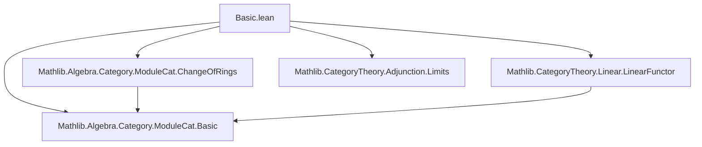
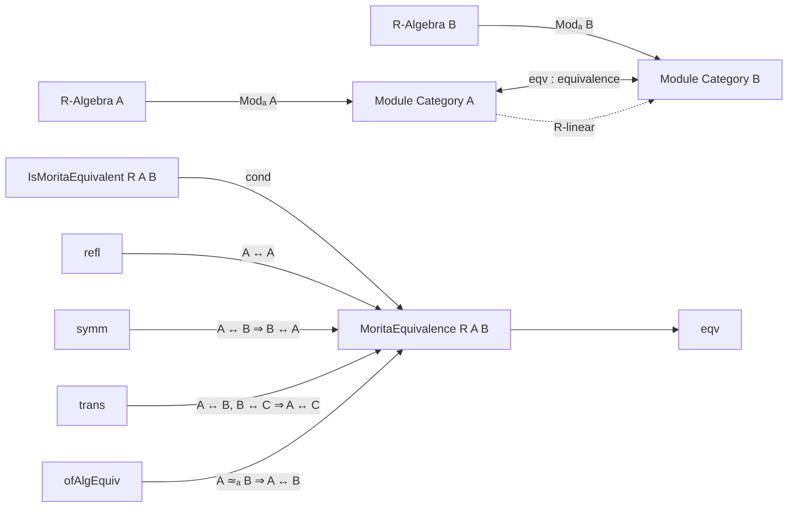

### Technical Brief: `Basic.lean` — Morita Equivalence in Lean 4

---

#### **1. Key Definitions & Theorems**

| Name | Type / Signature | Purpose |
|------|------------------|---------|
| `MoritaEquivalence R A B` | `Structure` | Encodes an *R*-linear equivalence of module categories `Modₐ A ≌ Modₐ B`. Contains:   • `eqv : ModuleCat A ≌ ModuleCat B`   • `linear : eqv.functor.Linear R` |
| `IsMoritaEquivalent R A B` | `Prop` | Predicate asserting existence of a Morita equivalence: `Nonempty (MoritaEquivalence R A B)` |
| `MoritaEquivalence.refl R A` | `MoritaEquivalence R A A` | Identity Morita equivalence via identity functor |
| `MoritaEquivalence.symm R e` | `MoritaEquivalence R B A` | Inverse equivalence of `e : MoritaEquivalence R A B` |
| `MoritaEquivalence.trans R e e'` | `MoritaEquivalence R A C` | Composition of equivalences `e : A ↔ B`, `e' : B ↔ C` |
| `MoritaEquivalence.ofAlgEquiv R f` | `MoritaEquivalence R A B` | Morita equivalence induced by an *R*-algebra isomorphism `f : A ≃ₐ[R] B` |
| `IsMoritaEquivalent.refl`, `symm`, `trans`, `of_algEquiv` | `Lemma` | Show `IsMoritaEquivalent` is an equivalence relation and closed under algebra isomorphism |

---

#### **2. Naming Conventions**

- **Prefixes**:
  - `MoritaEquivalence.`: for structure and its constructors/lemmas.
  - `IsMoritaEquivalent.`: for predicate-level lemmas.
- **Suffixes**:
  - `refl`, `symm`, `trans`: standard for equivalence relation properties.
  - `ofAlgEquiv`, `of_algEquiv`: indicate construction from algebra isomorphism.
- **Structure field naming**:
  - `eqv`: underlying categorical equivalence.
  - `linear`: proof that the functor is *R*-linear (auto-inferred via `instance`).

---

#### **3. Tactic Stack**

- **`infer_instance`**: used to synthesize `Additive` instance from `linear`.
- **`by infer_instance`**: in `linear` field of `refl`, `ofAlgEquiv`, etc., to discharge `Linear` typeclass.
- **`Nonempty.map`, `Nonempty.map2`**: to lift constructions to `Nonempty` in `IsMoritaEquivalent` lemmas.
- **`rw` / `simp`** (implied): likely used in downstream proofs (not shown here), especially with `ModuleCat.restrictScalarsEquivalenceOfRingEquiv`.

No heavy automation (`aesop`, `ring`, `linarith`) appears in this file — the proofs are mostly *definitionally* or *typeclass-driven*.

---

#### **4. Proof Logic**

- **Structure-based reasoning**: proofs are mostly *constructive* and rely on:
  - **Categorical properties**: identity, inverse, and composition of equivalences.
  - **Typeclass inference**: `Linear R` instances derived from `Additive` and preservation of binary products.
  - **Universe management**: all rings constrained to same universe `u₁` for simplicity (see TODO comment).
- **Inductive structure**:
  - `refl`, `symm`, `trans` mirror categorical equivalence properties.
  - `ofAlgEquiv` uses `ModuleCat.restrictScalarsEquivalenceOfRingEquiv`, leveraging change-of-rings/extension-of-scalars machinery.

---

#### **5. Imports & Dependencies**

| Import | Role |
|--------|------|
| `Mathlib.Algebra.Category.ModuleCat.ChangeOfRings` | Provides `restrictScalarsEquivalenceOfRingEquiv`, key for `ofAlgEquiv`. |
| `Mathlib.CategoryTheory.Linear.LinearFunctor` | Supplies `Linear R` typeclass and instances (e.g., `instLinearId`, `instLinearComp`). |
| `Mathlib.Algebra.Category.ModuleCat.Basic` | Defines `ModuleCat`, its objects/morphisms, and basic constructions. |
| `Mathlib.CategoryTheory.Adjunction.Limits` | Supplies categorical limits/adjunctions used implicitly (e.g., binary products → `Additive`). |

---

#### **6. Mermaid Diagrams**

##### **Dependency Graph (Module-Level)**

##### **Conceptual Overview of `Basic.lean`**

---

#### **7. Future Work (from TODO)**

- `R ≈ Matₙ(R)` via Morita equivalence (classical result).
- Characterization via **projective generators**.
- Characterization via **full idempotents**.
- Characterization via **invertible bimodules**.
- Preservation of simplicity under Morita equivalence.

---

#### **8. Tags & Scope**

- **Tags**: `Morita_Equivalence`, `Category_Theory`, `Noncommutative_Ring`, `Module_Theory`
- **Scope**: Foundational categorical treatment of Morita theory for *R*-algebras, with emphasis on *R*-linearity and equivalence relation properties.

--- 

This file serves as the *core logical scaffolding* for Morita theory in Mathlib4, establishing the basic equivalence relation and its invariance under algebra isomorphism, while deferring deeper structural characterizations to future work.
