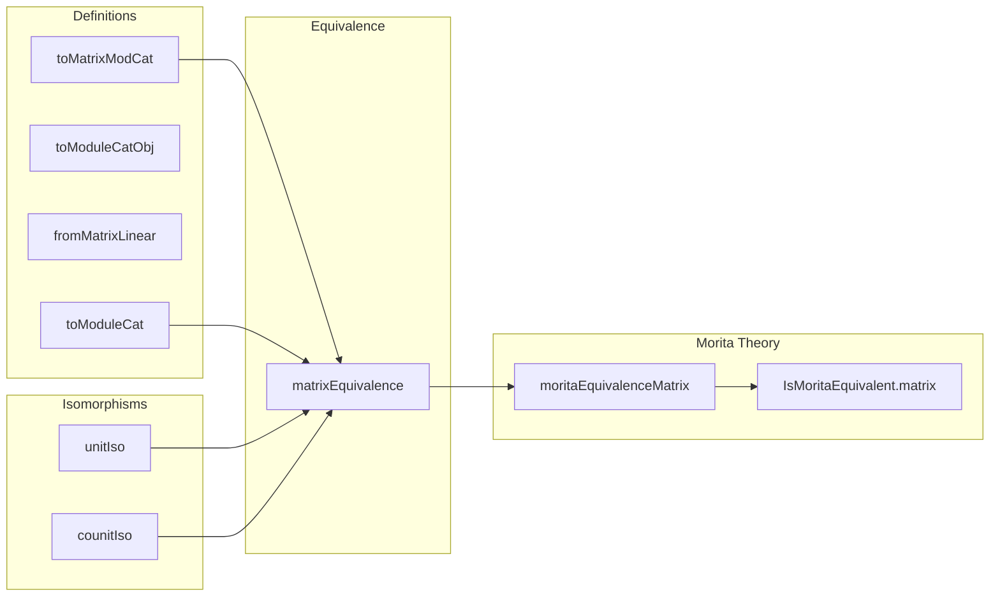

### Technical Brief: `Matrix.lean` — Morita Equivalence between $ R $ and $ M_n(R) $

---

#### **1. Key Definitions & Theorems**

| Name | Type / Signature | Purpose |
|------|------------------|---------|
| `ModuleCat.toMatrixModCat` | `ModuleCat R ⥤ ModuleCat (Matrix ι ι R)` | Functor induced by $ M \mapsto \iota \to M $, extending scalars along $ R \to M_n(R) $. |
| `MatrixModCat.toModuleCatObj` | `ι → Submodule R M` | Image of $ E_{ii} \cdot M $, where $ E_{ii} $ is the elementary matrix with 1 at $(i,i)$ and 0 elsewhere. |
| `MatrixModCat.fromMatrixLinear` | `M →ₗ[Matrix ι ι R] N ⇒ E_{ii}M →ₗ[R] E_{ii}N` | Restriction of an $ M_n(R) $-linear map to the $ E_{ii} $-summand. |
| `MatrixModCat.toModuleCat` | `ModuleCat (Matrix ι ι R) ⥤ ModuleCat R` | Functor $ M \mapsto E_{ii} \cdot M $, viewing it as an $ R $-module. |
| `fromModuleCatToModuleCatLinearEquiv` | $ E_{ii} \cdot (\iota \to M) \simeq_\ell M $ | Isomorphism showing $ E_{ii} \cdot (\iota \to M) \cong M $ as $ R $-modules. |
| `toModuleCatFromModuleCatLinearEquiv` | $ M \simeq_\ell (\iota \to E_{jj} \cdot M) $ | Isomorphism showing $ M \cong (\iota \to E_{jj} \cdot M) $ as $ M_n(R) $-modules. |
| `MatrixModCat.unitIso` | $ \text{toMatrixModCat} \circ \text{toModuleCat} \cong \mathrm{id} $ | Natural isomorphism showing left-inverse property. |
| `MatrixModCat.counitIso` | $ \text{toModuleCat} \circ \text{toMatrixModCat} \cong \mathrm{id} $ | Natural isomorphism showing right-inverse property. |
| `ModuleCat.matrixEquivalence` | $ \text{ModuleCat } R \cong \text{ModuleCat } M_n(R) $ | Explicit equivalence of module categories. |
| `moritaEquivalenceMatrix` | `MoritaEquivalence R₀ R (Matrix ι ι R)` | Shows the equivalence respects base ring $ R_0 $-algebra structure. |
| `IsMoritaEquivalent.matrix` | $ R \sim_{\text{Morita}} M_n(R) $ | Main theorem: $ R $ and $ M_n(R) $ are Morita equivalent. |

---

#### **2. Naming Conventions**

- **Prefixes**:
  - `toMatrixModCat`, `toModuleCat`: Functors going *to* matrix modules / *from* matrix modules.
  - `fromMatrixLinear`: Maps induced *from* matrix-linear maps.
  - `unitIso`, `counitIso`: Components of adjunction/isomorphism data.
- **Suffixes**:
  - `Obj`: Submodule or object construction (e.g., `toModuleCatObj`).
  - `LinearEquiv`: Linear isomorphisms (e.g., `fromModuleCatToModuleCatLinearEquiv`).
  - `Hom`, `of`, `ofHom`: Category-theoretic constructions for morphisms/objects.
- **Other patterns**:
  - `mem_`: Membership lemmas (e.g., `mem_toModuleCatObj`).
  - `isScalarTower_`: Proof of scalar tower condition (e.g., `isScalarTower_toModuleCat`).

---

#### **3. Tactic Stack**

Frequently used tactics in proofs:
- `simp` / `simp only`: Simplification using definitional equalities and lemmas.
- `ext`: Extensionality for functions, linear maps, submodules.
- `rw`: Rewriting using equalities (especially `smul_assoc`, `Matrix.smul_eq_diagonal_mul`, etc.).
- `dsimp`: Simplify definitional equalities before rewriting.
- `nth_rw`: nth occurrence rewriting (used for precise control).
- `obtain ⟨y, hy⟩`: Destruct existential quantifiers.
- `congr`: Congruence for function extensionality.
- `aesop`: For routine first-order reasoning (not heavily used here, but possible).
- `ring`: For commutative ring identities (used implicitly via `simp`).
- `cases`: Case analysis on `DecidableEq ι` or finite types.

---

#### **4. Proof Logic**

- **Structure**: The proof follows the standard categorical Morita theory pattern:
  1. Define two functors $ F = \text{toMatrixModCat} $, $ G = \text{toModuleCat} $.
  2. Construct natural isomorphisms:
     - $ \eta : GF \Rightarrow \mathrm{id} $ (`unitIso`)
     - $ \varepsilon : FG \Rightarrow \mathrm{id} $ (`counitIso`)
  3. Verify triangle identities (via `functor_unitIso_comp`).
- **Key lemmas**:
  - `fromModuleCatToModuleCatLinearEquiv`: Shows $ E_{ii} \cdot (\iota \to M) \cong M $.
  - `toModuleCatFromModuleCatLinearEquiv`: Shows $ M \cong (\iota \to E_{jj} \cdot M) $.
- **Induction / finite sum tricks**:
  - Use of `Finset.sum_eq_single_of_mem` and `Finset.sum_smul` to reduce sums to single terms.
  - `single_smul`, `smul_single`, and `mul_smul` manipulations for matrix actions.

---

#### **5. Imports & Dependencies**

- **Core imports**:
  ```lean
  Mathlib.LinearAlgebra.Matrix.Module
  Mathlib.RingTheory.Morita.Basic
  ```
- **Key underlying theories**:
  - `Matrix.Module`: Module structure on $ \iota \to M $, scalar multiplication via diagonal matrices.
  - `Morita.Basic`: General Morita equivalence framework (`MoritaEquivalence`, `IsMoritaEquivalent`).
  - `CategoryTheory.ModuleCat`: Category of modules over a ring.
  - `LinearMap`, `Submodule`, `AddCommGroup`, `IsScalarTower`, `SemigroupAction`.

---

#### **6. Mermaid Diagrams**

##### **Dependency Graph (High-Level)**

```mermaid
graph TD
  A[Matrix.lean] --> B[Mathlib.LinearAlgebra.Matrix.Module]
  A --> C[Mathlib.RingTheory.Morita.Basic]
  B --> D[Matrix Module Structure]
  B --> E[LinearMap.mapMatrixModule]
  C --> F[Morita Equivalence Framework]
  C --> G[IsMoritaEquivalent]
  A --> H[ModuleCat R]
  A --> I[ModuleCat (Matrix ι ι R)]
  H --> J[Functor F = toMatrixModCat]
  I --> K[Functor G = toModuleCat]
  J --> L[unitIso : GF ≅ id]
  K --> M[counitIso : FG ≅ id]
  L & M --> N[Equivalence : ModuleCat R ≌ ModuleCat M_n(R)]
  N --> O[MoritaEquivalence]
  O --> P[IsMoritaEquivalent.matrix]
```

##### **Overview of File Structure**



---

#### **7. Summary**

This file formalizes the classical result that the category of modules over a ring $ R $ is equivalent to the category of modules over the matrix ring $ M_n(R) $, where $ n = |\iota| $. It constructs the equivalence explicitly via:
- Extension of scalars $ M \mapsto \iota \to M $,
- Compression via idempotent $ E_{ii} $.

The formalization is fully categorical, leveraging Lean’s `CategoryTheory` and `ModuleCat`, and culminates in a proof that $ R $ and $ M_n(R) $ are Morita equivalent. The key insight is that $ E_{ii} $ is a full idempotent, and the equivalence is witnessed by the Peirce decomposition $ M \cong \bigoplus_{i,j} E_{ij} \cdot M $.

--- 

Let me know if you'd like a formalized proof sketch or a tactic-by-tactic breakdown of `functor_unitIso_comp`.
