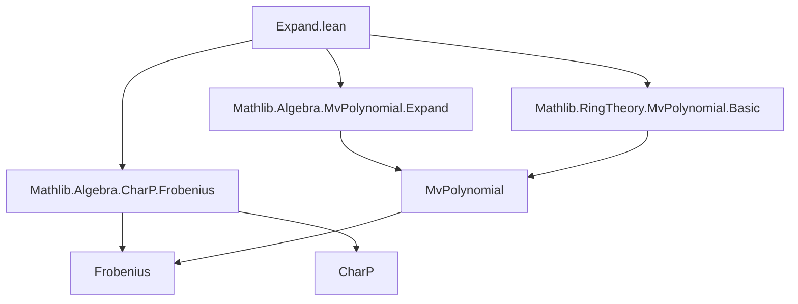
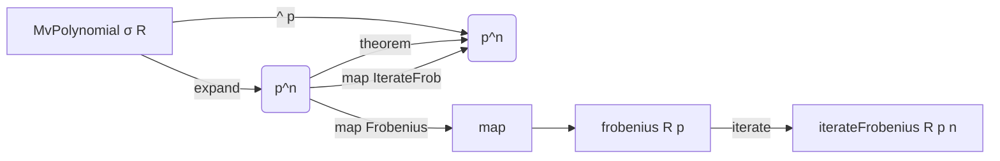

**Technical Brief: `Expand.lean` Module**

---

### 1. **Key Definitions & Theorems**

| Name | Type / Signature | Purpose |
|------|------------------|---------|
| `expand` | `MvPolynomial σ R → MvPolynomial σ R` (implicit, from `Mathlib.Algebra.MvPolynomial.Expand`) | The *$p$-th expand* operator: for $f \in MvPolynomial\ \sigma\ R$, `f.expand p` substitutes each variable $X_i$ with $X_i^p$. |
| `frobenius` | `R → R` (from `CharP R p`) | The Frobenius endomorphism $r \mapsto r^p$ in characteristic $p$. |
| `iterateFrobenius` | `ℕ → R → R` | Iterated Frobenius: $r \mapsto r^{p^n}$. |
| `map_frobenius_expand` | `(f.expand p).map (frobenius R p) = f ^ p` | Relates expand and Frobenius: applying Frobenius to coefficients after expand equals raising $f$ to the $p$-th power. |
| `map_iterateFrobenius_expand` | `map (iterateFrobenius R p n) (expand (p ^ n) f) = f ^ p ^ n` | Generalizes the above to $p^n$: applying $n$-fold Frobenius to coefficients after `expand (p^n)` equals raising $f$ to the $p^n$-th power. |

> **Note**: Both theorems are deprecated as of `2025-12-27`, with aliases:
> - `expand_char` for `map_frobenius_expand`
> - `map_expand_pow_char` for `map_iterateFrobenius_expand`

---

### 2. **Naming Conventions**

- **Prefixes**:
  - `map_`: indicates interaction with `map` (functorial action on polynomials).
  - `expand_`: used for properties of the `expand` operation.
- **Suffixes**:
  - `_char`: indicates dependence on characteristic $p$ (e.g., `expand_char`, `map_expand_pow_char`).
  - `_frobenius`: highlights Frobenius involvement (e.g., `map_frobenius_expand`).
- **Functional style**: `expand p f`, `iterateFrobenius R p n`, `f ^ p`.

---

### 3. **Tactic Stack**

Frequent tactics used in proofs:

| Tactic | Role |
|--------|------|
| `induction_on'` | Structural induction on `MvPolynomial` (using `monomial` and `add`). |
| `simp` / `simp_rw` | Simplification using lemmas like `monomial_pow`, `frobenius`, `add_pow_expChar`, `map_add`, etc. |
| `rw` / `conv_lhs => rw [...]` | Rewriting using equalities (e.g., `pow_succ`, `pow_mul`, induction hypothesis). |
| `symm` | Reversing equality to match desired direction. |
| `add_comm`, `pow_succ'`, `iterateFrobenius_add`, `map_map`, `map_expand`, `expand_mul` | Specific algebraic rewrites for MvPolynomial arithmetic and Frobenius. |

---

### 4. **Proof Logic**

- **Base case (`n = 0`)**: Trivial via `map_id`.
- **Inductive step (`n+1`)**:
  1. Use `pow_succ` and `pow_mul` to decompose $p^{n+1} = p \cdot p^n$.
  2. Apply induction hypothesis to reduce to case $n$.
  3. Rewrite LHS using:
     - `← map_frobenius_expand` (to relate Frobenius and expand),
     - `pow_succ'`, `add_comm`,
     - `iterateFrobenius_add`, `map_map`, `map_expand`, `expand_mul`, and `iterateFrobenius_one`.
  4. Conclude via algebraic simplification.

**Pattern**: Induction on $n$, leveraging Frobenius compatibility with addition/multiplication in characteristic $p$, and structural properties of `expand`.

---

### 5. **Imports & Dependencies**

| Import | Purpose |
|--------|---------|
| `Mathlib.Algebra.MvPolynomial.Expand` | Core definition and basic API of `expand`. |
| `Mathlib.RingTheory.MvPolynomial.Basic` | Basic MvPolynomial theory (e.g., `map`, `induction_on'`, `monomial`, `add`, `mul`). |
| `Mathlib.Algebra.CharP.Frobenius` | Definition of Frobenius and its properties in characteristic $p$. |

> **Scope**: This module sits at the intersection of:
> - **MvPolynomial arithmetic** (structure, maps, induction),
> - **Characteristic $p$ algebra** (Frobenius, iterated Frobenius),
> - **Power operations** (`^`, `expand`, `frobenius`).

---

### 6. **Mermaid Diagrams**

#### **Dependency Graph (Module-Level)**



#### **Theoretical Overview (Conceptual Flow)**



#### **Proof Strategy Flow (for `map_iterateFrobenius_expand`)**

```mermaid
flowchart TD
  Start[Goal: map (iterateFrob n) (expand (p^n) f) = f^(p^n)] --> Induction[Induction on n]
  Induction --> Base[Base: n = 0]
  Base --> Simp[simp [map_id]]
  
  Induction --> Step[Step: n → n+1]
  Step --> Decompose[Decompose p^(n+1) = p·p^n]
  Decompose --> IH[Apply IH]
  IH --> Rewrites[Apply lemmas: map_frobenius_expand, expand_mul, etc.]
  Rewrites --> Simplify[Algebraic simplification]
  Simplify --> End[QED]
```

--- 

**End of Brief**
