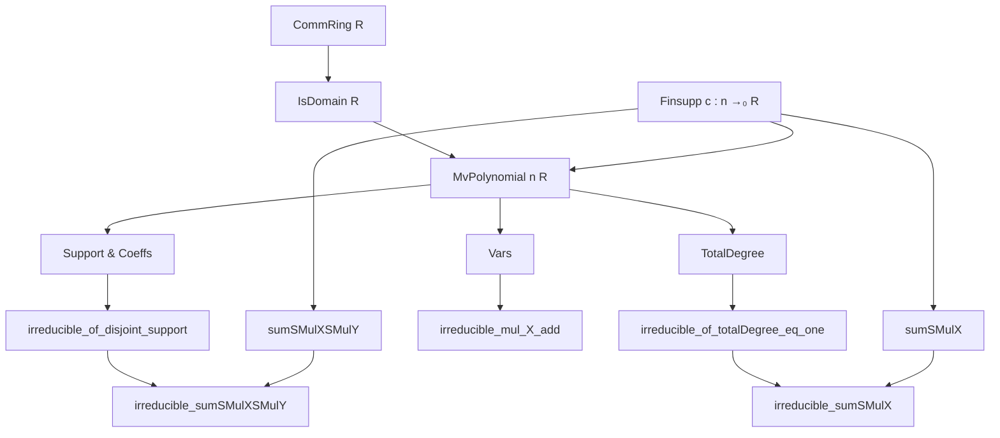
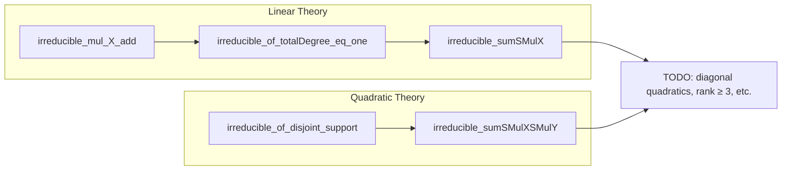

**Technical Brief: `IrreducibleQuadratic.lean`**

---

### 1. KEY DEFINITIONS & THEOREMS

| Name | Type / Signature | Purpose |
|------|------------------|---------|
| `sumSMulX` | `(c : n →₀ R) → MvPolynomial n R` | Constructs the linear polynomial $\sum_i c_i X_i$ over $R[X_1,\dots,X_n]$. |
| `sumSMulXSMulY` | `(c : n →₀ R) → MvPolynomial (n ⊕ n) R` | Constructs the quadratic polynomial $\sum_i c_i X_i Y_i$ over $R[X_1,\dots,X_n,Y_1,\dots,Y_n]$, using `n ⊕ n` to separate $X$- and $Y$-variables. |
| `irreducible_mul_X_add` | `f * X i + g` irreducible under conditions | General criterion: if $f,g$ are coprime and avoid variable $i$, then $f X_i + g$ is irreducible in a domain. |
| `irreducible_of_disjoint_support` | General irreducibility criterion | If $f$ has nontrivial support, a monomial with exponent 1 in variable $i$, pairwise disjoint supports of monomials, and is primitive, then $f$ is irreducible. |
| `irreducible_of_totalDegree_eq_one` | `p` of total degree 1, primitive ⇒ irreducible | Linear case: a primitive multivariate polynomial of total degree 1 is irreducible over a domain. |
| `irreducible_sumSMulX` | `sumSMulX c` irreducible under conditions | Linear polynomial $\sum c_i X_i$ is irreducible if $c$ has nonempty support and is primitive (no nonunit common divisor). |
| `irreducible_sumSMulXSMulY` | `sumSMulXSMulY c` irreducible under conditions | Quadratic polynomial $\sum c_i X_i Y_i$ is irreducible if $c$ has nontrivial support and is primitive. |

---

### 2. NAMING CONVENTIONS

- **Prefixes**:
  - `irreducible_`: for irreducibility theorems.
  - `sumSMulX`, `sumSMulXSMulY`: for explicit constructions of linear/quadratic forms.
- **Suffixes**:
  - `_of_`: indicates conditions (e.g., `totalDegree_eq_one`, `disjoint_support`).
  - `_apply`, `_eq`, `_mem`: standard Lean conventions for lemmas about definitions.
- **Variable naming**:
  - `c : n →₀ R`: finite support function (coefficients).
  - `ι`, `d`, `φ`, `ψ`: auxiliary constructions in proofs.
  - `i`, `j`: indices in `n`.

---

### 3. TACTIC STACK

Frequently used tactics:
- `aesop`: for automated reasoning about equalities, inequalities, and membership.
- `simp` / `simp only`: simplification with custom lemmas (`coeff_sumSMulX`, `mem_support_iff`, etc.).
- `rw`: rewriting using equalities (e.g., `coeff_sumSMulX`, `aux`, `hcoeff`).
- `obtain` / `have`: to introduce intermediate results.
- `refine`: for structured proof construction (e.g., `refine .of_map ...`).
- `grind only`: custom tactic (likely from the authors’ infrastructure) for simplifying expressions.
- `wlog`: without loss of generality, for symmetry arguments.
- `congr`: congruence reasoning (e.g., on `totalDegree`).
- `rwa`, `rfl`, `by aesop`, `by simp`: common proof combinators.

---

### 4. PROOF LOGIC

**General proof strategy**:
- **Reduction to known irreducibility criteria**:
  - Linear case: reduce to `irreducible_of_totalDegree_eq_one`, using primitivity and degree analysis.
  - Quadratic case: reduce to `irreducible_of_disjoint_support`, by:
    - Embedding coefficients via `ι : n ↪ (n ⊕ n) →₀ ℕ`, mapping $i \mapsto \delta_{\text{inl}(i)} + \delta_{\text{inr}(i)}$.
    - Showing monomial supports are pairwise disjoint.
    - Verifying primitivity via coefficient extraction.
- **Inductive/structural reasoning**:
  - Use of `totalDegree_mul_of_isDomain` to relate degrees of products.
  - Use of `vars`, `support`, and `coeff` to analyze monomial structure.
- **Coprime/coprime-like arguments**:
  - `IsRelPrime` used in `irreducible_mul_X_add`.
  - Primitivity (`∀ r, (∀ i, r ∣ c i) → IsUnit r`) used in both linear and quadratic cases.

---

### 5. IMPORTS & DEPENDENCIES

**Core imports**:
- `Mathlib.Algebra.MvPolynomial.Division`
- `Mathlib.Algebra.MvPolynomial.NoZeroDivisors`
- `Mathlib.Algebra.MvPolynomial.Nilpotent`

**Key underlying theories**:
- `MvPolynomial` infrastructure: `vars`, `support`, `coeff`, `totalDegree`, `renameEquiv`, `optionEquivLeft`.
- `Polynomial` infrastructure: `C`, `X`, `totalDegree`, `irreducible_C_mul_X_add_C`.
- `Finsupp`: `linearCombination`, `embDomain`, `support`, `single`, `erase`.
- `IsDomain`, `IsUnit`, `IsRelPrime`, `irreducible`.

---

### 6. MERMAID DIAGRAMS

#### Dependency Graph (High-Level)

#### Overview of File Structure

---

### 7. OPEN QUESTIONS (from TODO)

- **Diagonal quadratics**: $\sum c_i X_i^2$ — need ≥3 nonzero $c_i$, primitivity.
- **Mixed sums**: sums of both $\sum c_i X_i$ and $\sum c_i X_i Y_i$.
- **Degree ≤ 2 over fields**: irreducibility depends on rank of quadratic part and lower-degree terms.
  - Examples: $X^2 - Y$ (irreducible), $X^2$, $X^2 - 1$, $X^2 - Y^2$ (reducible).
  - $X^2 + Y^2$: irreducible over $\mathbb{R}$, reducible over $\mathbb{C}$.

---

### 8. NOTES ON FORMALIZATION QUALITY

- **Robust use of embeddings**: `ι` and `embDomain` elegantly encode the quadratic form in a larger variable set.
- **Modularity**: lemmas like `irreducible_mul_X_add` and `irreducible_of_disjoint_support` are reusable.
- **Precision in primitivity**: phrased as `∀ r, (∀ i, r ∣ c i) → IsUnit r`, matching the standard notion of primitive polynomial over a domain.
- **Potential improvements**:
  - Could benefit from a unified `quadraticForm` abstraction for future generalizations.
  - `grind only` suggests custom infrastructure — could be replaced with standard `simp`/`ring` if possible.

--- 

Let me know if you'd like a formalization of the TODO cases (e.g., diagonal quadratics) or a port to a more abstract setting (e.g., graded rings).
