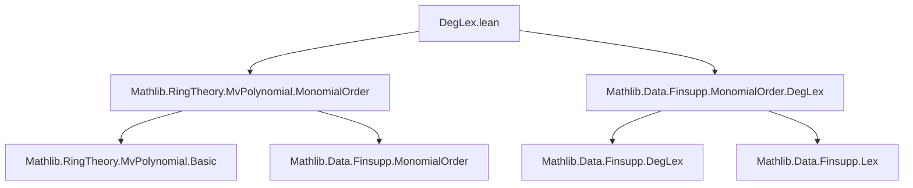
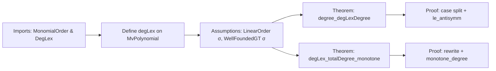

**Technical Brief: `DegLex.lean`**

---

### 1. **Key Definitions & Theorems**

| Name | Type / Signature | Purpose |
|------|------------------|---------|
| `degLex` | `MonomialOrder (MvPolynomial σ R)` | Degree lexicographic monomial order on multivariate polynomials, built from `Finsupp.DegLex`. |
| `degree_degLexDegree` | `(degLex.degree f).degree = f.totalDegree` | Shows that the *degree* (i.e., the maximum exponent vector under `degLex`) of a nonzero polynomial `f`, when projected to its *total degree* (sum of exponents), equals `f.totalDegree`. |
| `degLex_totalDegree_monotone` | `degLex.degree f ≼[degLex] degLex.degree g → f.totalDegree ≤ g.totalDegree` | Proves monotonicity of total degree with respect to the `degLex` order: if `f` is ≤ `g` in `degLex`, then `f`’s total degree ≤ `g`’s. |

> Note: `degLex.degree f` is the *leading monomial’s exponent vector* under `degLex`. The theorem uses `degree` (from `MonomialOrder`) to extract that exponent vector, then takes its `degree` (i.e., sum of components), equating it to `f.totalDegree`.

---

### 2. **Naming Conventions**

- **Prefixes**:
  - `degLex_`: Indicates usage of the degree-lexicographic monomial order.
  - `totalDegree`: Standard notation for sum of exponents.
- **Suffixes**:
  - `degree`: Refers to the exponent vector (or its total) associated with a monomial or polynomial.
- **Pattern**: `degLex_*` for lemmas about `degLex`, `*_totalDegree` for total-degree-related properties.

---

### 3. **Tactic Stack**

- `by_cases hf : f = 0` → case analysis on zero polynomial.
- `simp [hf]` → simplification using hypothesis.
- `apply le_antisymm` → standard tactic to prove equality of naturals/ordinals via two inequalities.
- `exact le_totalDegree …` → uses existing lemma `le_totalDegree`.
- `unfold MvPolynomial.totalDegree` → expands definition (as sup over support).
- `apply Finset.sup_le …` → proves inequality for supremum by bounding each element.
- `intro b hb` → introduces arbitrary element of support.
- `exact DegLex.monotone_degree h` → applies monotonicity of degree under `DegLex` order.

> Dominant tactics: `simp`, `apply`, `intro`, `exact`, `unfold`, `Finset`-based reasoning.

---

### 4. **Proof Logic**

- **Structure**: Case analysis on `f = 0`, then:
  - For nonzero `f`, prove equality by two inequalities:
    1. `≤`: Use `le_totalDegree` on a support element (the leading monomial under `degLex`).
    2. `≥`: Show every exponent in support has degree ≤ `degLex.degree f`, via `DegLex.monotone_degree`.
- **Monotonicity proof**:
  - Rewrites using `← degree_degLexDegree`.
  - Applies `DegLex.monotone_degree` to the hypothesis `h`.

> Core logical flow: *inductive-free*, relies on properties of `DegLex` order and support finiteness.

---

### 5. **Imports**

| Import | Role |
|--------|------|
| `Mathlib.RingTheory.MvPolynomial.MonomialOrder` | Provides `MonomialOrder` typeclass and basic infrastructure for monomial orders on `MvPolynomial`. |
| `Mathlib.Data.Finsupp.MonomialOrder.DegLex` | Defines `DegLex` monomial order on `Finsupp`, used to instantiate `MonomialOrder` for `MvPolynomial`. |

> These imports define the *monomial order framework* and the specific `degLex` instance.

---

### 6. **Mermaid Diagrams**

#### **Dependency Graph (Module-Level)**

#### **Overview of File Content**

---

### 7. **Domain & Theory Scope**

- **Domain**: Formalization of multivariate polynomial algebra, specifically monomial order theory.
- **Theory**: Connects `degLex` (a well-known monomial order used in Gröbner basis theory) to total degree, a key invariant in degree-based arguments (e.g., induction on degree, termination proofs).
- **Use Case**: Enables reasoning about how `degLex`-leading terms control total degree, useful in algorithms (e.g., division, reduction) and proofs of termination (e.g., Hilbert basis theorem).

--- 

Let me know if you'd like a formalization-level dependency graph (e.g., `MvPolynomial` → `MonomialOrder` → `DegLex`) or expansion of `DegLex.monotone_degree`.
